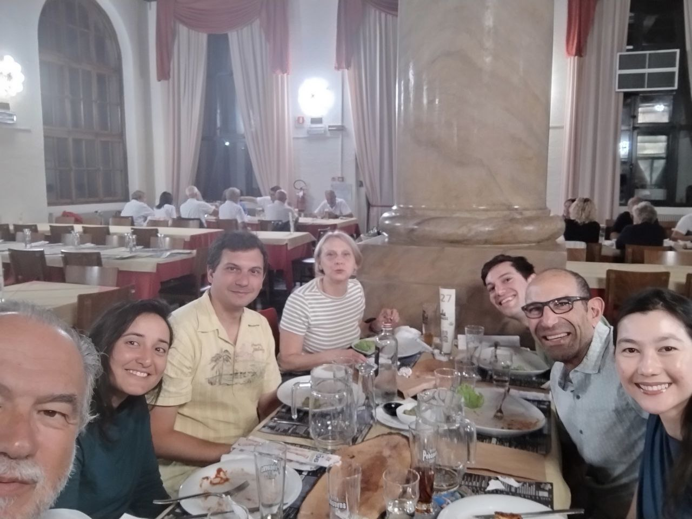
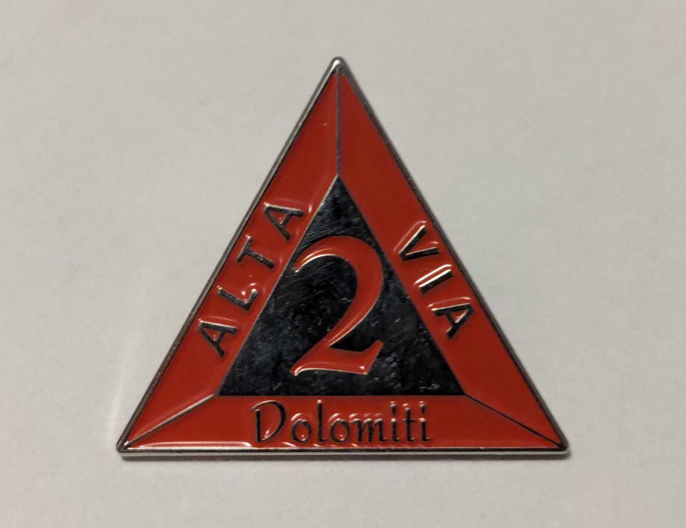
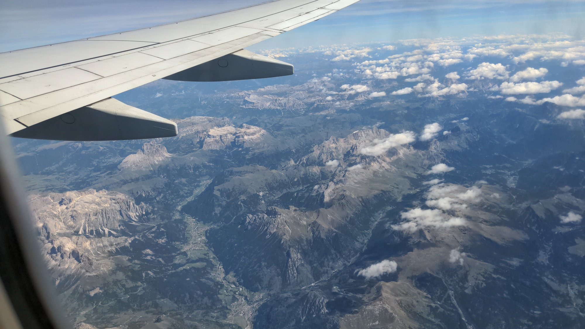

<table style="width: 100%; table-layout: fixed;"> <thead> <tr>
	<th style="text-align: left"> <a href="../day9">← Day 9</a> </th>
	<th style="text-align: center"> <a href="../">Alta Via 2</a> </th>
	<th style="text-align: right">  </th>
</tr> </thead> </table>

# After the hike

## Back home

*August 28, 2025*

My dad's cousin came to pick us up. As we got into the car, the
storm started.  From there, it kept raining the whole afternoon. Not
coninuously, it came and went, but when it was there it was
very strong. The bad weather continued for a couple of days.

We made a good call ending our trip early.

## Celebration

*August 29, 2025*

Some of the people we met along the way arrived in Feltre on the next
day. Like use, they could not properly finish the Alta Via, as the bad
weather caught them when they arrived at Passo Cereda.

We decided to meet for a dinner all together at [Birreria
Pedavena](https://www.labirreriapedavena.it/), the largest brewery in
Italy, which is conveniently located between Croce d'Aune and Feltre. In
fact, if you walk Alta Via 2 all the way to Feltre, you pass right in
front of the Birreria.

## Award

*September 2, 2025*

Upon completing Alta Via 2, hikers can receive an official pin. It is
awarded by the tourist office in Feltre, where they can also
add their name to the book of "finishers".

As you know, we did not complete the full Alta Via. But since Feltre is
just around the corner, we thought why not go there and ask? In the end,
the exact route of Alta Via 2 is not set in stone.

It turns out that, according to the guidelines laid out by the Italian
Alpine Club, reaching Rifugio Boz is enough to officially complete Alta
Via 2 and be called a finisher!

Indeed, they know that the last leg of the hike is often skipped due to
bad weather. Ending the journey at Passo Cereda, however, is not enough.

So now we also have some official recognition for our effort. Cool!

## Farewell to the mountains

*September 3, 2025*

After the hike I spent a few days at home with my family. But now it is
time to go back to the flat lands, where I have been living for the past
few years.

My flight back to Amsterdam, as it sometimes does, flew right over the
Dolomites. I was able to recognize not only my home town, but also many of
the mountains and valleys my dad and I walked through just a week earlier.

<table style="width: 100%; table-layout: fixed;"> <thead> <tr>
	<th style="text-align: left"> <a href="../day9">← Day 9</a> </th>
	<th style="text-align: center"> <a href="../">Alta Via 2</a> </th>
	<th style="text-align: right">  </th>
</tr> </thead> </table>

