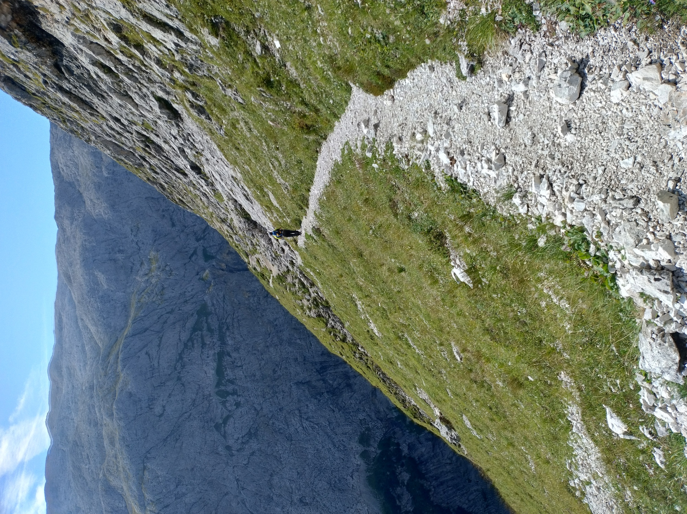

# Alta Via 2

[Alta Via 2](https://en.wikipedia.org/wiki/Alta_Via_2) is high mountain
route in the [Dolomites](https://en.wikipedia.org/wiki/Dolomites). It goes
from [Brixen](https://en.wikipedia.org/wiki/Brixen), in South Tyrol, to
[Feltre](https://en.wikipedia.org/wiki/Feltre), the city where I was born.
With its 180km of lenght and around 10000 meters of altitude gain, it
requires multiple days to complete, with most guides suggesting a 12-
or 13-day itinerary.

In August 2025, my father and I completed this route, walking for 9
consecutive days. In these pages I want tell you about this adventure.
If you are interested in hiking similar routes you may find some
useful information here, but a technical description of the journey
is not my main goal. If you are just interested in watching the
pictures we took along the way, you can find them in
[this google drive folder](https://drive.google.com/drive/folders/1dVb3_vxpRhcRsMq5lOmuu-DCY0bE01pD)
(until I figure out a good way to host them on this website).

Note: in order to limit the size of this website, the pictures you find
in these pages are scaled down. Follow the link above for full-quality
pictures.

* [Preparation](./preparation)
* [Day 1 - The Odles in the rain](./day1)
* [Day 2 - Trail 666](./day2)
* [Day 3 - A knee-breaking descent](./day3)
* [Day 4 - The forest and the pastures](./day4)
* [Day 5 - Entering the Pala group](./day5)
* [Day 6 - The Farangole trail](./day6)
* [Day 7 - The longest day](./day7)
* [Day 8 - TODO](./day8)
* [Day 9 - TODO](./day9)
* [After the hike](./after)
