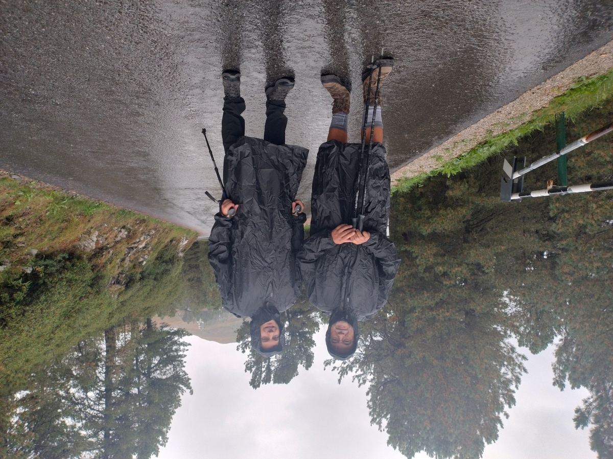

# Day 1 - The Odles in the Rain

|[← Preparation](../preparation)|[Alta Via 2](../)|[Day 2 →](../day2)|
|:-|:-:|-:|

*Download the [gpx file](../gpx/av2-day1.gpx) or see the route on
[outdooractive.com](https://www.outdooractive.com/en/route/hiking-trail/eisacktal/-2025-alta-via-2-day-1/325540727/?share=%7E3zdmcd3i%244ossqbct)*

## The road to Kreutztal

Our first day starts quite early, as we wake up at 5:15. My uncle is
giving us a car ride to Kreutztal, which will take a little more than
3 hours. We leave at 5:55.

We drive up the Cordevole valley, a road that reminds me of the
many hikes I used to do in the Dolomites, usually starting from the
[Falzarego pass](https://en.wikipedia.org/wiki/Falzarego_Pass),
hiking around the [Tofane](https://en.wikipedia.org/wiki/Tofane),
the [Cinque Torri](https://en.wikipedia.org/wiki/Cinque_Torri),
[Averau](https://en.wikipedia.org/wiki/Averau) and others.
But we are not going there this time.

The road itself is quite scenic.  Sorry, I did not
take any pictures pictures.  After we go North, we
drive through famous turistic villages like Arabba and
[Corvara](https://en.wikipedia.org/wiki/Corvara%2C_South_Tyrol).
But these small towns leave a weird impression on me, as they consist
mostly of hotels and a few restaurants and bars - all closed because
it is too early for turists to wake up. Are these places just holiday
resorts now?

Just before we reach Kreutztal, our starting point, it starts raining.

## The hike begins

*My dad and I, ready to start hiking*

By the time we reach Kreutztal (2000m on sea level), park the car and
put on our rain clothes, it is already 9:30. And this is going to be
one of the longest days, at least according to our estimates.

The Plosehütte (2447m) is not far, and we reach it pretty
quickly. Unfortunately, it is closed for renovations, and we can't even
get close enough to take a picture of our first checkpoint.

At least the view from up there is... something.

*The
[Odles](https://www.val-gardena.com/en/dolomites/geisler-mountain-group/),
surrounded by clouds*

The clouds came and went, but this is pretty much the clearest the
skies have been the whole morning. Besides the cold and the rain being
unpleasant, the low visibility gave us some technical difficulties: right
after passing by the hut, we found ourselves on a grassy slope and we
lost the track. In normal conditions we would have been able to look
out for the next trail marking, or just walk in the right direction, but
with this thick fog we were forced to double check our GPS and our maps.

## Down through the forest, then up again

Luckily it did not take us long to find the right way, and we kept descending
in a [larch](https://en.wikipedia.org/wiki/Larch) forest.

*A trail in a forest between Plosehütte and
Schlüterhütte - Rifugio Genova*

The descent is pleasant. We even manage to catch some break from the
heavy rain, and take a few more pictures of the Odles.

We reach the Rodella Pass (1867m) at around 13:00, and from there we
walk up to Schlüterhutte - Rifugio Genova (2297m). As the rain became
heavier, I did not take many notes of this part of the route.

As the trail is crossed by a stream of water, we have to pass a short
challenging section, where we are forced to climb on the wet rock.
The climb itself is not hard, but the trail is not clearly marked
at that point, which left us wondering if we were doing the right thing.

We are then blocked by a more difficult trail feature: cows.

*Cows are blocking the road. Yes, that little gap is the only way forward.*

After overcoming this zoological obstacle, we reached the
Schlüterhütte - Rifugio Genova at 16:00 and we stop for a slice of
[*Apfelstrudel*](https://en.wikipedia.org/wiki/Apple_strudel).

## The long descent to the village

At 6 hours and 30 minutes of hiking, this would have been a good
first day.  But unfortunately we cannot stop here. At 16:30 we begin
the long descent towards Lungiarü (1398m).

*Down there, that's where we have to go. Do you see it? Me neither.*

We walk for two hours in the rain and the fog before reaching the
village. Two hours may not sound like much, but it felt like an
eternity.

The village of Lungiarü, in
[Val Badia](https://en.wikipedia.org/wiki/Val_Badia), is quite nice, but
we have no energy for sightseeing. All we can do before falling asleep
is a shower, dinner, and trying to dry our clothes for the next day.

|[← Preparation](../preparation)|[Alta Via 2](../)|[Day 2 →](../day2)|
|:-|:-:|-:|
