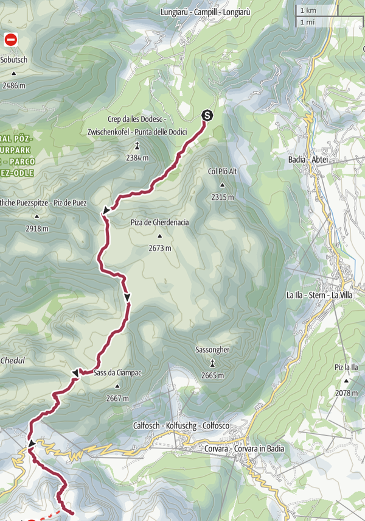
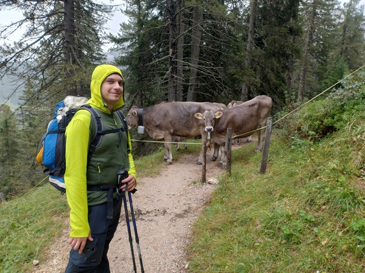

# Day 2 - Trail 666

TODO make map images much smaller, set max-height and max-width to 40 em or
something (or smaller than 100% anyway)
TODO click to enlarge for map images

|[← Day 1](../day1)|[Alta Via 2](../)|[Day 3 →](../day3)|
|:-|:-:|-:|

*Download the [gpx file](../gpx/av2-day2.gpx) or see the route on
[outdooractive.com](https://www.outdooractive.com/en/route/hiking-trail/alta-badia/-2025-alta-via-2-day-2/325541331/?share=%7E3zdmlslt%244ossqbcn)*

## The beginning of a long day

According to our plan, this second day is going to be the toughest.
Our planned route consists of more than 1700m of altitude gain, which
would already be quite a long hike for a single day, leave alone for
one out of 9 days of walking. Moreover, the weather forecasts for the
day are not good - there is chance of thunderstorms in the afternoon.

Luckily we find someone willing to give us a car ride from our B&B to
the edge of the village, saving us about one hour of walk. We start
walking at around 8:30.

TODO salita che parte tranquilla
TODO foto con albero

TODO vediamo camosci e marmotte
TODO malga antersasc

...

TODO rimuovi foto con mucche

*Cows are blocking the road. Yes, that little gap is the only way forward.*

|[← Day 1](../day1)|[Alta Via 2](../)|[Day 3 →](../day3)|
|:-|:-:|-:|
