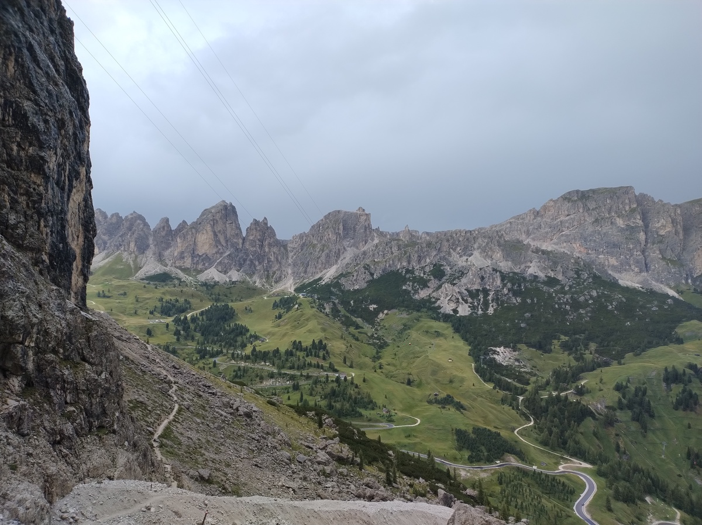

# Day 2 - Trail 666

|[← Day 1](../day1)|[Alta Via 2](../)|[Day 3 →](../day3)|
|:-|:-:|-:|

## Route of the day

<strong>Click to see map</strong>

*Download the [gpx file](../gpx/av2-day2.gpx) or see the route on
[outdooractive.com](https://www.outdooractive.com/en/route/hiking-trail/alta-badia/-2025-alta-via-2-day-2/325541331/?share=%7E3zdmlslt%244ossqbcn)*

## The beginning of a long day

According to our plan, this second day is going to be the toughest.
Our planned route consists of more than 1700m of altitude gain, which
would already be quite a long hike for a single day, leave alone for
one out of 9 days of walking. Moreover, the weather forecasts for the
day are not good - there is chance of thunderstorms in the afternoon.

Luckily we find someone willing to give us a car ride from our B&B to
the edge of the village, saving us about one hour of walk. We start
walking at around 8:30.

The first part of the trail is not very steep, and the weather is
not awful either. We even manage to see some mountains!

In about an hour we reach *malga Antersasc* (2084m on sea
level).  Around this small abandoned building we see a few
[chamois](https://en.wikipedia.org/wiki/Chamois) and some very fat
[marmots](https://en.wikipedia.org/wiki/Marmot) - seriously, these
things were huge! Unfortunately all the pictures I took were terrible,
you need some pretty good cameras to catch them from a distance. Here
is a shot of myself looking at a tree that grew on a rock instead.

After a short break, we get back on the trail and start walking towards
the [Puez hut](https://www.rifugiopuez.it/en/).  We could already tell
from the map that the trail up to *forcella Puez* (2500m), before the
hut, was going to be very steep. However, we found out that it was very
well kept, which made it easier than we expected.

*The trail up to forcella Puez is reinforced with some trunks that
turn it almost into a staircase.*

Unfortunately, as we walked up the weather got much worse, and we were
forced to wear all our rain clothes again, including gloves.

We reach the Puez hut (2447m) at 11:20, earlier than planned. We take
some time to rest and try to dry up from the rain; I change my socks
and t-shirt, which definitely helps.

## The forgotten Forcellas

(*Forcella* is an Italian term that denotes a tight mountain pass, usually
only reachable by a steep trail. I will sometimes use the Italian word
because I don't know an exact equivalent in English. For proper names I
may also use the equivalent word in the local language: *Furcella* or
*Jeuf* in [Ladin](https://en.wikipedia.org/wiki/Ladin_language),
*Joch* in German, *Foržela* in
[Venetian](https://en.wikipedia.org/wiki/Venetian_language).)

We start walking again around 12:00, and it is immediately clear that we
have made a small miscalculation in planning the route. We thought
that the trail to [Gardena Pass](https://en.wikipedia.org/wiki/Gardena_Pass)
would be straight downhill, but actually we'll have to climb up and then
down a couple of tight passes: *Furcella de Ciampei* (2366m) and *Jeuf de
Crespëina* (2528m). This is easily going to cancel out the time we gained
in the morning. Fortunately, this part of the trail is quite pleasant to
walk, if at times steep; the weather is also not too bad, as we only have
to bear some light rain.

As we are about to reach Gardena Pass (2136m), a strong storm begins.
I speed up to take shelter in a hut down at the pass, leaving my dad
a few minutes behind. I reach the pass at 14:35.

## One hell of a trail

The outlook for the last part of the day is bleak, to say the least.
Thunderstorms are forecast until late in the evening. There is likely
going to be a gap between 16:00 and 17:00, but it is not going to last
long enough to reach the Pisciadù hut, were we are going to sleep. We
have to choose between leaving immediately under the heavy rain hoping
it stops while we are on the way, and waiting for the first wave of
the storm to pass but risking it starts raining again before we reach
our destination.

We choose the former, because it was our best chance to arrive at the
hut before it gets dark. Moreover, despite the forecast of thunder and
lightning, so far it is just raining heavily, which although unpleasant
is not dangerous.

We leave from the pass at around 15:00, under the storm. The ascent
is not steep at first.  Luckily, as predicted, after about one our the
rain stops.

*Our last view of Gardena Pass and the Odles group, on the way up
to the Pisciadù hut.*

But then we reach the infamous trail 666. This is not a nickname, it
is the actual number that the [Italian Alpine Club](https://www.cai.it/)
gave to this trail.

Actually, this is the easiest of two
possible ways to the Pisciadù, the other being the
[Ferrata Tridentina](https://www.alta-badia.org/en/leisure-activities/climbing-and-mountaineering/brigata-tridentina-route/).
The booklet I am following describes it as "[...] reserved for
well-equipped experts. Don't do it with heavy backpacks; don't do it if
the weather is not good." We get at 0 out 3, the thought of taking the
[via ferrata](https://en.wikipedia.org/wiki/Via_ferrata) does not not
even cross our minds.

So trail 666 it is. This trail is also known as *Setus trail*, or somewhat
improperly *Setus via ferrata*. It is extremely steep and it is more a
climb than a walk, but it is not a via ferrata.  Most maps describe it
as *sentiero attrezzato* (equipped trail), as it does have some fixed
steel rope and handles where the climber can hang a safety rope.

We have some simple ropes equipped with a
[Carabiner](https://en.wikipedia.org/wiki/Carabiner), and we decide to
use them. In the following days we would talk with other people who
took the same route, and some of them would claim that a rope is not
necessary on that trail. I don't care, I was relieved to have my trusty
rope, especially considering the bad weather and how tired I was after
more than 8 hours of hiking (plus the 9 hours of the previous day). And
a safety rope is certainly of no use if kept in the backpack.

*Trail 666 is really steep.*

Overall, the steel rope and the handles are of great help, and although
a couple of times I was unsure where to put my feet and risked slipping,
I would not consider this trail dangerous, if one is properly equipped.

The reason I found this trail hard was its *length*. I seriously had
some difficulties caused by how tired and sore my muscles were, after
two full days of hike. Sometimes I could not complete a step or a arm
movement on the first try because I just did not have the enough strength
to push or pull up. And it just kept going!

But at 17:30, exhausted but satisfied, we finally reach the top of
this climb. The Pisciadù hut (2587m) is just around the corner.

*My dad at the end of trail 666.*

We, our clothes and our boots are still wet from all the rain we caught
throught the day. Let's hope everything dries up during the night.

|[← Day 1](../day1)|[Alta Via 2](../)|[Day 3 →](../day3)|
|:-|:-:|-:|
