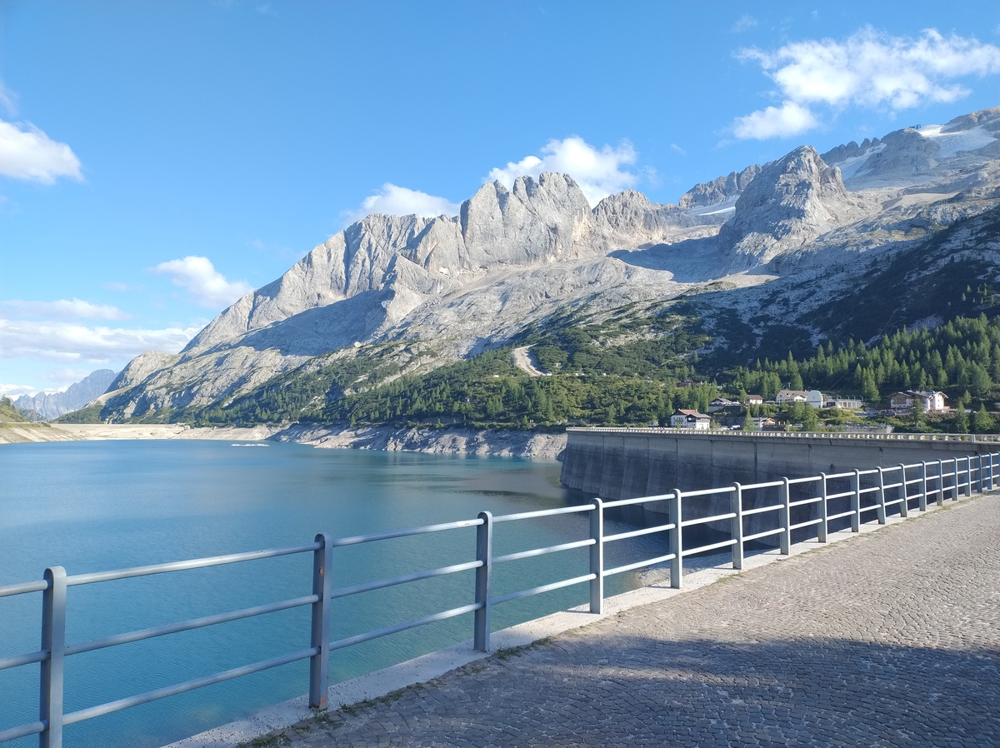

# Day 3 - A knee-breaking descent

|[← Day 2](../day2)|[Alta Via 2](../)|[Day 4 →](../day4)|
|:-|:-:|-:|

*Download the [gpx file](../gpx/av2-day3.gpx) or see the route on
[outdooractive.com](https://www.outdooractive.com/en/route/hiking-trail/alta-badia/-2025-alta-via-2-day-3/325541657/?share=%7E3zdmpbrn%244ossqbcq)*

Our clothes are still wet by the time we wake up. The summer nights
in the Alps are just too humid. But at least we can finally see some
sun. The weather is going to be much better for the next few days.

*A beatiful view from the Pisciadù hut at dawn.*

The beds in the hut were comfortable and we slept well. After a comical
incident with my dad's boots - he put on someone else's pair, not knowing
that I had brought his back into our room, and spent a good 15 minutes
searching for them - we are ready to leave the hut at 8:20.

*The Pisciadù lake and Piz Pisciadù (peak Pisciadù).*

The days starts with a short but somewhat steep section of the trail.
There are some steel ropes and we use our simple harness once again,
although this time we felt we could have done without.

At 9:45 we reach what is likely the highest point of our route,
an anonymous plateau at 2960 meters on sea level. There are higher
points on some variations of the route, for example *Punta Penia* in the
[Marmolada](https://en.wikipedia.org/wiki/Marmolada) massif, but we are
going to take a lower route, which is the more classical one according
to my guide book.

At this point, we are completely immersed in a sea of fog. It is quite
cold, probably only a couple of degrees above 0°C, and there is some
unpleasantly cold breeze.

*My dad resting on a rock, trying to keep warm.*

The fog comes and goes, letting us see the beautiful panorama for
a few brief moments.

As we walk down from the plateau, my left knee starts hurting. It is
not unbearable, and it only hurts when I walk downhill. But it does
not bode well for the rest of the day: our next stop is 900m below us,
so we are going to walk downhill for most of the day.

At 10:30 we are on top of the *Antersass* (2906m), a minor peak next to
the more prominent [Piz Boè](https://en.wikipedia.org/wiki/Piz_Bo%C3%A8)
(3152m). We could have walked arount the Antersass, but the trail to
climb up to the top and then down is actually easier than the one that
goes around it. Going to the top of Piz Boè would have been an
interesting detour, but not quite feasible for our 9-day plan.

We reach [Rifugio Boè](https://www.rifugioboe.it), a recently renovated
hut at 2873m, before 11:00.

*A view of Piz Boè (peak Boè) from Rifugio Boè (Boè hut). The hut
on the top of Piz Boè is, perhaps confusingly, called
[Capanna Piz Fassa](https://www.rifugiocapannapizfassa.com/en/).*

We have now left Sout Tyrol. The rest of the Alta Via 2 route
roughly follows the border between the provinces of Trento and
Belluno.

We leave the hut at 11:20. The fog has returned, but it is not as
cold as before.

The trail to *Foržela Pordoi* (2848m) is mostly flat, and very crowded,
because of a cable car that makes it accessible even to families with
kids. I am not sure I like this kind of over-turism in in places that
would otherwise be hard to reach.

The descent is on a long and steep [scree](https://en.wikipedia.org/wiki/Scree).
I have never liked walking down this kind of trail, but now that my knee
is screaming for mercy I am really hating it. I would have rather walked it
up twice than down once.

*The steep descent to the Pordoi Pass.*

We reach the [Pordoi Pass](https://en.wikipedia.org/wiki/Pordoi_Pass)
at 13:30.  I need some rest before continuing, so we decide to stop
until 14:10. Luckily the weather is nice - or not terrible, at least -
and we can enjoy a nice view of the surroundings.

*The mountains surrounding the Pordoi Pass.*

*The view in the direction of [Cianacei](https://en.wikipedia.org/wiki/Canazei).*

The walk up an easy trail among ski paths.  Here too there are plenty of
turists, and I can't blame them for choosing to walk in such a beautiful
place. This is a very common touristic destination both in the Summer
and in the Winter.

We walk past a strange place called
[Rifugio Fredarola](https://www.fredarola.it/) (2370m), which looks
more like a night club you could find the center of Milan rather than
a mountain hut. They are even playing some electronic lounge music.
It's hard to describe, but it feels oddly out of place here. But for
people coming from a big city this is just what they expect to find here;
I guess it is a matter of points of view.

We continue on a wide, mostly flat trail. For now my knee is is doing
fine, but I am a bit scared for the descent that awaits us later today.
And finally we have a good view on the Marmolada, the Queen of the
Dolomites.

*The Marmolada, the highest mountain in the Dolomites, and its glacier.
At the feet of the massif you can see the
[Fedaia Lake](https://en.wikipedia.org/wiki/Fedaia_Lake), around which
there are a couple of huts, including the one where we are staying tonight.
In the distance you can see the
[Pelmo](https://en.wikipedia.org/wiki/Monte_Pelmo) and the
[Civetta](https://en.wikipedia.org/wiki/Monte_Civetta).*

We stop at [Rifugio Viel Dal Pan](https://www.rifugiovieldalpan.com/)
(2432m) for a short break at 15:30. From there, the steep descent towards
the Fedaia Pass (2054m) begins. My knee forces me to walk slowly, so by
the time we reach the pass it is already 17:30.

The day is almost concluded, but we have to walk to to opposite side
of the lake to [Rifugio Fedaia](https://www.rifugiofedaia.com/). The
closer [Rifugio Castiglioni](https://www.rifugiomarmolada.it/), where
we stop for a beer, was fully booked when we planned our trip.

We walk fast on the old road next to the lake, chatting with a local
resident who helps us keep up the pace.  We arrive at our hotel at 18:05,
after almost 10 hours of hike (including breaks), and we are very happy
to find a comfortable room with private bathroom waiting for us.

This day was longer than we planned, partly because of my knee.
But the scenery was beautiful.

|[← Day 2](../day2)|[Alta Via 2](../)|[Day 4 →](../day4)|
|:-|:-:|-:|
