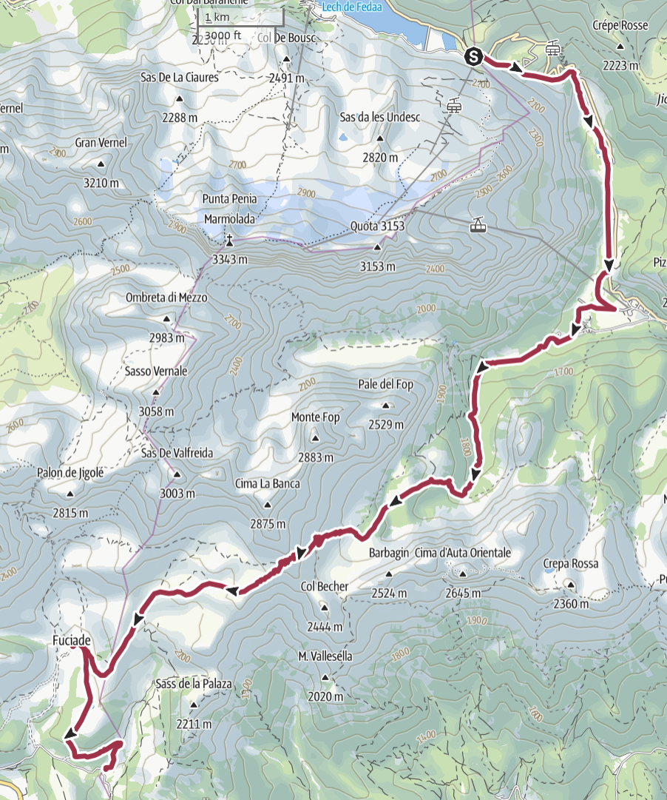
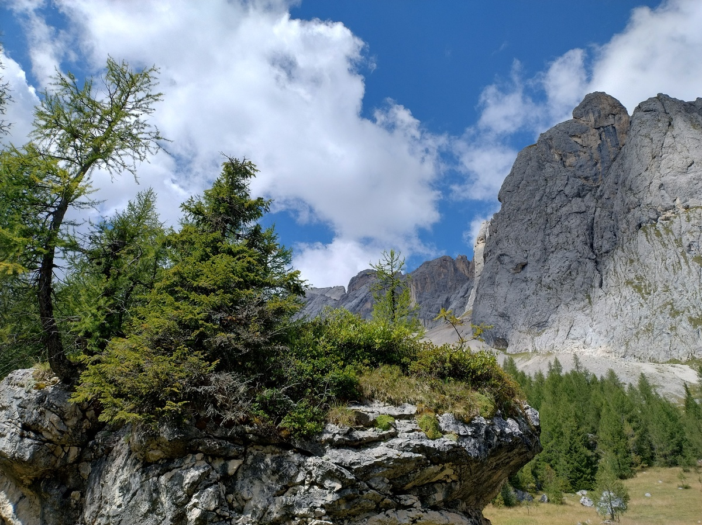
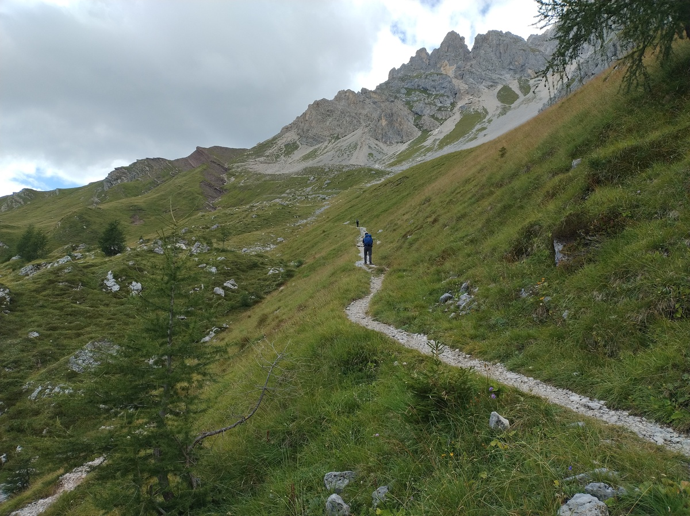
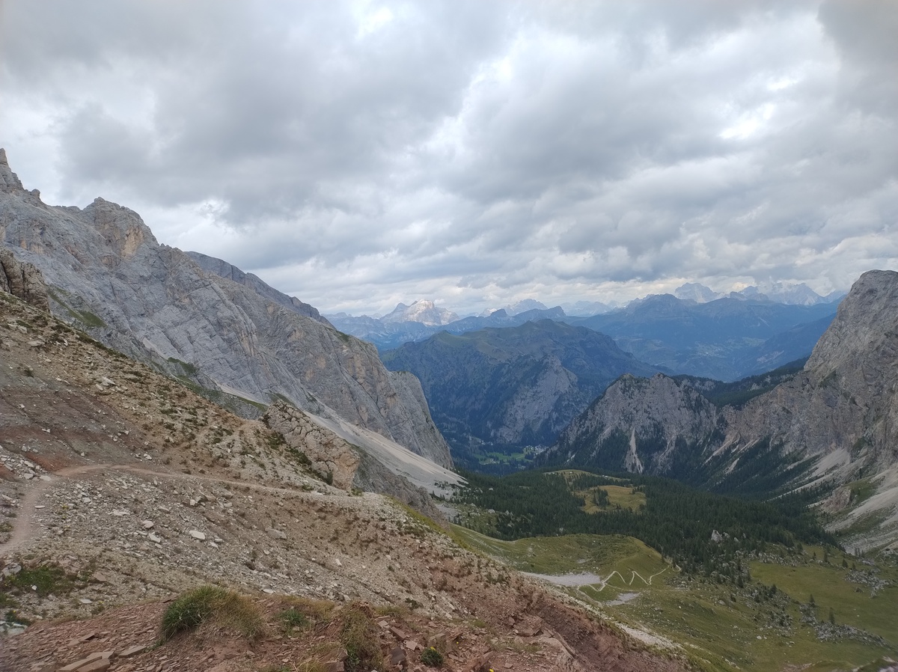
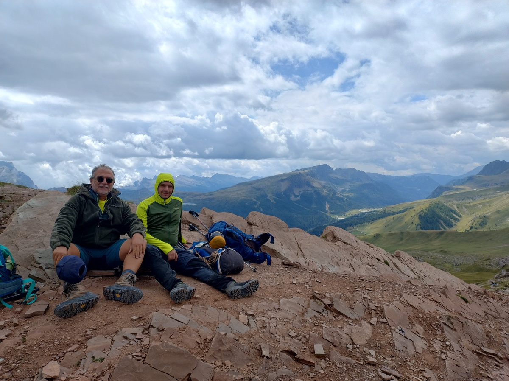
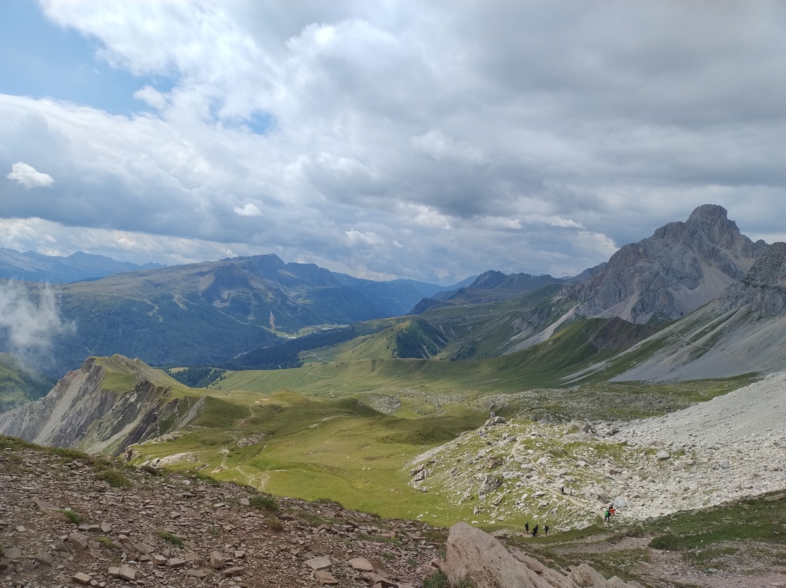
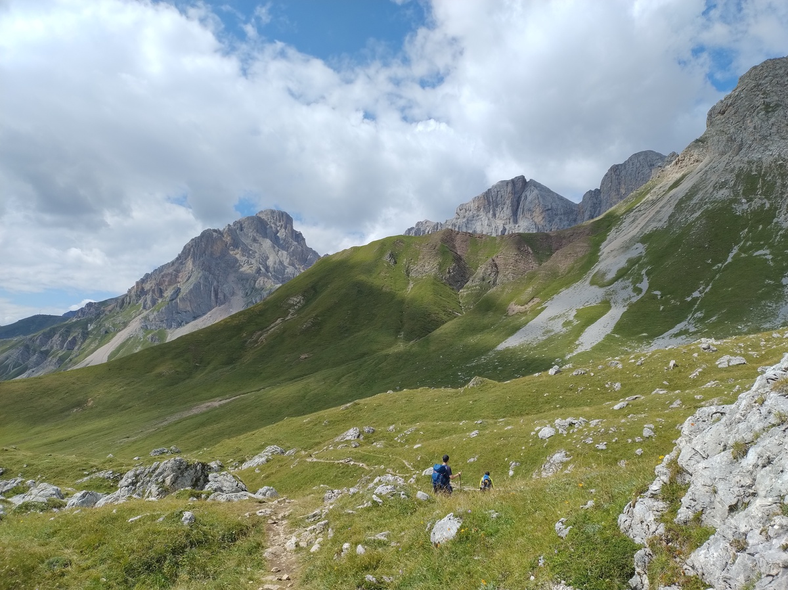
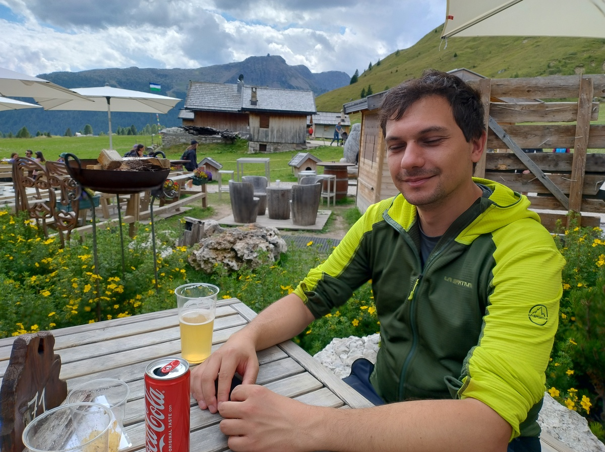
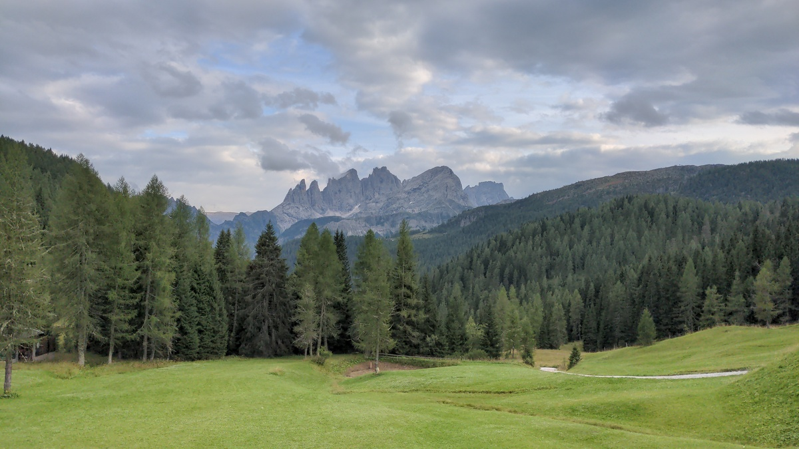

# Day 4 - The quiet forest and the relaxing pastures

|[← Day 3](../day3)|[Alta Via 2](../)|[Day 5 →](../day5)|
|:-|:-:|-:|

## Route of the day

<strong>Click to see map</strong>

*Download the [gpx file](../gpx/av2-day4.gpx) or see the route on
[outdooractive.com](https://www.outdooractive.com/en/route/hiking-trail/province-of-belluno/-2025-alta-via-2-day-4/325541990/?share=%7E3zdmunnm%244ossqbcs)*

## To Malga Ciapèla and Forca Rossa

Our fourth day starts at 8:20, with a steep descent on a ski path.
My knee stil hurts, and this points I am afraid I may have to
deal with it for the rest of trip.

At 9:30 we pass Malga Ciapela (1450 meters on sea level) and we start
walking up again. Soon we find an enigmatic sign which is apparently
trying to communicate that going left or right leads to the same
places. We spend like 5 minutes figuring this out, and we choose to
go left.

The path is not steep and walking in the forest is enojyable.  Since we
are at a lower altitude than we have been for most of the other days,
it is also much warmer than, say, yesterday morning.

*A view from the forest, on the way up from Malga Ciapèla to Forca Rossa.*

The forest soon leaves space to grassy slopes and naked rock.  The way
up is still pleasant, and we have met almost no other hiker so far -
in stark contrast with the previous day.

*The lower clay-red peak on the center-left of the picture is Forca Rossa,
where we are headed. "Rossa" in Italian means "red" - it's nice when things
are what their name says they are, isn't it?*

We arrive at *Forca Rossa* (2500m) at 13:05. Only in the last few minutes
my knee gave me some problems, but it is not so bad that it makes me
want to stop.

Here at the top of this trail there are all the hikers that we did not
meet on the way up; they probably came from the other side. There must
be some kind of force field blocking tourists from entering the province
of Belluno.

*View from Forca Rossa to the Belluno side.*

*My dad and I chilling - quite literally, because of the wind.*

*View from Forca Rossa to the Trentino side.*

## Walking down green pastures

There is a great view on both sides of this pass, but the wind is cold
and strong and we are not keen on staying long. After eating a couple
of protein bars and taking many pictures, we start walking down towards
Fuciade at 13:40.

*Walking down to Fuciade.*

The way down is quite relaxing. We walk among green pastures, where
cows and horses grazed freely. That is, until they are less romantically
slaughtered to make [Bresaola](https://en.wikipedia.org/wiki/Bresaola).
But until then they can enjoy the green grass.

At 15:00 we reach Fuciade (1982m), a location where many families with
kids were relaxing after a meal at [the hut](https://www.fuciade.it/en/).
If one wants a more quiet place, a short walk up the trail that we were
descending quickly leads away from the crowd.  This place gave a sense
of tranquillity.

*Me relaxing in Fuciade while I enjoy a glass of
[Radler](https://en.wikipedia.org/wiki/Shandy#Radler) - don't be fooled
by the Coca-Cola can.*

After a short short break, we move to
[Rifugio Flora Alpina](https://floralpina.it) (1800m), that we reach
shortly at around 16:00. The place is surrounded by the forest,
and the only peaks that are not hidden by trees are the
[Mulaz](https://it.wikipedia.org/wiki/Mulaz) and the
[Focobón group](https://it.wikipedia.org/wiki/Gruppo_del_Focobon).

*A spectacular view of the Mulaz and the Focobón group. As the light
changed and the clouds moved, the colors changed as well. I spent quite
some time just sitting outside the hut, admiring these peaks.*

Now, for the first time since we started our journey, we some time 
to relax before dinner. We enjoy a sauna and a hot tub.

|[← Day 3](../day3)|[Alta Via 2](../)|[Day 5 →](../day5)|
|:-|:-:|-:|
