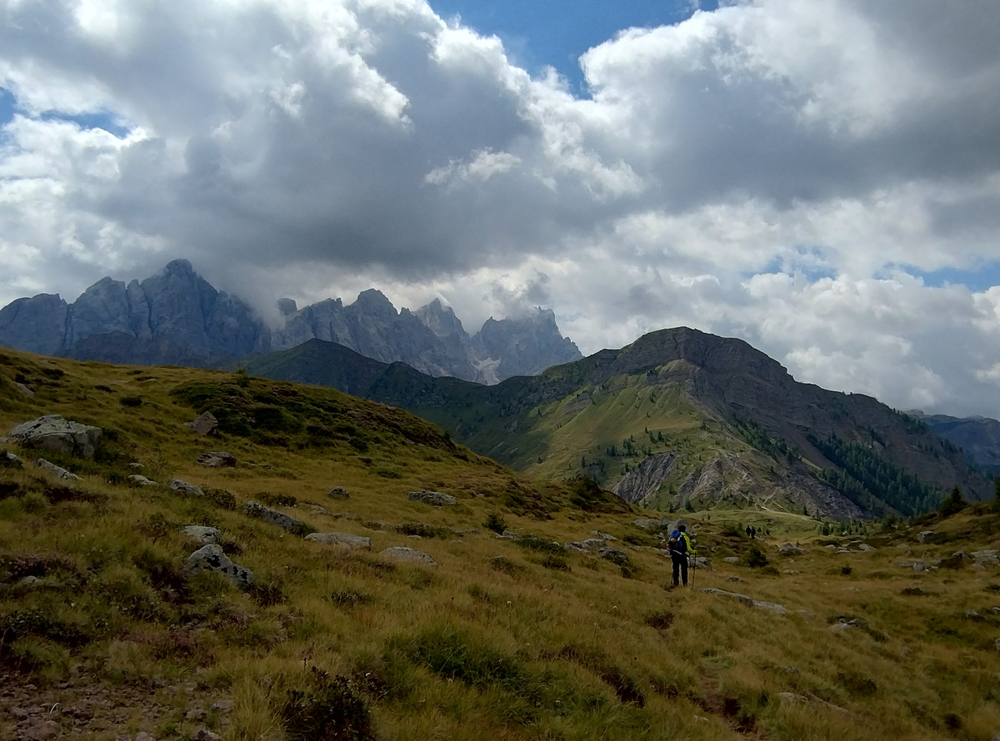
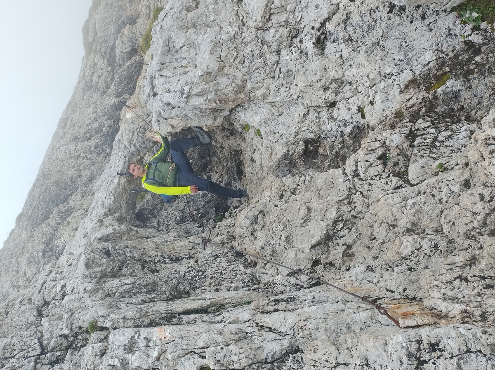

<table style="width: 100%; table-layout: fixed;"> <thead> <tr>
	<th style="text-align: left"> <a href="../day4">← Day 4</a> </th>
	<th style="text-align: center"> <a href="../">Alta Via 2</a> </th>
	<th style="text-align: right"> <a href="../day6">Day 6 →</a> </th>
</tr> </thead> </table>

# Day 5 - Entering the Pala group

<em>August 24, 2025</em>

## Route of the day

<strong>Click to see map</strong>

*Download the [gpx file](../gpx/av2-day5.gpx) or see the route on
[outdooractive.com](https://www.outdooractive.com/en/route/hiking-trail/province-of-belluno/-2025-alta-via-2-day-5/325542248/?share=%7E3zdmwhgp%244ossqbdb)*

## Back on track

<em>
This photo is the same at the last one of the previous day,
but it is one of my best shots. It is also quite fascinating how the light
at dawn mixes up all the colors compared to previous day's picture.
</em>

After a long sleep, we are ready to leave Flora Alpina at 8:20. Our
first checkpoint is the
[San Pellegrino Pass](https://en.wikipedia.org/wiki/San_Pellegrino_Pass),
(1918 meters on sea level) which is unfortunately a bit farther away than
it would have been if we slept in Fuciade.

It takes us about one hour to reach the pass. On the way we saw a cow
breastfeeding her calf, which was cute. We cross the main road on the pass,
and from here we have to walk up on grassy slopes and ski paths. The
signs point to a path that is not the one we planned, but the two tracks
join shortly afterwards. The ski paths are extremely steep, but wide,
so we can easily zig-zag all the way up.

At 10:30 we reach the *Pale di Gargol* (2218m), a plane that I am not
sure why deserves a name. Perhaps the name refers to the whole area
which I guess could be described as a rocky meadow.

<em>
The Pale di Gargol. The term "pala" means "shovel" in Italian,
but according to the
<a href="https://it.wikipedia.org/wiki/Pale_di_San_Martino#Il_toponimo">
Italian Wikipedia page</a> about the
<a href="https://en.wikipedia.org/wiki/Pala_group">Pale di San Martino</a>
mountains, in the local language it once denoted a grassy slope at the
feet of a mountain range.
</em>

Once again, the landscape has changed to show us something completely
different from that we have seen so far. The constant shifting from rocks,
to forest, to grass, to yet other types of rock and any combination of
those features is in my opinion one of the most fascinating aspects of
Alta Via 2.

<em>Walking down to Passo Valles.
In the background, the Pale di San Martino.</em>

The trail continues almost flat in this unusual scenery until we
descend to [Passo Valles](https://it.wikipedia.org/wiki/Passo_Valles) (2032m)
at around 11:50. We are now entering the fascinating section of
the *Pale di San Martino*, also known in English as the
[Pala group](https://en.wikipedia.org/wiki/Pala_group), of which
the Mulaz and the Focobón group are the northernmost peaks.

But first we need a break. We stop at a bar on the pass for a coffee
and a slice of strüdel.

## Veneggia, Venegiotta and Pass dei Fochet

We leave the pass at 12:20, and in half an hour we reach Forcella
Veneggia (2217m). The view opens up to the wild valley in the south.

<em>The view from Forcella Veneggia.</em>

So far, the day has not been particularly challenging. Later on
we'll have to pass some difficult sections, but for now we continue
on some easy, if narrow, trails.

Despite the beauty of the place, we don't meet many other hikers.
In fact, I think we saw more marmots than people in this part of
the route.

At around 14:00 we reach *Passo Venegiotta* (2300m), and about 30 minutes
later *Passo dei Fochet* (2291m). The weather has been good today so far,
but here a strong cold wind starts blowing, and we can feel a few drops
of rain.

## Through the rocks, to Rifugio Mulaz

The landscape changes once again. We are now walking on rocks and gravel.

We walk down a scree to around 2175m, before starting to climb up again.
It's cold and cloudy, and this part of the trail is a fair bit more
difficult than the previous. Nothing particularly hard or dangerous,
but we have to pay more attention to where we put our feet.

The trail abruptly becomes extremely steep, and very demanding on my
muscles, which so far had been enjoying a more relaxing day.

<em>
Some steel ropes help make the climb to Rifugio Mulaz less dangerous.
</em>

We reach Rifugio Mulaz (2570m) at 16:40, after a little more
than 8 hours from when we left Flora Alpina. Somehow, despite the
long walk between them, both these places are in the territory of
[Falcade](https://en.wikipedia.org/wiki/Falcade).

<em>Reaching Rifugio Mulaz</em>

From this hut, the only landscape you can see, in any direction, is naked
rock. There is a tiny window from where you can see a valley, but the
sight is cut out and the only visible thing is more rocks.  Definitely
fascinating, although I personally prefer more varied landscapes.

I'll add a picture on the next day's page, the early morning light
was much better.

Oh and by the way, up here every resource is very scarce. There is
no drinkable tap water, and showers cost 8€ for 5 minutes. But I
really need one today.

<table style="width: 100%; table-layout: fixed;"> <thead> <tr>
	<th style="text-align: left"> <a href="../day4">← Day 4</a> </th>
	<th style="text-align: center"> <a href="../">Alta Via 2</a> </th>
	<th style="text-align: right"> <a href="../day6">Day 6 →</a> </th>
</tr> </thead> </table>

