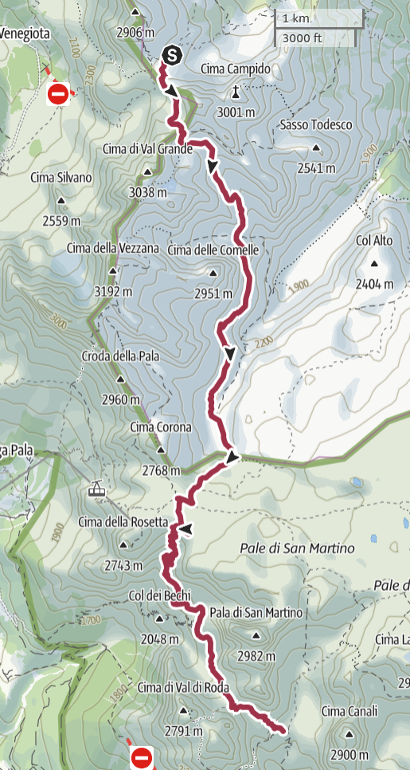

# Day 6 - The Farangole trail

|[← Day 5](../day5)|[Alta Via 2](../)|[Day 7 →](../day7)|
|:-|:-:|-:|

*Download the [gpx file](../gpx/av2-day6.gpx) or see the route on
[outdooractive.com](https://www.outdooractive.com/en/route/hiking-trail/province-of-belluno/-2025-alta-via-2-day-6/325542632/?share=%7E3zdmb4fp%244ossqbdc)*

## The starry night

During the night I woke up and managed to catch a glimpse of a wonderful
starry night, the likes of which I have never seen before.

If you live in a place with a lot of light pollution, like every medium
to large city nowadays, seeing *a few* stars may already be an unusual
experience.  At the moment I live in a fairly small city, and we literally
never see stars over here. We are lucky if we see Venus once in a while.

But I grew up in a small village in a sparsely populated area, I *was*
used to seeing skies full of stars at night. But this time, at 2500
metres above sea level, in the middle of literally nowhere, the sky was
soething else.

I did not manage to take a good picture, sorry. I did not feel like going
out in the freezing cold.

## The Farangole pass

At Rifugio Mulaz, the sun rises at 6:40 and sets at around 7:05.
In the morning. Luckily for you, I got up early enough to catch
the sunset.

*Rifugio Mulaz is closely surrounded by high mountains.  This is the only
spot where you could see something in the distance.  The sun rises from
the peaks on the left of this picture, only to hide away behind those
on the right shortly afterwards.*

It's a beautiful day, if only a bit cold. This time we get up earlier than
usual and we are ready to leave at 7:15. The main challenge of the day
is going to be the *passo delle Farangole* (2932 meters on sea level),
a high mountain pass not far from the hut. Our guide book even suggests
a possible alternative route for less confident hikers, but we believed
it to be within our capabilities.

After steep, but short, climb to *Forcella Margherita* (2655m) we reach a
section of the trail that would not be particularly challenging, it was
not for the fact that the track is not well marked.

*The trail after Forcella Margherita, right before the Farangole pass.*

In fact, the traces of the hikers who missed the path are *more* visible
than the actual trail, likely because said hikers made them more clear
by backtracking their steps when they realized they were out of the
trail. We do the same a couple of times.

We soon reach the start of the equipped trail that leads to the pass,
but I am not convinced and I decide to try climbing up the scree next
it. This was probably a mistake, so we soon turn left and attach our
trusty ropes to the steel supports.

*Climbing up to the Farangole pass.*

The track is very steep, and at times
[exposed](https://en.wikipedia.org/wiki/Exposure_%28heights%29), but the
steel ropes and the other supporting material is in a good state.
Overall, this famous Farangole pass is easier than we expected.

*And down we go. The steel ladder looks like it ends in the void,
but actually there is an extra steel beam protruding from the
rock, and after that there only a 60cm drop.*

After clearing the pass at around 9:00, we feel satisfied and proud of
ourselves. My knee does not even hurt anymore.

Little did we now that the truly difficult part is the Farangole *trail*,
which we'll have to go through later this morning.  But for now, in our
blisfful ignorance, we enjoy the beautiful weather and we take plenty
of pictures as we walk down from the pass.

*The view North, towards the mountains we have just passed.*

*An imposing rocky plateau on the South.*

*The view to the North-East.*

## The Farangole trail

As the trail gets tight and very exposed, we realize that maybe
*this* is the section the guide book was warning us about. We
proceed carefully, attaching our home-made harness when a steel rope
is available. Unfortunately, most of the trail is on a narrow ledge
surrounded by grass and soft soil, where no piece of supporting material
can be fixed. At least it is not wet.

*My dad walking on a narrow section of the Farangole trail.*

*Another hiker following us on the same trail.*

Since this trail is challenging and dangerous, we have to keep
constant focus on our steps and the way ahead of us. We have little
time to relax and enjoy the beautiful view, and we take much fewer
pictures than we did earlier.

*The view from the last part of the Farangole trail, towards
the East. Soon we'll have to walk down to the dry bed of the
river at the bottom center of this picture. On the left, you
can see the tiny line that is the Farangle trail.*

At 12:30 we reach the bottom of *Valgrande*. We are at
*Pian dei Cantoni* (2310m).

## To Rifugio Rosetta and beyond

TODO

|[← Day 5](../day5)|[Alta Via 2](../)|[Day 7 →](../day7)|
|:-|:-:|-:|
