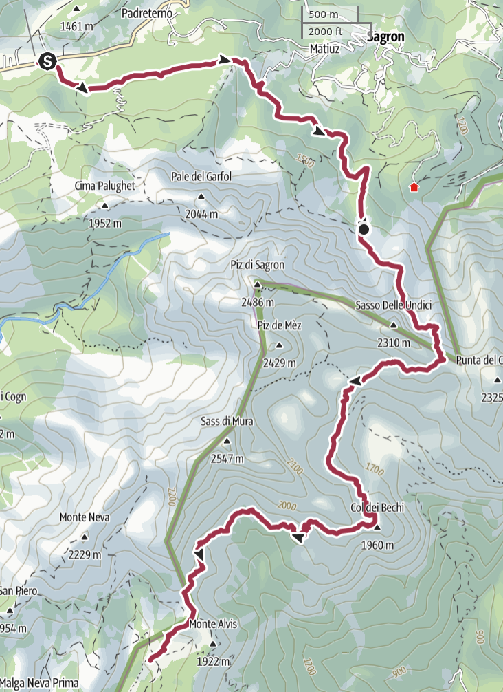

<table style="width: 100%; table-layout: fixed;"> <thead> <tr>
	<th style="text-align: left"> <a href="../day7">← Day 7</a> </th>
	<th style="text-align: center"> <a href="../">Alta Via 2</a> </th>
	<th style="text-align: right"> <a href="../day9">Day 9 →</a> </th>
</tr> </thead> </table>

# Day 8 - The Troi dei Caserin

<em>August 27, 2025</em>

## Route of the day

<strong>Click to see map</strong>

*Download the [gpx file](../gpx/av2-day8.gpx) or see the route on
[outdooractive.com](https://www.outdooractive.com/en/route/hiking-trail/san-martino-di-castrozza-primiero-vanoi/-2025-alta-via-2-day-8/325543034/?share=%7E3zdmeu44%244ossqbdb)*

## A damp morning

Today the final part of Alta Via 2 begins. We are entering the *Vette
Feltrine*, a part that is perhaps less well-known by tourists, but no
less beautiful. The trails we'll have to walk are going to be narrow,
often steep.

The weather forecasts for the day are not great, but we
should reach [Rifugio Boz](https://www.rifugioboz.it/) (1718 meters
on sea level) before it starts raining. For now there is just a thick fog,
and the weather is unpleasantly hot and humid.

<em>Our last sight of Rifugio Cereda and the Pala Group.</em>

We leave at 7:45. At first we walk on a secondary paved road, then on
a dirt road.  Both my guide booklet and the signs try to make us walk
downhill towards the nearby villages of Matiuz and Padreterno, but there
is a clearly faster road that stays in the forest and leads to the
start of the actual trail.

<em>
The top sign is marked as "AV2", for Alta Via 2. There is a gap that
was probably filled by a sign pointing left, which is the way we took.
I suspect someone - perhaps the local forest authorities - removed
the sign because they did not want people to go that way, but I
can't imagine why. Or perhaps the sign simply fell off.
</em>

After about one hour of walk in the forest, the actual trail begins.
The humidity is very intense, still unpleasant. Unfortunately this also
means that the pictures of the day are very... foggy.

<em>The valley behind us, in the fog.</em>

## L'Intaiàda

The trail becomes steep, and then extremely steep. We walk along
a vertical wall of granite, where a narrow passage is carved out.
Indeed, this part of the trail is called *L'Intaiàda*, which
can be roughly translated as *The Carved-Out*.

<em>Admittedly not the best picture of L'Intaiàda.</em>

The trail continues, narrow and exposed, but well equipped with some
sturdy metal ropes where needed. It requires some attention, but I don't
find it scary or particularly difficult; there is always some rock or
support piece I can hang on to rest while I think about the next steps.

<em>Another section of L'Intaiàda.</em>

The trail continues very steep, and at 12:05 we reach the *Pass del
Comedon* (2130m).

<em>View from the pass.</em>

## A quick break at Bivacco Feltre

From the pass we walk down an extremely steep trail, initially very
exposed, then less scary.

My left knee has been doing well so far, but suddently I feel an acute
sting of pain that almost makes loose my balance. This is not good. It
is also very different from the constant, mild to moderate pain that I
have felt when walking downhill in the past few days. But I push through,
slowly and steadily.

The fog becomes even thicker, at times we can't see much farther than
20-30 meters.

<em>We are close to Bivacco Feltre, but we can't see it.</em>

For a brief moment I catch a glimpse of *Bivacco Feltre* (1930m), a
[sheet metal shelter](https://en.wikipedia.org/wiki/Bivouac_shelter)
where hikers can wait for the bad weather to subside, or spend the night
in case of need.

<em>Bivacco Feltre.</em>

We reach the bivouac at 13:05, and we decide to take a break. We eat
a protein bar and refill our water bottles. Unfortunately, we can see
literally nothing besides the meadow around us, and the fog.

<em>
Our view from Bivacco Feltre. The guide book describes the place
as "pleasant and majestic". I guess I'll have to trust them on this one.
</em>

We need some rest, but we don't want to wait for too long. The journey
is still long, and if we don't reach our destination before 17:00 we
will probably be caught by the forecasted thunderstorm. We leave the
bivouac at 13:30.

## The Troi dei Caserin

From the shelter we walk down, loosing about 200 or 300 meters of
altitude. We quickly gain them back, as the trail continues upwards.
The fog is still very thick, we can't see further than 10m.

The trail so far is not particuarly hard, but there are some interesting
passages where we have to cross some waterfalls and some small water
streams.  Or maybe I found them interesting only because my bad knee
prevented me from pushing with my left leg and I had to make some complex
alternative manouvers.

At 14:50 we reach *Col dei Bech* (1960m), which means *Ibex' hill*.
And in fact, just after Cold dei Bech, in one of the rare moments when
the fog let us see at more than 15 meters, we did see a small family
of chamois.  Ok, not quite ibex, but close enough.  Judging from the
quantity of warm shit that we saw on the trail, they had probably walked
right ahead of us for a while.

We continue on this trail that becomes increasingly narrow and exposed,
difficult in some sections. We are on the *Troi dei Caserin* ("the
Caserins' trail").

There are some steel ropes in the most dangerous parts, but not for
long: soon we reach a grassy section, and the trail becomes ever
more narrow. On our left, the emptiness of a hundred-meters free fall is
hidden by the fog. My aching knee makes everything even more challenging.

We did not take many pictures of this part of the journey, mainly because
we were focusing on keeping our feet on the ground. Apparently, my dad
and I walked this same trail some 15 years ago, when it was covered in
half a meter of snow. And I say apparently because, even though we both
remember that trip quite well, we have no recollection of taking such a
dangerous path in those conditions. But there is no alternative road,
so we must have done it... somehow.

At 16:45 we reach *Pass de Mura* (1867m). The view opens up, but we
can't quite see our destination yet.

<em>
You see the tiny building down there? It is not Rifugio
Boz, but Malga Neva. Luckily for us, the Rifugio is closer than that.
</em>

We walk down from the pass and we reach [Rifugio
Boz](https://www.rifugioboz.it/) (1718m) at 17:05. Just as we walk
through the door, a strong storm begins.

## At Rifugio Boz

We are tired, hungry and our muscles are sore. As we check in, the hut
manager asks us if we are walking the Alta Via. We respond that yes,
we are, and tomorrow we will be going all the way to [Rifugio Dal
Piaz](https://www.rifugiodalpiaz.com), and we'll finally walk down
victorious to Croce d'Aune in the evening.

"Are you sure about that?" - she says.

"Why?" - we ask, not sure if she was joking or not.

"Have you seen the weather forecast?"

<table style="width: 100%; table-layout: fixed;"> <thead> <tr>
	<th style="text-align: left"> <a href="../day7">← Day 7</a> </th>
	<th style="text-align: center"> <a href="../">Alta Via 2</a> </th>
	<th style="text-align: right"> <a href="../day9">Day 9 →</a> </th>
</tr> </thead> </table>

