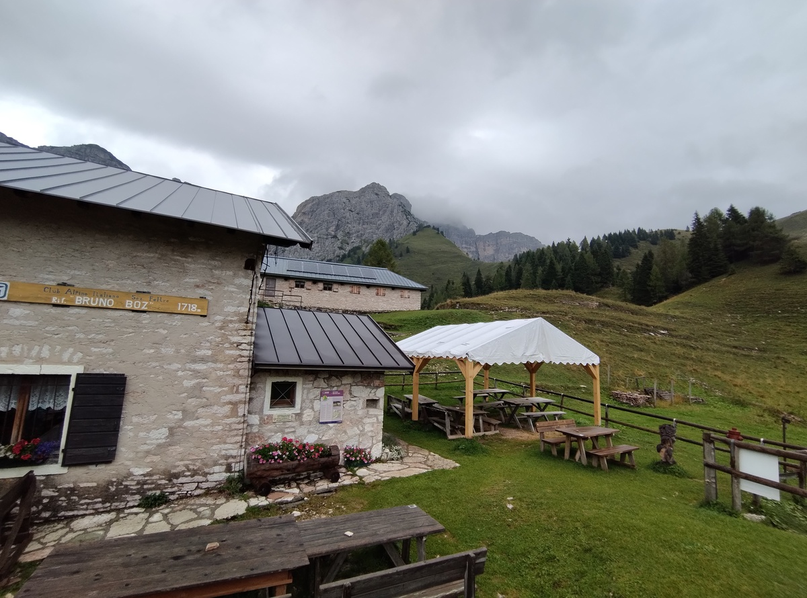

<table style="width: 100%; table-layout: fixed;"> <thead> <tr>
	<th style="text-align: left"> <a href="../day8">← Day 8</a> </th>
	<th style="text-align: center"> <a href="../">Alta Via 2</a> </th>
	<th style="text-align: right"> <a href="../after">After the hike →</a> </th>
</tr> </thead> </table>

# Day 9 - Cutting it short

<em>August 28, 2025</em>

## Route of the day

<strong>Click to see map</strong>

*Download the [gpx file](../gpx/av2-day9.gpx) or see the route on
[outdooractive.com](https://www.outdooractive.com/en/route/hiking-trail/province-of-belluno/-2025-alta-via-2-day-9/325543151/?share=%7E3zdmfdkz%244ossqbdb)*

## An inevitable decision

The last leg of the Alta Via 2 is long, challenging and dangerous.
Most of the trail is on top of a ridge, exposed on both sides, and strong
winds are frequent.

And in the afternoon of August 28, the last day of our Alta Via 2, there
are going to be strong thunderstorms. The manager at Rifugio Boz told
us "I have walked this trail many times, but with a weather like this,
I would never dare".

We are prepared and experienced, but we are powerless against the forces
of nature. We give up. On August 28, the last day of our Alta Via 2,
we are not going to Rifugio Dal Piaz, or to Croce d'Aune. We are going
down a safer trail, in the forest of the
[*Val Canzoi*](https://www.dolomitipark.it/en/visiting-the-park/itineraries/on-foot/nature-trails/val-di-canzoi/),
and we are going to conclude our adventure half a day earlier.

## From Rifugio Boz to Malga Alvis

<em>Rifugio Boz with the
<a href="https://en.wikipedia.org/wiki/Sass_de_Mura">Sass de Mura</a>
in the background.</em>

We leave the hut at 7:35. The are two ways to walk down to Val Canzoi:
either we climb up to *Passo Alvis*, or to *Passo Finestra*. We
choose the former, as the trail that comes down from Passo Alvis
ends close to a bar where we can wait for someone to pick us up.

<em>We walk together with other 3 hikers to Passo Alvis.
We are not the only ones who decided to cut the Alta Via short.</em>

The weather is not bad for now. There are clouds, but it is not raining.
But the afternoon storm is going to be massive.

At 7:55 we are up to Passo Alvis (1880 meters on sea level). From there,
we only need to go down another 1000 meters. We can't quite see the
bottom of the valley, but we do see the back of the main mountains that
are also visible from our home.

<em>The view from Passo Alvis. In the back, partly hidden by the
clouds, you can see the <a href="https://en.wikipedia.org/wiki/Pizzocco">
Pizzocco</a>,
the main mountain that rises above our home town. We are coming home!</em>

We walk down from the pass. The descent starts steep, but the trail is
not difficult. We see one last family of chamoix, running away from us.

At 8:40 we reach Malga Alvis (1573m).

<em>Malga Alvis.</em>

It starts raining. We take shelter inside the malga. The building
is not used for its original purpose anymore, but it is maintained
by the local natural park administration as a bivouac for hikers.
Some 15 years ago, in a cold late April, my dad and I spent the night
here before continuing our hike the following day.

## Down to the valley, one last time

Luckily the rain stops soon, and the five of us can continue our march.
The *Lago della Stua* is now visible.

<em>Lago della Stua in Val Canzoi.</em>

We keep going down. My knee starts hurting again, but we are almost there.
Overall I enjoyed this last part of the journey. The trail in this
mid-mountain forest is exactly the kind of road that I used to walk a
lot years ago, when I frequently hiked around these mountains.

Our adventure ends at 10:40, on the dam of the lake.

We reach the nearby bar, we sit down, we drink a
[spritz](https://en.wikipedia.org/wiki/Spritz_(cocktail)).

<table style="width: 100%; table-layout: fixed;"> <thead> <tr>
	<th style="text-align: left"> <a href="../day8">← Day 8</a> </th>
	<th style="text-align: center"> <a href="../">Alta Via 2</a> </th>
	<th style="text-align: right"> <a href="../after">After the hike →</a> </th>
</tr> </thead> </table>

