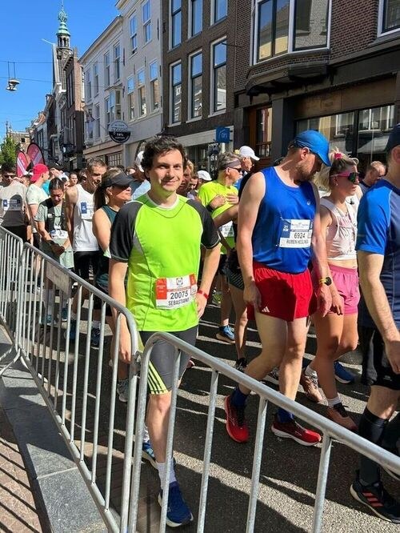
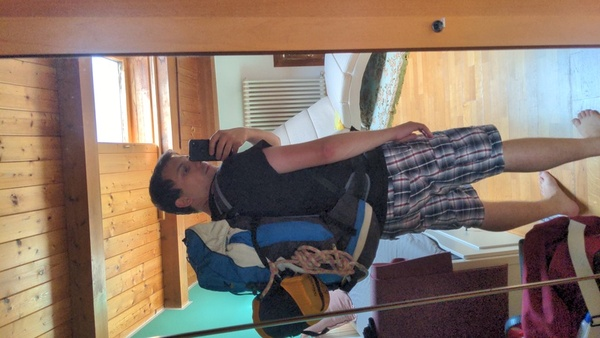

<table style="width: 100%; table-layout: fixed;"> <thead> <tr>
	<th style="text-align: left">  </th>
	<th style="text-align: center"> <a href="../">Alta Via 2</a> </th>
	<th style="text-align: right"> <a href="../day1">Day 1 →</a> </th>
</tr> </thead> </table>

# Preparation

Alta Via 2 is not a hike one can do without planning. Obviously, one must
be sufficiently trained - though advanced climbing skills are generally
not needed, walking on steep mountain trails for multiple days requires
some experience and a decent condition. But there is also the logistics
side of things: Where are you going to sleep? How many clothes are
you bringing?  Do they all fit in your backpack? And what if it rains?

## Training

We started planning this hike about a year in advanced, so we had
plenty of time to train for it. Unfortunately, since I now live in
the Netherlands, I could not practice by actually walking in mountain
trails. My dad was luckier, because there are plenty of physically
demanding trails that start just a few minutes drive away from where
he lives.

So I replaced the actual hiking with two types of training: long-distance
running and leg muscle exercises.

For the running part, I went for 6-12km runs twice a week more or less
regularly. This is something I enjoyed regardless of my goal of training
for the hike; I even took part in a local half-marathon run.

<em> At the starting gate of the <a
href="https://marathon.nl/">Leiden half marathon</a>.  Two hours and
six minutes later, I am not going to be smiling like that.  </em>

The gym part was less entartaining for me, I never liked exercising
indoors.  But I managed to train somewhat consistently for 15-30 minutes
once or twice a week. My exercises included squats, side planks, one-leg
push-ups and the like. Boooring.

With all of this I was quite confident I was going to be in good shape
for the hike. I was more worried about the logistics...

## Planning the route

Most sources (including the one I followed, a red booklet that I
can't find online, but whose content is mostly summarized in [this
website](https://www.altavia2dolomiti.com/percorso)) suggest walking
Alta Via 2 in 12 or 13 days. But this way some of the days consist
of less than 5 hours of walking. On the other hand, well-trained hikers
can complete the whole route in 7 days or less. We decided that 10
days would be a good middle ground for having a fun and intense hike
without overdoing it. In hindsight, this was a good plan, but I don't
think I would have minded some of those short walking days.

For multiple reasons, we decided to sleep in huts rather than camping.
Since these regions tend to be quite popular with turists, we decided to
book our accommodations early on.  We started booking in May, thinking
it would be early enough, but it was not - at least not the for part in
[Südtirol](https://en.wikipedia.org/wiki/South_Tyrol).  None of the
huts in our first two days had any spare bed. We contacted all the
places that were somewhat close to our path, to no avail. In the end we
were forced to squeeze the first 3 days into 2, and make a long detour
to reach a nearby village to sleep in a B&B on our first night.

The rest of the route followed largely the border between
[Trentino](https://en.wikipedia.org/wiki/Trentino) and the [province of
Belluno](https://en.wikipedia.org/wiki/Province_of_Belluno), and it was
easier to find accommodation there.  fine. Not every hut in our original
plan was available, but we could always find good alternatives nearby.

Our final plan was the following:

||Start|Finish|Up|Down|Distance|
|:-|:-:|:-:|:-:|:-:|:-:|:-:|
|[Day 1](../day1)|[Kreutztal](https://en.wikipedia.org/wiki/Brixen)|[Lungiarü](https://en.wikipedia.org/wiki/Lungiar%C3%BC)|1050m|-1620m|22.1km|
|[Day 2](../day2)|[Lungiarü](https://en.wikipedia.org/wiki/Lungiar%C3%BC)|[Rifugio Pisciadù](https://www.rifugiopisciadu.it/)|1820m|-690m|19.0km|
|[Day 3](../day3)|[Rifugio Pisciadù](https://www.rifugiopisciadu.it/)|[Rifugio Fedaia](https://www.rifugiofedaia.com/)|760m|-1310m|18.0km|
|[Day 4](../day4)|[Rifugio Fedaia](https://www.rifugiofedaia.com/)|[Rifugio Flora Alpina](https://floralpina.it/)|1030m|-1290m|17.4km|
|[Day 5](../day5)|[Rifugio Flora Alpina](https://floralpina.it/)|[Rifugio Mulaz](https://www.prenotarifugi.cai.it/en/detail/?id=5769)|1160m|-410m|17.6km|
|[Day 6](../day6)|[Rifugio Mulaz](https://www.prenotarifugi.cai.it/en/detail/?id=5769)|[Rifugio Pradidali](http://www.rifugiopradidali.com/pradidali/Home.html)|890m|-1160m|12.4km|
|[Day 7](../day7)|[Rifugio Pradidali](http://www.rifugiopradidali.com/pradidali/Home.html)|[Rifugio Passo Cereda](https://www.rifugiocereda.com/)|1110m|-2000m|17.1km|
|[Day 8](../day8)|[Rifugio Passo Cereda](https://www.rifugiocereda.com/)|[Rifugio Boz](https://www.rifugioboz.it)|1210m|-860m|12.8km|
|[Day 9](../day9)|[Rifugio Boz](https://www.rifugioboz.it)|[Croce d'Aune](https://en.wikipedia.org/wiki/Croce_d%27Aune)|800m|-1500m|20.0km|

For the first and last days, the plan was to have someone bring us there
and pick us up, so we spent only 8 nights out. We did not realize at
the time, but this plan gave us a nice balance between high mountain
huts (for the real mountaineering experience) and proper hotels
(for better comfort). Confusingly, both the huts and the hotels
were also called *rifugio* (or *hütte* in German, or *utia* in
[Ladin](https://en.wikipedia.org/wiki/Ladin_language)).

## Packing up

You may find it silly, but fitting all the necessities in our backpacks
was the part of this adventure that I was most worried about. We were
going to hike for 9 days, but clearly we could not pack 9 sets of clean
clothes; that alone would almost fill our backpacks. And it's not just
t-shirts and underwear, we needed warm and waterproof clothes, too. And
what about food? The huts served dinner and breakfast, but we definitely
needed something to eat throughout the day.

In the end, this is what we packed:

### Hiking gear

* Hiking boots.
* [Hiking sticks](https://en.wikipedia.org/wiki/Trekking_pole), similar
  to [nordic walking](https://en.wikipedia.org/wiki/Nordic_walking)
  poles, but they are usually kept shorter. They help pushing when going
  up and keep you stable when you walk down.
* A simple harness consisting of a strong rope with a
  [carabiner](https://en.wikipedia.org/wiki/Carabiner), to be
  used for the occasional *equipped trails* (think of a [via
  ferrata](https://en.wikipedia.org/wiki/Via_ferrata), but easier).
* Two water bottles (0.5L + 1L). The smaller one was a thermos-like bottle,
  but I ended up never filling it with hot water or tea.
  It would have been better to just bring two lightweight plastic bottles.
* Maps: [Tabacco](https://www.tabaccoeditrice.it/en/home-english/)
  maps number [30
  (Brixen-Villnössertal)](https://www.tabaccoeditrice.it/en/cartografie_en/125000-coast/030_en/),
  [6 (Val di Fassa e Dolimiti
  Fassane)](https://www.tabaccoeditrice.it/en/cartografie_en/125000-coast/06_en/),
  [22 (Pale di San
  Martino)](https://www.tabaccoeditrice.it/en/cartografie_en/125000-coast/022_en/),
  plus an older map of the same brand for the Feltre area, that
  followed a different numbering scheme. We also had offline maps from
  [OpenStreetMaps](https://www.openstreetmap.org/#map=12/46.5905/11.7540)
  on our phones - we used [Organic Maps](https://organicmaps.app/) and
  [Mapy](https://mapy.com) as clients - but a paper backup is always
  convenient, especially because of the size: it is much easier to read
  a large map than to look at one on a 6" screen. The Tabacco maps were
  also more accurate in some specific parts, because they included
  codes for describing each trail's type or difficulty.

### Clothes

Most of the clothes we brought with us were made of some synthetic fabric
that was extremely lightweight and quick to dry up.

* 4 T-shirts (2 or 3 would have been enough).
* 4 pairs of underwear (again, 2 or 3 would have been enough).
* Zip-off hiking trousers that could be converted to shorts (but
  I ended up almost always using them in trouser form).
* A full set of "normal" clothes (underwear, socks, T-shirt, shorts) that
  I used only in the huts.
* A lightweight hoodie that somehow kept me warm amazingly well. I used
  it for any temperature between 2°C to 20°C, as it did not feel
  uncomfortable when it was too hot, as a regular hoodie would.
* A regular cotton hoodie that never used.
* Slippers.
* A baseball cap.
* A rain poncho. I did not like wearing it, because it made me sweat a lot
  and I ended up getting wet anyway. But in ceratin moments it was necessary.
* Rain trousers. In the end I never used them, my regular hiking trousers
  were somewhat waterproof, and the rain poncho covered all the rest.
* Gloves. Temperatures reached close to 0°C, and having your hands wet
  with strong winds at near-freezing temperatures is not fun.

### Food and medicine

* The only food we pack were protein bars. We brought 3 bars per person per
  day, but this was way too much. I ended up eating one ~100g bar per
  day on average, because we were often able to grab some food (like a
  slice of [*Strüdel*](https://en.wikipedia.org/wiki/Apple_strudel))
  in the huts we walked by during the day.
* Energy tablets. Some quick energy boost,
  they were mostly vitamins with some caffeine.
* Plasters, both regular ones and
  [blister platers](https://en.wikipedia.org/wiki/Compeed).
* Painkillers and other basic medicine.

### Other stuff

* Sleeping bag. A very light one is enough, since every hut provided heavy
  blankets, but not linens, and guests have to bring their own.
* One towel, [the most thing to
  bring](https://en.wikipedia.org/wiki/The_Hitchhiker's_Guide_to_the_Galaxy).
* Soap, toothbrush and toothpaste.
* Wet wipes.
* Wallet, phone, phone charger and a power bank.
* A small planner and a pen, to keep a journal of the trip.

At 12kg water included, the backpack is quite heavy. I could have saved a
couple of kilos, but in the end we used almost everything that we brought.

<em>Ready to go!</em>

<table style="width: 100%; table-layout: fixed;"> <thead> <tr>
	<th style="text-align: left">  </th>
	<th style="text-align: center"> <a href="../">Alta Via 2</a> </th>
	<th style="text-align: right"> <a href="../day1">Day 1 →</a> </th>
</tr> </thead> </table>

