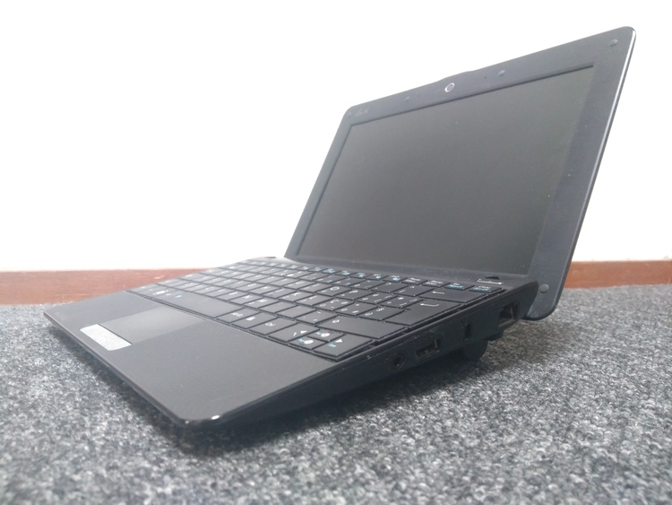
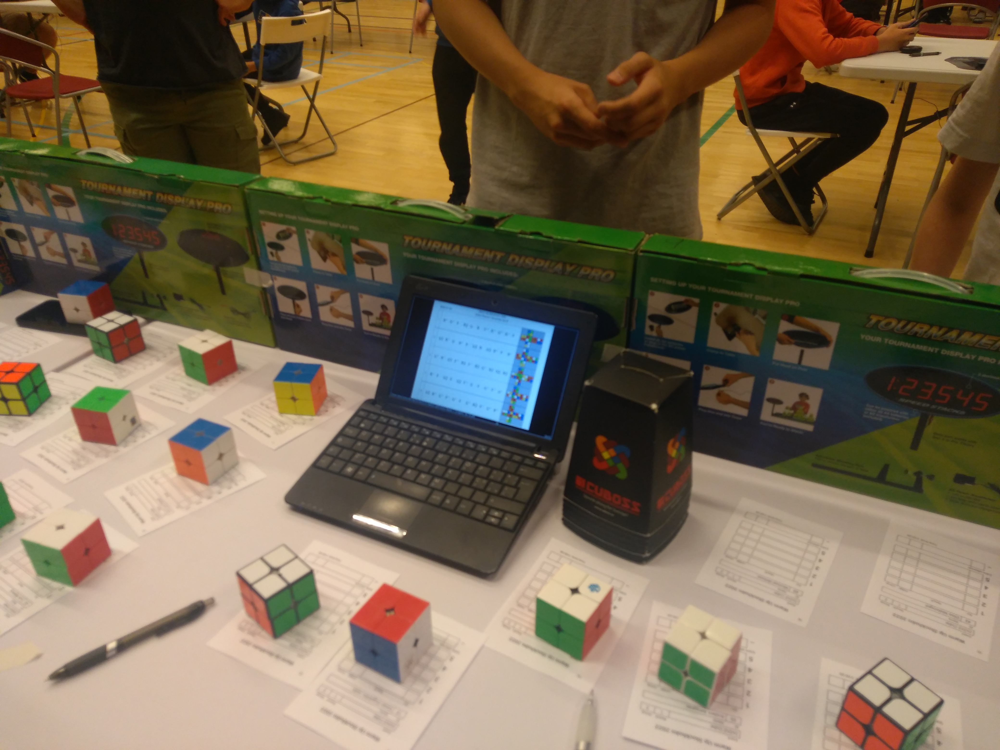

# Long live netbooks!

[*Netbook*](https://en.wikipedia.org/wiki/Netbook) was a term used
around 2010 to describe small laptops. They could be anywhere from 8"
to 11" in screen size. One of the most popular lines of netbooks were the
[Asus eee PCs](https://en.wikipedia.org/wiki/Asus_Eee_PC).

The appeal was clear: you could bring this tiny computer around and take
advantage of any free wifi connection - be it on a train, in a pub or
at school - to surf the web.

Netbooks had an unfortunate destiny for at least two reasons. Firstly,
laptop technology was not at a point where you could have a small,
relatively powerful and cheap device all in one. Most netbooks were
underpowered and struggled to run Windows out of the box. Secondly,
smartphones and tablets, that came out very shortly after, quickly
overtook the netbooks' market share and sent them to oblivion.

This post is going to be in two parts: first I want to talk about the
netbook I got in 2010 and how it turned out to be useful in 2022. The
second part is going to be a list of steps I took to set it up after
re-installing OpenBSD on it.

## Part 1: My "darkstar"

### In the 2010's

Back in 2010, when I was in high school, I started going on 4-5 days long
trips about once every two months or so. I did not have a laptop, only a
desktop PC, so my mother thought it was a good idea to get me a netbook.
She chose an Asus 1001px, a very standard 10" netbook.  It was in many
ways un unremarkable machine, with 1Gb of ram a weak dual core CPU. But
it got its job done.



It ran some Windows monstrosity that I did not dare touching (was it
Vista or 7?). I immediately installed Linux on it. My favorite distro
at the time was [Slackware](http://www.slackware.com/), but I decided
to try out Arch on this one. I used the hostname *darkstar*, because
it was the default on my favourite distro and it fit nicely with it's
black plastic. I have used that name for this laptop on every other OS
I installed on it ever since.

Arch Linux was a bad choice: since I would use this netbook only once
every two months, every time I updated it something broke. Or, as an Arch
fanboy would say nowadays, "something required manual intervention". At
some point I got rid of Arch and installed Slackware.

I also used it without problems at the beginning of university, in 2013,
but after a few months I bought a more powerful 15" regular laptop.
All in all I have not used my darkstar much, but it was a useful tool.

### Distro hopping in 2020

When the first lockdowns came in March 2020 I had decided to use my
netbook for some little experiments. Nothing crazy, just trying out some
distros and play around with them - had *distro-hopped* since 2011 or so.

I installed [Alpine](https://www.alpinelinux.org/) first. It was fine,
but the lack of man pages by default did not amuse me. Then I tried
[Void](https://voidlinux.org/), that I ended up installing on my main
laptop later that year and I am still using as my main OS to this day.
Finally I decided to try something different and went with OpenBSD.

### Backpacking in 2022

Earlier this year I traveled around Europe for a couple of weeks,
mainly to attend the
[Rubik's Cube European Championship](https://www.worldcubeassociation.org/competitions/Euro2022)
and other events.  I wanted to travel with just a backpack, no suitcase,
and my main laptop is quite large and heavy. I did not want to rely on
my smartphone alone, so I thought that carrying around my old netbook
could be a good compromise.

I kept OpenBSD, because I figured I would mostly use it in tty only, no X,
and the command line utilities seem more polished and cohesive on
OpenBSD than on Linux. Using something like Firefox was doable in case
of emergency, but definitely not a pleasant experience. Some things
like streaming videos from YouTube were completely impossible -
but there were workarounds like using
[yt-dlp](https://github.com/yt-dlp/yt-dlp).

I decided to buy a larger battery, that also made it stand a bit taller,
kinda like a typewrite, and some extra RAM - I maxed it out at 2Gb, it
cannot handle more. Since the hard drive was not easily accessible without
taking apart the whole thing, I did not upgrade to an SSD drive at first.
I was afraid of not being able to detach and re-attach the keyboard and
touchpad connectors without damaging them.

My little netbook turned out to be more useful than I thought: the
organization team at a cube competition I attended during that trip was
short on laptops, and mine was perfectly capable of displaying pdf files.
The fact that there was no file manager installed made it a bit hard
for other people to operate it when I was not around, but in the end we
managed to use it.



After the trip I kept using it occasionally, as a "sofa laptop". I wrote
a couple of these blog posts on it. Who needs more than 1Gb of ram to
write some Markdown and push it with rsync?

A few weeks ago I changed my mind about the hard drive and tried
disassemblying *darkstar* completely, just to reassemble it and check
that all went well. And it did! So I bought a cheap SSD and used it to
replace the original hard drive.


Of course when putting everything back together I somehow improperly
attached the keyboard, so that it worked in the BIOS but not after boot,
and I also damaged the touchpad connector. Luckily I was able to fix
both these issues.

I was finally ready to install OpenBSD 7.1 on the new SSD.

## Part 2: Installing and configuring OpenBSD

This section is probably more useful for me as a personal note than for
anyone else who might be reading it. Nonetheless I figured people might
be curious, and it does not hurt to publish it here. If you don't care
about it, just skip to the "Conclusion" section at the end.

The whole install process was super simple and took about 6 minutes.
The new SSD drive probably helped a lot here. After the installation of the
base system was completed, I made a few tweaks and added some packages.
I am not one of those cool people who have a git repository with all their
config files and script that put everything into place automatically, I just
do everything by hand. Since I don't reinstall my OS every other day it is
not a big deal.

### Security patches

First I updated the base system by installing the newest security patches
with `syspatch(8)`

```
# syspatch
Get/Verify syspatch71-001_wifi.tgz 100% |********************|  4423KB   00:003
Installing patch 001_wifi
syspatch: updated itself, run it again to install missing patches
```

Ok then, one more time

```
# syspatch
(...)
Errata can be reviewed under /var/syspatch
```

All good now!

### Enabling doas for the regular user

OpenBSD's `doas` is roughly the equivalent of Linux's `sudo`. Unlike `sudo`,
we just need a one-line config file to use it:

```
# echo 'permit persist :wheel' > /etc/doas.conf
```

### Swap caps lock and escape

I like to have the Caps Lock key function as Escape, and vice versa. To have
this in X one can use `setxkbmap -option caps:swapescape`, but for the OpenBSD
console we need to use `wsconsctl(8)`, or to edit `wsconsctl.conf(5)` if we
want to make it permanent:

```
# cat > /etc/wsconsctl.conf
keyboard.map+="keycode 58 = Escape"
keyboard.map+="keycode  1 = Caps_Lock"
^D
```

The change won't happen until we reboot or we issue the
corresponding `wsconsctl` commands.

### Generating ssh keys

Simply run

```
$ ssh_keygen
```

to get a new pair for RSA keys. Using another device (with its own ssh key), I then
copy the public key to my server's `.ssh/authorized_keys` file.

### Installing and configuring syncthing

I use [syncthing](https://syncthing.net/) to share some files and folders
between my devices. It is a nice and flexible piece of software that does
not rely on any centralized service. I use it both to keep important files
synchronized between my main devices and to quickly exchange
data locally between my phone and my laptop (e.g. pictures). One of the
advantages about its decentralized structure is that in the latter case
I do not need an internet connection (nor a cable).

After installing syncthing with

```
# pkg_add -u syncthing
```

I enabled the corresponding service

```
# rcctl enable syncthing
```

I also want it to run as my user instead as the default `_syncthing` user:

```
# rcctl set syncthing user sebastiano
```

Finally, I had to adjust the file descriptor limits. As documented in the
official doc `/usr/local/share/doc/pkg-readmes/syncthing`:

```
Syncthing is fairly hungry for file descriptors and the default limits may be
insufficient. On OpenBSD, Syncthing uses kqueue(2) to "watch" files, and since
kqueue(2) doesn't support recursive watching, each file has be watched
individually. The upshot of this is that each file in a watched folder will use
one file descriptor.

If you run Syncthing via the rc.d(8) script, then you can give
Syncthing more file descriptors by adding the following to login.conf(5):

       syncthing:\
                :openfiles-cur=4096:\
                :openfiles-max=4096:\
                :tc=daemon:

Don't forget to rebuild the login.conf.db file (if necessary):

        # [ -f /etc/login.conf.db ] && cap_mkdb /etc/login.conf

Note that in addition to ulimits, there is a kernel-level file descriptor limit
which may also need to be adjusted. This limit is managed through the
kern.maxfiles sysctl(8).
```

So let's be generous and set these limits very high:

```
# echo "kern.maxfiles=4000000" > /etc/sysctl.conf
# cat > /etc/login.conf

syncthing:\
	:openfiles-cur=1000000:\
	:openfiles-max=1000000:\
	:tc=daemon:
^D
```

I can then configure syncthing using its web-based interface.  To avoid
opening up a full-fledged web browser on this poor little thing, I can
use *ssh port forwarding* from my other laptop:

```
# ssh -N -L 8888:localhost:8384 darkstar
```

(I won't go into detail on this command; `darkstar` is the hostname of my
netbook, `8384` is syncthing's default port for its web-based interface,
`8888` was picked arbitrarily.)

I can then open `http://localhost:8888` from my other laptop to access
my netbook's syncthing configuration and add other devices and shared
folders.

### All the rest

Now all that is left to do is pretty straightforward: install some more programs
(such as a browser, a media player and a pdf reader), copy my config files (e.g.
`.profile`, `.nexrc`) from my shared folder, clone some of my git repos.

Nothing that is worth describing in detail here.

## Conclusion

I like my netbook, and I am glad that I found some practical use for
it even after 12 years.  It's size make it a nice sofa companion, and
its clicky keyboard is just a pleasure to type on - much better than the
mushy one of my main laptop!  It is always a pleasure for me to make good
use of a piece of hardware that most people would consider obsolete and
throw away without thinking twice.

Netbooks were not successful in their time, but I think similar devices
could find their niche today. After all, 13" laptops are quite popular
among the few who actually need one over a tablet or a smartphone. I
am even considering getting an 11" laptop as my next main device - but
of course I would never replace my current one as long as it is working
fine :-)

Long live netbooks!

To conclude, here is a picture of my netbook being used to write this
very post:


