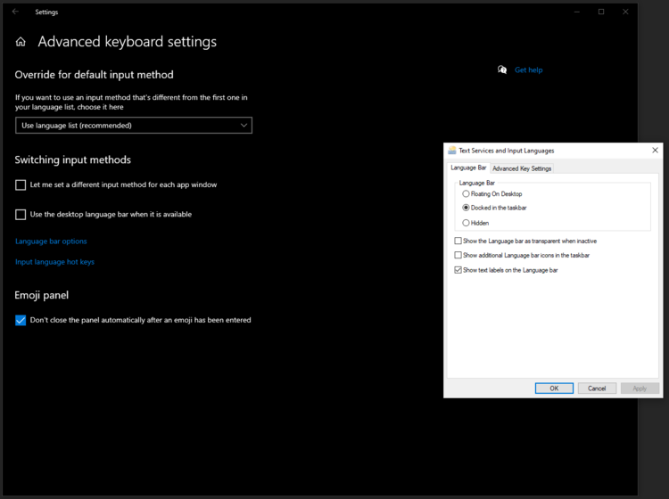

# The year of the Windows desktop

Last year I started a new job, and my company gave me a laptop.
This laptop runs Windows, an operating system I have used in the
past, but that I am not very familiar with.  It is a closed-source
OS, developed by a company called Microsoft, whose main paradigm
is letting the user interact with the system via a
[graphical user interface](https://en.wikipedia.org/wiki/Graphical_user_interface).

I have tried Windows a couple of times in the past, but I never stuck
with it.  Around the year 2000 my family had Windows ME desktop, and a
few years later I have used Windows XP for a while. It was not unusable,
but I have always found it a bit abstruse. Performing basic tasks such
as writing a shell (or *batch*) script or editing a configuration file
was hard or straight-up impossible. Somehow, the system got slower and
slower after a few months of use. And finally, while I recognize
that the closed-source development process has some advantages over
community-driven open source management, I personally prefer to use
things that are libre and free of charge.

But a long time has passed since I have last used Windows, and it would
not be fair to judge Windows 10 based on my sub-par experience with
older versions. In this post I'll review my recent experience with this
operating system and I'll try to answer the famous question: Is 2023
going to be year of the Windows desktop?

## General use 

### Desktop and window management

Let's start with a pleasant surprise: window management is actually
quite good for my taste, much better than I remembered from my ME /
XP times.  Windows now offers virtual desktops, like any classic DE
you are used to.  Moreover, you can move your windows to the edges of
the screen or maximize them with keyboard shortcuts (namely Super key +
arrow keys). You can even do some (manual) tiling:

The desktop looks fairly standard, similar to KDE or Cinnamon: a
bottom bar with some launchers, some status and a menu on the bottom
left. I approve of not changing things when they are not broken, good
job Microsoft!

The start menu now is also searchable by typing, a nice improvement.

### Default apps

There are some default apps installed in Windows, although I can't say
which of them were actually included in Windows and which have been
installed by my organization.

The browser is called Edge, and it is just another Chrome fork. There
is an email client called Outlook, a collaboration / video call app
called Teams and an office suite called Office. In general these apps
work... ok. They are all quite bloated and offer a lot of options.
They have their bugs and glitches (see below), but they do their job.

Honestly I am not impressed by these apps. They don't seem to offer
much more than 20 years ago - except perhaps Teams, which is a recent
addition. I guess users who make extensive use of their office suite
might prefer this, but you'll need a pretty powerful machine to run
these programs smoothly.

As a positive note, the default text editor Notepad is nice and
lightweight, a good piece of software.

### Package management

Traditionally, the only way to install new applications on Windows
was getting them from a third party source (website, CD-rom, ...) and
running an installer. Things are much better now: Windows offers both a
graphical "app store" and a command-line tool called Winget.  There are
also third-party tools such as [Chocolatey](https://chocolatey.org/).

### Bugs and sluggishness

Now let's move on to some of the bad stuff. The system overall feels
quite slow and sluggish. I would normally not complain about it - after
all, not all software is meant to be lightweight and quick, and Windows
is clearly opting for feature richness over speed. However, with a core
i9 CPU, two GPUs and 64Gb of RAM I would have expected better performance.

I have also noticed quite a large amount of small bugs and a few crashes
while doing completely normal operations. They range from minor graphical
glitches, to workflow problems (e.g. windows rearranging in position
when resuming from screen lock, video player freezing until reboot)
to complete crashes. The search feature in the file explorer seems to
be straight-up broken. The list goes on.

All of this is not a deal-breaker. It reminds me of the early KDE 4 days
- you are constantly fighting with an unstable system, but you can get
your job done. Unfortunately for Microsoft, I expect this to put off
many new users trying out Windows for the first time.

### Games

Unfortunately, Windows 10 does not come with any game included :(

## Advanced use

### Configurability and settings

One of the mistakes you can make when using Windows is trying to use it
as if it were Linux. This applies in particular when configurina
the desktop to your taste.

First of all, Windows does not offer as much configurability as Linux
does. I am not completely against this approach, it just feels limiting
not being able to tune every aspect of my OS.

Secondly, the only way to configure your Windows system is via a graphical
user interface. I find this approach vastly inferior to simply editing
a configuration file, for many reasons: things are harder to find, often
hiding behind multiple layers of settings menus; the system is not
reproducible, i.e. I can't copy my configuration files and move them to
my next installation; and so on.

One terrible experience I had was trying to configure the keyboard
layout to the one I am used to, that is US layout with Right Alt as
[Compose key](https://en.wikipedia.org/wiki/Compose_key).  It turned
out that this is not possible at all! There is also no way to swap
the Escape key with Caps Lock, but I was able to work around this with
[AutoHotkey](https://www.autohotkey.com/).

But again, I should not complain so much: I should use Windows as Windows
and accept its choices, and not get mad at it for not being Linux.

### Software development

Although it does not look like software developers
are a target user for Windows, it is still possible
to do some programming in it.  Microsoft even offers an
[IDE](https://en.wikipedia.org/wiki/Integrated_development_environment)
called Visual Studio, and its own framework called
[.NET](https://en.wikipedia.org/wiki/.NET).

Personally I don't like Visual Studio, although many of my colleagues
swear by it. I find it slow (more than one minute from launch to
"ready"!) and its celebrated auto-completion features seem fine only
for trivial stuff, making blatant mistakes as soon as your code has some
bits of complex logic in it.

One very positive note: Microsoft does offer some
incredible online documentation for developers, available at
[learn.microsoft.com](https://learn.microsoft.com). It is truly
well-written, and a big help both for learning and as a reference
manual. A win for Microsoft here!

### The command line

Although for Windows the command line is a second-class citizen, it does
have one, called **Powershell**. It is also possible to install **WSL**
to run a small Linux system inside Windows.

The Powershell's language is different from the UNIX shell. There
are many similarities, such as the basic commands for listing, copying
and removing files, but internally it is much different. There is no
[piping](https://en.wikipedia.org/wiki/Pipeline_(Unix)), the shell's
interpreter is case-insensitive and even its auto-completion feature
differs from Bash's! Overall this is not good or bad, just different.

[WSL](https://en.wikipedia.org/wiki/Windows_Subsystem_for_Linux),
short for **W**SL i**S** not an emu**L**ator, is basically a virtual
machine with access to the host file system.  It can be hit or miss with
graphical applications (support for X was added relatively recently),
but it generally works fine for command line tools.

WSL saved my life a couple of times when I had to edit a file with a
quick `sed` command. Working in WSL kind of defeats the purpose of using
Windows, but if you really struggle without some of your favorite
programs, it is at least an option.

## Conclusion

The first impression I had of Windows was that it is not an OS for
everyone. Sure, if you need an advanced integrated office suite or a
complex calendar + email + video call system, it might be the OS for
you. But I just don't think it is suitable for a regular software
developer like myself, and the frequent bugs and general sluggishness
are going to put off any occasional user.

But, to be fair, all software has some bugs, including Linux.  People who
complain that "Windows sucks" or "it just does not work" probably just got
used to the stuff that "sucks" or "does not work" on Linux.  Or perhaps
they don't want to make the effort to learn a different system, or to
spend a few hundred bucks for a Windows license.

So why is Windows not so popular? I believe it is because people just
use the OS that comes with the hardware they buy, without even wondering
what operating system they are running. If more hardware vendors offered
Windows instead of Linux, it would probably gain popularity. Nobody
would complain that they can't run systemd or Vim, because most of the
stuff people need is just a webapp nowadays.

If Microsoft ever manages to convince hardware vendors to ship Windows on
their products, maybe then the year of the Windows desktop will come. I
wish them good luck, but I'll stick to Linux for now.
