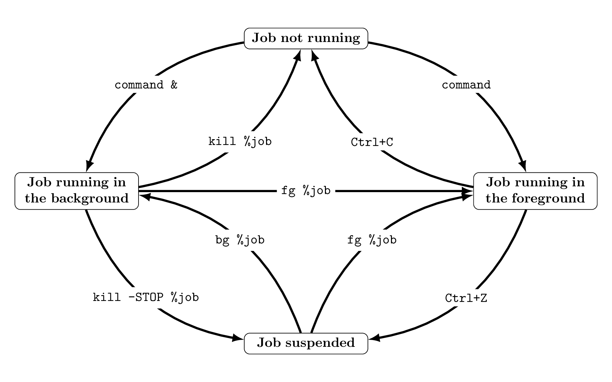

# Job control: one shell is all you need

If you work in a graphical desktop environment, you are most likely
used to multi-tasking. You can listen to music while you type your
blog posts, browse the web while your code compiles, and so on.

But what if you are interacting with your machine via a command
line?  Sure, you can use a
[terminal multiplexer](https://en.wikipedia.org/wiki/Terminal_multiplexer)
like [tmux](https://tmux.github.io).
But what if you forgot to run it before starting your tasks? And now
you are updating your packages and the shell is locked?! What a nightmare!

Luckily, the UNIX shell has a job control system that allows you
to run multiple tasks at the same time. What I explain in this post
has been tested on ksh on OpenBSD, but should work in the same way
on Linux or any UNIX-like OS with a POSIX-compatible shell - except
perhaps for the key combinations to suspend or kill a job.

This post is not meant to be an introduction to what the shell is,
but it is worth spending a few words to clear up some common (and
understandable) confusion. I'll keep them really *a few*.

## The terminal vs the shell, in 42 words

A [terminal emulator](https://en.wikipedia.org/wiki/Terminal_emulator)
is a program that displays text, usually coming from a
[shell](https://en.wikipedia.org/wiki/Shell_(computing)).
The shell reads text, normally entered by the user, and
interprets it. If this text instructs it to run another program, it
spawns a new [process](https://en.wikipedia.org/wiki/Process_(computing))
for it.

## Foreground and background jobs

A *job* is an entity that runs in the shell when you issue a command.
A job can consist of more than one process, for example if you
run multiple commands in a
[pipeline](https://en.wikipedia.org/wiki/Pipeline_(Unix)).
When you try to close a shell, it usually warns you if you have
running jobs *attached* to it, since it will *kill* them before
it closes - that might depend on the shell's configuration and
launch options, though.

When you run a program by typing its name of in a shell, say a text
editor like vi, this program "takes over" the shell. You can't run
any other command until this program terminates - or so it seems.
This happens also with most GUI programs, like firefox or gedit:
if you run them from a shell you will see some log messages, but
the shell is otherwise useless. This is the intendend behavior, and
this job is said to be running in the *foreground*. At any time
there can be at most one foreground job in a given shell.

If you have read my previous
[blog entry on the shell](../2022-09-13-sh-1), you should know that
you can launch a command in the *background* by adding an `&`
at the end of the line. Background jobs do not "block" the shell,
but they still use it to print their output.

So jobs can be running in the foreground or in the background of a
shell. There is also a third possible state for a shell's job: it
can be *suspended*. On most UNIX shells you can suspend a foreground
job by pressing `Ctrl`+`Z`. Try it: if you open `vi`, or any other
terminal-based program, and press `Ctrl`+`Z`, you are sent back to
a command prompt. This is even more fun with a graphical application:
its whole window becomes unresponsive and you can't even close it!
(Ok, I admit my definition of "fun" might be... unusual)

## Full job control

So far we have seen how to run commands (jobs) in the foreground
(default behavior) or in the background (using `&`), and how to
suspend the job in the foreground (with Ctrl+Z). But we can do more.

To get an overview of the jobs attached to the current shell, you
can use the `jobs` command. If you run it while you have some
backgrounded or suspended jobs, you'll something like this:

```
[3] + Suspended   vi
[2] - Suspended   cat
[1]   Running     ./git/nissy/nissy
```

The number in brackets is the job's *ID*. It is followed by the
job's status (Done, Running, Suspended or Stopped) and the command
that started the job. If you use the `-l` option you'll get the
job's *process ID*, or PID, too.

You can use this information to change a job's status with the
`fg` and `bg` builtins. For example, typing

```
$ fg %job_id
```

makes a currently backgrounded or suspended job run in the foreground.
Similarly

```
$ bg %job_id
```

makes a currently suspended job run in the background. As far as I
know, there is no way to tell the job running in the foregroung to
pass to the background - you have to suspend it first, and then use
`bg`.

You can replace `%job_id` with the job's PID (without percent
symbol) or with `%string`, where `string` is the beginning of the
job's name.  If you call `fg` or `bg` without any argument, the job
marked by a `+` in the jobs list is selected. You can select the
job marked by a `-` with `%-`

All of this is summed up in the following diagram:



*Picture generated with [tikz](https://github.com/pgf-tikz/pgf)
([code 1.2Kb](jobs-diagram.tex), [pdf 27.3Kb](jobs-diagram.pdf)).
Do you know a better (simpler) tool or language to generate svg
graphics and diagrams programmatically? Let me know!*

You may have noticed that [kill(1)](http://man.openbsd.org/kill)
makes an appearance. I have not talked about it yet, and I won't
go over it in detail in this post, but to put it briefly you can
use `kill` to send certain [signals](http://man.openbsd.org/signal)
to a process or job - such as `SIGSTOP` to suspend and `SIGTERM` to
terminate. This is what pressing a Ctrl+Z or Ctrl+C actually does
under the hood.

## Conclusion

With just a few simple bultins and keyboard sortcuts, the UNIX shell
gives some good flexibility in managing running jobs. If, like me,
you run most of your shells in a graphical terminal emulator or in
a tmux session, you can already get all the flexibility you want
by opening a new terminal window. But the ability to suspend jobs
and resume them later might be something new. Moreover, you might
find yourself in a situation where spawning a new window is not an
option - for example if you are connected to a remote machine via
ssh and you forgot to run tmux when you logged in.

I hope you found this post interesting. I certainly enjoyed
writing it, and I learnt a couple of new tricks in the process.
