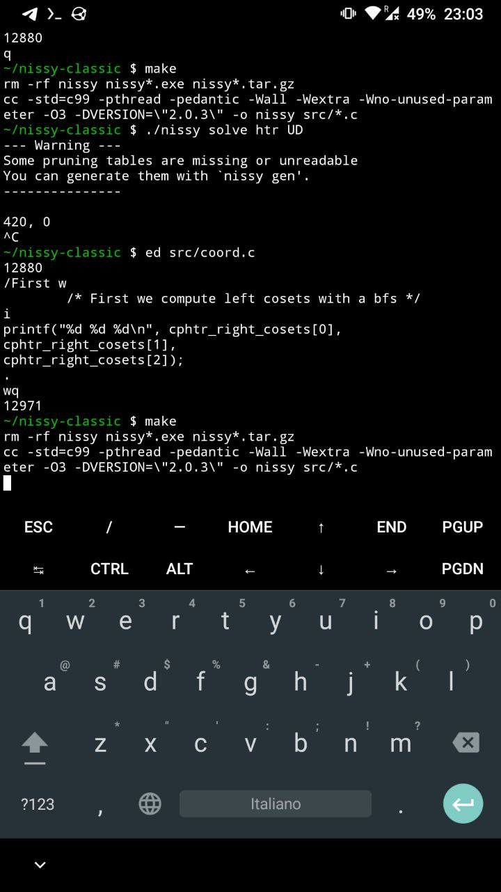

# I had to debug C code on a smartphone

A few days ago someone contacted me about an issue they had with
[nissy](https://nissy.tronto.net) - a project of mine that I have talked
about in [my last blog post](../2023-04-10-the-big-rewrite).

I was happy to look into it, but I could not reproduce the error in any
way, while this person ran into it consistently every time they tried
to use a certain functionality.

They were using a [Mac M1](https://en.wikipedia.org/wiki/Apple_M1),
which has an
[ARM-based CPU](https://en.wikipedia.org/wiki/ARM_architecture_family).
So I guessed the error was caused by me relying on some undefined
behavior of C that resulted in different compiled code on
[x86](https://en.wikipedia.org/wiki/X86)
and on ARM. But I had no ARM-based machine to debug this.

Except...

## Everyone has an ARM computer

Most (if not all) smartphones have and ARM-based CPU. This means, at
least in theory, that if this bug was really related to this different
CPU architecture, I could reproduce it on my phone.

Nissy is a command line application. To compile it you just need a C
compiler + standard library and a terminal emulator. On Android there is
[termux](https://termux.dev), that I already use to ssh into my personal
server in case I need to check something on the go and to play around.
So I installed git, [clang](https://clang.llvm.org) and gdb on it, and
I was ready to go!



This was not the most pleasant experience. Yes, I could have installed
vim or some other text editor instead of using ed, but I don't think this
would have improved things all that much. I mostly edited the code on
my laptop and transferred my changes to my phone with quick git push &
pulls, keeping text editing on the phone to a minimum.

And it worked! I was able to reproduce the bug on the first try in
this environment.  In hindsight, I should have tried building nissy
with a different compiler first, which would have saved me the hassle
of working on a 5-inch screen.  I tried afterwards, but I could not
reproduce the error this way.

## The actual bug

The bug itself was just a classic out-of-bounds error.  Simplifying a
bit, at the beginning of a file I had a bunch static arrays that looked
pretty much like this:

```
#define N 10000
static int a[N];
static int b[N];
```

The values in these arrays where written only once, in their respective
`initialize_a()` and `initialize_b()` functions, both called at startup.

The second array `b[]` was initialized correctly, but the value `b[0]`
changed after calling `initialize_a()`, which in theory did not touch
`b[]` in any way. But, due to some wrong logic, in this function I ended
up writing some value into `a[N]`, which is out of the bounds of array
`a[]`.  Apparently, when targeting ARM the compiler decided to allocate
the space for `a[]` and `b[]` in contiguous areas of memory, something
that did non happen on other architectures - perhaps some padding was
added between the two?

Once spotted, fixing the bug was easy: if a certain index `i` reached
the value `N`, the correct thing to do was to skip that value. I had
simply forgotten to check this. Adding an `if (i != N)` solved it.

## Retrospective

Debugging on a smartphone is obviously not ideal, especially since nissy
(at least in its current form) is not meant to run on one.  This motivated
me to think back and look for ways to prevent this kind of problem.

### Testing

The error in the code had nothing to do with CPU architectures, it
was a logic error. The algorithm I had in mind was correct, but I
forgot one case and typed it out wrong. This is something that is
bound to happen to everyone, so how could I have avoided it?

A good way to spot errors in your logic is to write [unit
tests](https://en.wikipedia.org/wiki/Unit_testing).  In this particular
case, though, I cannot think off the top of my head how to write a
unit test that would spot this error, at least when running on a x86
machine. In the end, the function `initialize_a()` achieved its goal -
albeit with an undesired side effect.

### Better tools

In C, the size of an array is just an indication of how much memory
has to be allocated for it. There is no runtime check when accesing an
element. Most compilers can check for *static* out-of-bound accesses, i.e.
`int a[10]; a[11] = 0` will result in a warning (not even an error!)
at compile time. But even this would have not spotted my bug.

Tools like [Valgrind](https://valgrind.org) can help you analyze this
kind of memory-related issues, such as accessing unallocated memory
areas and memory leaks. However, to my surprise, valgrind did not help
here. I guess this is because the memory I ended up accessing was still
reserved for my code, just for a different array - or for some padding
between the two.  Or perhaps I should have used more thorough settings.

There are modern languages that try prevent you from shooting yourself
on the foot, like [Rust](https://www.rust-lang.org). But for me C has a
huge advantage over any of these better-on-paper alternatives: I know it
decently well. Another good reason is ubiquity - I don't want to force
my few potential users to install a whole Rust environment just for nissy!

### Real world checks

Running your software on more platforms and making sure everything
works as expected is a good way to spot errors that are architecture-
or compiler-dependent. I am definitely not going to buy a Mac M1 just to
test out this toy project, but I could at least test it on all the devices
I have - including my phone.  Since it is a command-line application,
setting up a test suite that runs a bunch of commands and then checks
that the outpus is as expected would be relatively easy.

## Conclusion

Typing on a phone is painful. Nonetheless, debugging this was actually
kind of fun.

Knowing some low-level stuff always helps. In this case, I was able to
reproduce the issue only because I knew that different CPU architectures
exists, and that a Mac M1 is similar to an Android phone in this regard.

But I also want to stress that this bug was not related to the CPU
architecture: there was a logic error in my code. The fact that it was
only visible on ARM is a coincidence.  In the end, correct logic is the
most important thing in coding.
