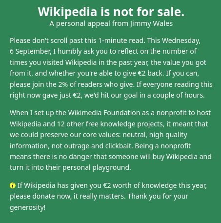

# I donated 100€ to Wikipedia

Yesterday I was looking something up on Wikipedia and I was presented
with a message like this:

I am sure you too have seen this kind of message before, about once
a year.

Despite them begging me not to scroll past, this is exactly what I
usually do.  When I don't, I may read the whole thing, but I have never
donated any money.

Until last night. I sympathize with Wikipedia's mission - in fact,
I believe Wikipedia is one of the best things that happened to the
Internet. I have already expressed how I feel about free access to
knowledge in [an earlier post](../2023-01-11-aaron-swartz). And they
are asking just for 2€, so what is my excuse?

I usually dismiss this question and keep scrolling, but this time, for
no particular reason, I decided not to.  Instead of donating a small
sum and facing the same moral dilemma again next year, I decided to give
50x the suggested amount and be good for 50 years.

A little bit from everyone is enough, and I feel I have done my part.

This is the email I received after my donation:

*Dear Sebastiano,*

*Thank you so much for the one-time gift of €100.00 to support Wikipedia
and a world where knowledge is free for everyone.*

*Every single donation helps us to improve people’s access to accurate and
reliable information, especially in a rapidly changing world. I’m truly
grateful for your support in enabling billions of people to experience the
gift of knowledge through Wikipedia.*

*We are determined to extend this access as far as possible to make sure
that no matter where you are born or where you live, the ability to access
free knowledge is always within your reach. I hope you will continue to
support us in building a future where Wikipedia exists everywhere, with
people across the world contributing to the sum of all knowledge.*

*Thank you again for supporting this remarkable mission; it is a privilege
for me to be part of the largest collaborative project in human history.
Wikipedia will always belong to you.*

*With gratitude,
Maryana*

*Maryana Iskander
CEO, Wikimedia Foundation*
