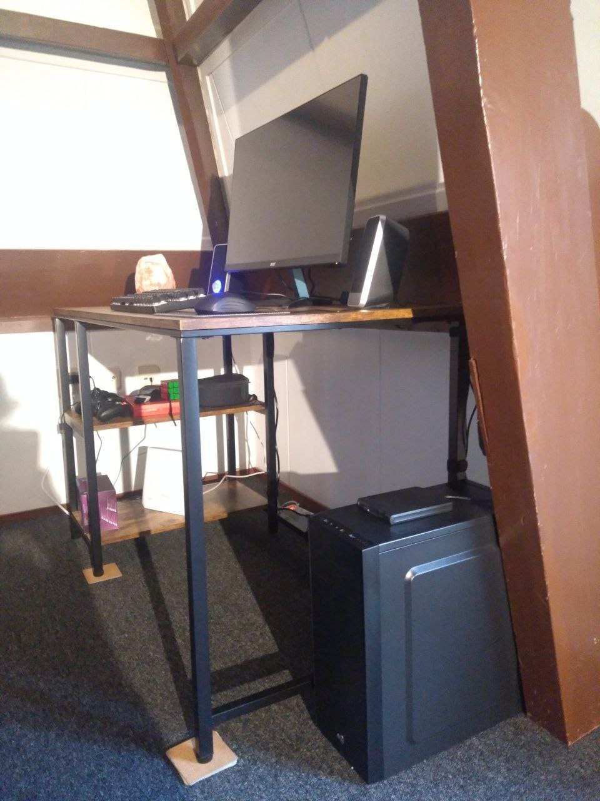
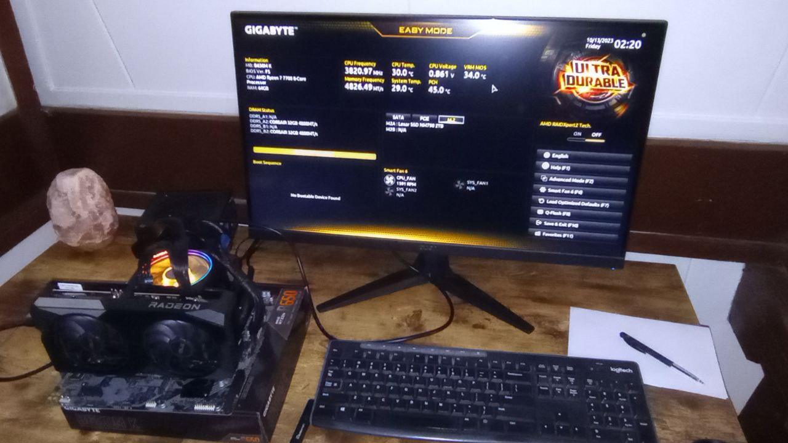

# Build time!

After thinking about it for quite some time, my girlfriend and I finally
got a nice desktop PC. This is our first build, and the first time I
open up a desktop PC in 10 years or so!



## Specs

* CPU: AMD Ryzen 7 7700 (8 cores / 16 threads, 3.8GHz base / 5.3GHz Boost)
* GPU: Asus AMD Radeon RX 6650 XT (8GB dedicated memory)
* RAM: 2x32GB
* SSD: 2TB NVMe

We (especially my girlfriend) play some games, but not the newest AAA
titles, and we are definitely willing to sacrifice some graphics quality.
So we went for some "best bang for the buck" CPU and GPU, paying attention
to the power usage, too.

I also write code for fun, and for one of my hobby projects I would like
to experiment with different sizes of RAM, so I wanted at least 32GB. We
ended up getting 64 because we had some money left in our budget and we
did not need (or want) a better (and more power-hungry) CPU or GPU.

With the case and all the peripherals, including a pretty good 27"
screen, we got it for less than 1400€, which I think is a good price.

## Building it up

We were a bit scared of putting all the pieces together. My girlfriend
has never done it, and the last time I assembled a
PC it was back in the days of spinning hard drives with
[IDE connectors](https://en.wikipedia.org/wiki/Parallel_ATA)
and motherboard
[beep codes](https://en.wikipedia.org/wiki/Power-on_self-test#Progress_and_error_reporting).
You know, when the PC kindly told you in pseudo-Morse code exactly what
was wrong. Those were the days!

Nostalgia aside, the build process went pretty smoothly - except for
a small cut on my middle finger. Here are some of the things I found
interesting:

### Black is the new green

I remember mother boards and graphics card used to be all green, now not
anymore! At least in our case, they are all black. Cool, I guess.

### Tiny NVMe drive

Modern NVMe drives are really small! I remember old hard disks being
literal bricks - you would not want to drop one of those, lest it breaks
your toes or damages the floor. Now you would not want to drop one for
fear of loosing it under the sofa.

### Fans everywhere

The case has a fan, the CPU has a fan, the GPU has two. I don't remember
there were this many fans in ~2009, but if it keeps my chips cool,
I'll take it!

### Damned RGB

We (especially me) do not like at all the modern "gamer aesthetics" that
demand RGB lights everywhere. So we carefully chose components that had
the no LEDs, or as little as possible. Unfortunately, the stock CPU fan
has more lights than a Christmas tree. Our solid black case saves us here.

### Ugly BIOS

I mean, WTF is this screen?



It's like a B-tier early 2000s video game. I think the classic 80s
style, curses-like graphics looked much better. But on the other hand,
who cares.

## Operating system

We agreed on using Linux, because we are both Linux users, because all
the games we would like to play work either natively or via proton,
and because fuck you Microsoft and your crappy spyware.

I use [Void](https://voidlinux.org/), but for a shared PC I would like
something that "just works" with minimal setup. My girlfriend uses
[Mint](https://linuxmint.com/), but she wanted to try out something
new.  Debian seemed like a solid choice, and it is
[very similar to Linux](https://www.youtube.com/watch?v=s5ocXFgowZA)
(in case you can't click on the link or don't understand Italian, it's a joke).

For the desktop environment we initially went for XFCE, but my
girlfriend immediately disliked it because many administration tasks
were counter-intuitive or just impossible (e.g. adding a new user). So
we switched to KDE, and we are both reasonably satisfied with it. However,
I am a bit disappointed to see that it is (still) a bit buggy - some of the
first disappointments include: [Discover](https://apps.kde.org/discover/)
failing to open, KDE "administrator" users not being able to use `sudo`,
the [screen failing to turn off](https://discussion.fedoraproject.org/t/f37-kde-5-27-screen-doesnt-dim-nor-turn-off/73960)
after the set timeout.  At least it is not as buggy as the initial KDE4
release in 2008.

## Build time?

So, how long does it take to build Linux on my new Linux build?

```
$ sudo apt build-dep linux
$ wget https://cdn.kernel.org/pub/linux/kernel/v6.x/linux-6.5.7.tar.xz
$ tar -xvf linux-6.5.7.tar.xz 
$ cd linux-6.5.7.tar.xz
$ make mrproper
$ make defconfig
$ time make -j16

real    1m27.215
user    17m57.806s
sys     1m46.663s
```
