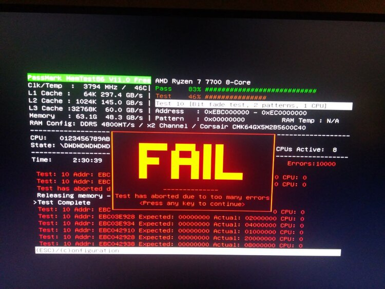

# Sometimes it's the hardware

In the last few weeks, I was debugging a nasty bug on a hobby project.
I needed to work with ~58GB of data generated by the program itself,
which made everything quite slow and cumbersome to work with. But this
specific piece of code was quite simple and I was able to rule out
every possible cause of the bug, so where could the problem be?

(Ok I think you can guess it from the title, but I want to tell you the
whole story anyway.)

## The bug

Long story short, my program is a
[Rubik's cube solver](https://nissy.tronto.net/) and I need
to generate some lookup tables to speed up the solution search.
Pretty much a standard
[IDA*](https://en.wikipedia.org/wiki/Iterative_deepening_A*) method:
the larger the table, the faster the solver.

I am implementing a new kind of tables, and I know how to reliably
generate one of around 30MB and one of around 58GB. I can also compute
tables of different sizes between those two, but the method I use is
experimental and I am not 100% sure the results are correct.  But I can
also generate the intermediate tables by deriving them from the 58GB one.
This method is quite slow and can only work if the user has enough RAM,
but it gives me a way to test the correctness of the other method.

The algorithm to derive the smaller tables from the huge one is quite
simple, but to my surprise I was getting different results at every
run. I thought it must be some kind of
[undefined behavior](https://en.wikipedia.org/wiki/Undefined_behavior),
as it often the case with C.

Time to take out my debugging weapons!

## The whole arsenal

To have a reasonable chance at uncovering nasty bugs related to undefined
behavior, bad memory access, concurrency and other C programming
nightmares, I used all of the following:

* All compile-time warnings GCC offers, enabled with `-Wall -Wextra -pedantic`.
* [Sanitizers](https://github.com/google/sanitizers), in particular the
  *address* and *undefined* sanitizers. The *thread* sanitizer could not be
  used with the large 58GB table because it requires much more memory, but in
  any case this specific computation is not parallelized (yet).
* `printf()` debugging. Not always effective when dealing with undefined
  behavior, but it never hurts.
* [GDB](https://en.wikipedia.org/wiki/GNU_Debugger).
* [Valgrind](https://valgrind.org/).

But nothing, my code did not trigger any error with these tools.
Of course it could be an error in my logic, but why would I get a
different results every time? This just did not make sense.

## Sometimes you are not stupid, sometimes the computer is broken

I started thinking that the OS could be doing something wrong. In fact,
I noticed that KDE and Firefox occasionally crashed when I used ~60GB of
RAM. Maybe the Kernel messed up [swapping](https://wiki.debian.org/Swap)?
And a KDE or Firefox bug related to unusual memory sizes and usage would
not be surprising.

So I tried giving a `swapoff -a` to disable swap, and then run the
program again. And I got inconsistent results and crashes once again.

At this point I started doubting my hardware, so I ran
[memtest86](https://www.memtest86.com/). Sure enough, something was wrong:

By the way, isn't this screen beautiful? It looks like it comes straight
out of an 1980's hacker movie.

## Conclusion

With some more testing I was able to determine that one of the two RAM
sticks works fine, and the other one is definitely broken. In case you
are curious, memtest86 gives a similar screen with a green PASS message
when all tests pass.

Everything is still covered by warranty, so I asked for a replacement.
Hopefully I'll have a working PC with 64GB of RAM again soon, but in
the meantime I think I'll survive with 32GB.

I have been programming for almost 20 years, and this is the first time
an error in my program was due to a faulty piece of hardware rather than
a bug in my code. Cool :)
