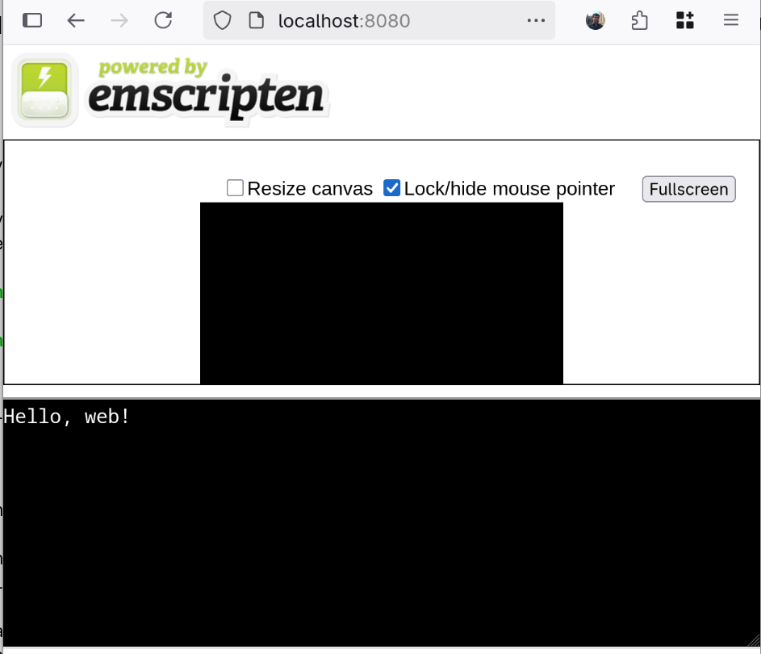
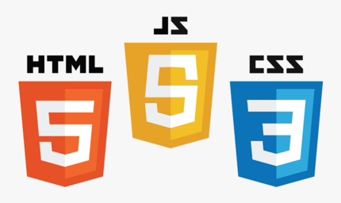

# A masochist's guide to web development

## Table of contents

* [Introduction](#introduction)
* [Setting things up](#setting-things-up)
* [Hello world](#hello-world)
* [Intermezzo I: What is WebAssembly?](#intermezzo-i-what-is-webassembly)
* [Building a library](#building-a-library)
* [Intermezzo II: JavaScript and the DOM](#intermezzo-ii-javascript-and-the-dom)
* [Loading the library and making it a module](#loading-the-library-and-making-it-a-module)
* [Multithreading](#multithreading)
* [Intermezzo III: Web Workers and Spectre](#intermezzo-iii-web-workers-and-spectre)
* [Don't block the main thread!](#dont-block-the-main-thread)
* [Callback functions](#callback-functions)
* [Persistent storage](#persistent-storage)
* [Closing thoughts](#closing-thoughts)

## Introduction

I have recently worked on making a web application out of
[my latest Rubik's cube optimal solver](https://git.tronto.net/nissy-core/file/README.md.html).
This involved building a rather complex C code base (with
multithreading, SIMD, callback functions and whatnot) to
[WebAssembly](https://en.wikipedia.org/wiki/WebAssembly) via
[Emscripten](https://emscripten.org/), and writing a minimal amount of
JavaScript and HTML for the frontend.

This whole process was complex, tiring and at times frustrating -
but eventually [it was a success](https://tronto.net:48)! Not only
I accomplished my goal, but I have learnt a lot along the way. After
finishing the work, I decided to write down all that I have learnt and
share it with the world with this post.

You may be wondering why one should do such a thing instead of either
rewriting their code base in a more web-friendly language, or distributing
their app using a native GUI framework. The main reason to use WebAssembly
is that it can provide near-native performance (or so they claim) while
running inside a web browser; this gives you all the portability of a
web app without too much of a performance drawback, something that would
not be possible with an interpreted language such as JavaScript.

So, what is this blog post? A tutorial for web development? I am not sure
about this, but if it is, it is definitely not a normal one. As the title
suggests, you should not start from this guide unless you just *love*
banging your head against the wall.  If you are looking for a *sane*
guide to web development, I strongly advise you head on to the
[Mozilla Developer Network tutorials page](https://developer.mozilla.org/en-US/docs/MDN/Tutorials)
and start from there.

But if you are a C or C++ developer looking to port a program or library
to the web, then you are in the right place. With this post I am going
to walk you through the process of building an increasingly complex
library that can run in a web browser.  Make sure you are
sitting comfortably and be ready to sweat, because I am not going to
shy away from the hard stuff and the complicated details.

To follow this tutorial you won't need much experience with web
development, but some familiarity with HTML and an idea of what JavaScript
will be useful. It will also help to know that you can access your
browser's JavaScript console and other developer tools by pressing F12,
at least on Firefox or Chrome - but I guess I have literally just taught
you that, if you did not already know it. For all the rest, I'll make
sure to add many hyperlinks throughout the text, so you can follow them
if something is new to you.

A little disclaimer: although I am a somewhat experienced C developer,
I had very little web development experience before embarking in
this adventure.  If you are a web developer, you may find errors in
this post that are going to make you laugh at my ignorance. If you do,
I'd appreciate it if you could report them to me by sending an email to
`sebastiano@tronto.net`!

With this out of the way, let's get started!

## Setting things up

The examples used in this tutorial are all contained in a git repository,
which you can find either on
[my git page](https://git.tronto.net/emscripten-tutorial/file/README.md.html) or
[on github](https://github.com/sebastianotronto/emscripten-tutorial).

In order to follow them you are going to need:

* A working installation of [Emscripten](https://emscripten.org/)
  (which also includes Node.js). Refer to the official website for
  installation instructions.
* A web server such [darkhttpd](https://github.com/emikulic/darkhttpd)
  or the Python `http.server` package; the examples will use darkhttpd.

I have only tested all of this on Linux, but everything should work
exactly the same on any UNIX system. If you are a Windows user, you can
either run everything inside
[WSL](https://learn.microsoft.com/en-us/windows/wsl/), or you can try and
adjust the examples to your system - if you choose this second option,
I'll happily accept patches or pull requests :)

## Hello world

Let's start with the classic Hello World program:

```
#include <stdio.h>

int main() {
	printf("Hello, web!\n");
}
```

You can compile the code above with

```
emcc -o index.html hello.c
```

And if you now start a web server in the current folder, for example with
`darkhttpd .` (the dot at the end is important), and open a web browser to
[localhost:8080](http://localhost:8080) (or whatever port your web server
uses), you should see something like this:



As you can see, the compiler generated a bunch of extra stuff around
you print statement. You may or may not want this, but for now we can
take it as a convenient way to check that our program works as expected.

There are other ways to run this compiled code. With the command above,
the compiler should have generated for you 3 files:

* `index.html` - the web page in the screenshot above.
* `index.wasm` - the actual compiled code of your program; this file contains
   WebAssembly bytecode.
* `index.js` - some JavaScript *glue code* to make it possible for `index.wasm`
  to actually run in a browser.

If you don't specify `-o index.html`, or if your specify `-o` followed
by a filename ending in `.js`, the `.html` page is not going to be
generated. In this case (but also if you *do* generate the html page),
you can run the JavaScript code in your terminal with:

```
node index.js
```

In later examples, the same code may not work seamlessly in both a web
browser and in Node.js - for example, when dealing with persistent data
storage. But until then, we can generate all three files with a single
command and run our code in either way.

It is also possible to ask Emscripten to generate only the `.wasm` file,
in case you want to write the JavaScript glue code by yourself. To do
this, you can pass the `-sSTANDALONE_WASM` option to `emcc`. However,
in some cases the `.js` file is going to be generated even when this
option is used, for example when building a source file without a `main()`
entry point. Since this is something we'll do soon, we can forget about
this option and just take it as a fact that the `.wasm` files generated
by emscripten require some glue JavaScript code to actually run,
but in case you are interested you can check out
[the official documentation](https://emscripten.org/docs/tools_reference/settings_reference.html#standalone-wasm).

You can find the code for this example, as well as scripts to
build it and run the web server, in the directory `00_hello_world`
of the git repository
([git.tronto.net](https://git.tronto.net/emscripten-tutorial/file/README.md.html),
[github](https://github.com/sebastianotronto/emscripten-tutorial)).

Anyway, now we can build our C code to run in a web page.  But this is
probably not the way we want to run it. First of all, we don't want to
use the HTML template provided by Emscripten; but more importantly, we
probably don't want to write a program that just prints stuff to standard
output. More likely, we want to write some kind of library of functions
that can be called from the front-end, so that the user can interact with
our program via an HTML + JavaScript web page.  Before going into that,
let's take a break to discuss what we are actually compiling our code to.

## Intermezzo I: What is WebAssembly?


[WebAssembly](https://en.wikipedia.org/wiki/WebAssembly) is a low-level
language meant to run in a virtual machine inside a web browser. The main
motivation behind it is running higher-performance web applications compared
to JavaScript; this is made possible, by its
compact bytecode and its stack-based virtual machine.

WebAssembly (or WASM for short) is supported by all major browsers
since around 2017.  Interestingly, Emscripten, the compiler we are
using to translate our C code to WASM, first appeared in 2011,
predating WASM by a few years. Early on, Emscripten would compile
C and C++ code into JavaScript, or rather a subset thereof called
[asm.js](https://en.wikipedia.org/wiki/Asm.js).

Just like regular
[assembly](https://en.wikipedia.org/wiki/Assembly_language), WASM
also has a text-based representation. This means that one could write
WASM code directly, assemble it to bytecode, and then run it.  We are
not going to do it, but if you are curious here is a simple example
(computing the factorial of a number, taken from Wikipedia):

```
(func (param i64) (result i64)
	local.get 0
	i64.eqz
	if (result i64)
		i64.const 1
	else
		local.get 0
		local.get 0
		i64.const 1
		i64.sub
		call 0
		i64.mul
	end)
```

As you can see, it looks like a strange mix of assembly and
[Lisp](https://en.wikipedia.org/wiki/Lisp_(programming_language)).
If you want to try and run WASM locally, outside of a web browser,
you could use something like [Wasmtime](https://wasmtime.dev/).

Until early 2025, the WASM "architecture" was 32-bit only. One big
limitation that this brings is that you cannot use more that 4GB
(2<sup>32</sup> bytes) of memory, because pointers are only 32 bits
long; moreover, your C / C++ code may need some adjustments if it
relied on the assumption that e.g. `sizeof(size_t) == 8`. At the
time writing a new standard that enables 64 bit pointers, called
WASM64, is supported on Firefox and Chrome, but not on Webkit-based
browsers such as Safari yet. Depending on when you are reading this,
this may have changed - you can check the status of WASM64 support
[here](https://webassembly.org/features/).

## Building a library

Back to the main topic. Where were we? Oh yes, we wanted to build
a C *library* to WASM and call it from JavaScript. Our complex,
high-performance, math-heavy library probably looks something like this:

library.h (actually, we are not going to need this):

```
int multiply(int, int);
```

library.c:

```
int multiply(int a, int b) {
	return a * b;
}
```

Or maybe it is a bit more complicated than that. But we said we are
going to build up in complexity, and this is just the beginning, so
let's stick to `multiply()`.

To build this library you can use:

```
emcc -o library.js library.c
```

As we saw before, this is going to generate both a `library.js` and a
`library.wasm` file. Now we would like to call our library function
with something like this

program.js:

```
var library = require("./library.js");
const result = library.multiply(6, 7);
console.log("The answer is " + result);
```

*(The `require()` syntax above is valid when running this code in Node.js,
but not, for example when running in a browser. We'll see in the next
session what to do in that case, but for now let's stick to this.)*

Unfortunately, this will not work for a couple of reasons. The reason
first is that Emscripten is going to add an underscore `_` to all our
function names; so we'll have to call `library._multiply()`. But this
still won't work, because by default the compiler does not *export* all
the functions in your code - that is, it does not make them visible to
the outside. To specify which functions you want to
export, you can use the `-sEXPORTED_FUNCTIONS` flag, like so:

```
emcc -sEXPORTED_FUNCTION=_multiply -o library.js library.c
```

And now we finally have access to our `multiply()` function...

```
$ node program.js
Aborted(Assertion failed: native function `multiply` called before runtime initialization)
```

...or maybe not. If you are new to JavaScript like I was a few weeks
ago, you may find this error message surprising. Some runtime must be
initialized, but can't it just, like... initialize *before* trying to
run the next instruction?

Things are not that simple. A lot of things in JavaScript happen
*asynchronously*, and in these situations you'll have to either use
[`await`](https://developer.mozilla.org/en-US/docs/Web/JavaScript/Reference/Operators/await)
or a
[*callback function*](https://developer.mozilla.org/en-US/docs/Glossary/Callback_function).
So we'll have to do something like this:

```
var library = require("./build/library.js");

library.onRuntimeInitialized = () => {
	const result = library._multiply(6, 7);
	console.log("The answer is " + result);
};
```

And now we can finally run our program:

```
$ node program.js 
The answer is 42
```

The code for this example can be found in the `01_library` folder in
the git repository
([git.tronto.net](https://git.tronto.net/emscripten-tutorial/file/README.md.html),
[github](https://github.com/sebastianotronto/emscripten-tutorial)).

## Intermezzo II: JavaScript and the DOM



If we want to build an interactive web page using JavaScript, we'll
need a way for our script to communicate with the page, i.e. a way
to access the HTML structure from JavaScript code. What we are looking
for is called
*[Document Object Model](https://developer.mozilla.org/en-US/docs/Web/API/Document_Object_Model)*,
or DOM for short.

For example, if you have a paragraph with some text in your HTML:

```
<p id="myParagraph">Hello!</p>
```

you can access this text from JavaScript like this:

```
var paragraph = document.getElementById("myParagraph");
paragraph.innerText = "New text!";
```

Here we are selecting the paragraph HTML element using its ID, and we
are changing its text via its `innerText` property, all from JavaScript.

Let's see a more complex example:

HTML:

```
<button id="theButton">Press me!</button>
```

JS:

```
var button = document.getElementById("theButton");
var counter = 0;

button.addEventListener("click", () => {
	counter++;
	button.innerText = "I have been pressed " + counter + " times!";
});
```

In the example above we add an
*[event listener](https://developer.mozilla.org/en-US/docs/Web/API/EventTarget/addEventListener)*
to a button: the (anonymous) function we defined is going to be called
every time the button is clicked. And since this is a web page, I guess
I can show you what this actually looks like.

Behold, the dynamic button:

<div style="text-align:center">
<button id="theButton">Press me!</button>
</div>

<script>
window.onload = () => {
	var button = document.getElementById("theButton");
	var count = 0;

	button.addEventListener("click", () => {
		count++;
		button.innerText = "I have been pressed " + count + " times!"
	});
};
</script>

If you are completely new to web development, you may be wondering
where you should write this JavaScript code. One option is to write it
in the same HTML file as the rest of the page, inside a `<script>` tag;
this is how I did it in the example above, as you can check by viewing
the source of this page (press Ctrl+U, or right-click and select
"view source", or prepend `view-source:` to this page's URL; hopefully
at least one of these methods should work in your browser).

However, if the script gets too large you may want to split it off in
a separate file, which we'll demonstrate in this next example.

Let's now make a template web page for using our powerful library. Let's
start with the HTML, which is in large part boilerplate:

index.html:

```
<!doctype html>
<html lang="en-US">
<head>
	<meta charset="utf-8">
	<meta name="viewport" content="width=device-width">
	<title>Multiply two numbers</title>
	<script src="./script.js" defer></script>
</head>

<body>
	<p>
	<input id="aInput"> x <input id="bInput">
	<button id="goButton">=</button>
	<span id="resultText"></span>
	</p>
</body>

</html>
```

Besides the `<body>` element, the only important line for us is line
7, which loads the script from a file. Notice that we use the `defer`
keyword here: this is telling the browser to wait until the whole page
has been loaded before executing the script. If we did not do this, we
could run in the situation where we `document.getElementById()` returns
`null`, because the element we are trying to get is not loaded yet (yes,
this happened to me while I was writing this post). If you want to know
more, check out this
[MDN page](https://developer.mozilla.org/en-US/docs/Web/HTML/Reference/Elements/script#defer).

Now to the JavaScript code. For now we are going to use the built-in
`*` operator to multiply the two numbers, but in the next section we
are going to replace it with our own library.

script.js (in the same folder as index.html):

```
var aInput = document.getElementById("aInput");
var bInput = document.getElementById("bInput");
var button = document.getElementById("goButton");
var resultText = document.getElementById("resultText");

button.addEventListener("click", () => {
	var a = Number(aInput.value);
	var b = Number(bInput.value);
	resultText.innerText = a * b;
});
```

The final result will look something like this:

<p style="text-align:center">
<input id="aInput"> x <input id="bInput">
<button id="goButton">=</button>
<span id="resultText"></span>
</p>

<script>
var aInput = document.getElementById("aInput");
var bInput = document.getElementById("bInput");
var button = document.getElementById("goButton");
var resultText = document.getElementById("resultText");

button.addEventListener("click", () => {
	var a = Number(aInput.value);
	var b = Number(bInput.value);
	resultText.innerText = a * b;
});
</script>

In a real-world scenario you would probably want to check that the text
provided in the input fields is actually a number, or perhaps use the
[`type="number"`](https://developer.mozilla.org/en-US/docs/Web/HTML/Reference/Elements/input/number)
attribute for the input fields. But we'll ignore these issues here -
we are going to have more serious problems to deal with.

## Loading the library and making it a module

With what we have learned in the previous intermezzo (you are not skipping
those, right?) we can finally run our library code in a real web page. The
code is pretty much the same as above; we just need to include both the
library and the script file in the HTML:

```
	<script src="./library.js" defer></script>
	<script src="./script.js" defer></script>
```

and of course we have to change the line where we perform the multiplication:

```
	resultText.innerText = Module._multiply(a, b);
```

Here `Module` is the default name given to our library by
Emscripten. Apart from being too generic a name, this leads to another
problem: we can't include more than one Emscripten-built library in our
page in this way - otherwise, both are going to be called `Module`.

Luckily, there is another way: we can build a
[modularized](https://emscripten.org/docs/compiling/Modularized-Output.html)
library, i.e. obtain a
[JavaScript Module](https://developer.mozilla.org/en-US/docs/Web/JavaScript/Guide/Modules).
This may sound a bit strange, because the name `Module` kind of implies
there is already a module. The way I understand it is that by default
Emscripten produces a *script* that *contains* a module named `Module`;
when building a modularized library, the whole resulting file is a module.

Modularizing our build is not necessary right now, but
there are a couple of other advantages to it:

* As mentioned above, we can change the name of our module and include
  more than one Emscripten-built library, if we want.
* We will be able to use the module in the same way in Node.js and in
  our web page script. This way we can minimize the differences between
  the two versions of our code, which can be useful for testing.
* In case we want to build a more complex layer of JavaScript between
  our library and our web page, with a modularized build we can easily
  include the module in another file, which can then be included in the
  main script.

So let's go ahead and build our library like so:

```
emcc -sEXPORTED_FUNCTION=_multiply -sMODULARIZE -sEXPORT_NAME=MyLibrary \
     -o library.mjs library.c
```

Notice I have changed the extension from `.js` to `.mjs`. Don't worry,
either extension can be used. And you are going to run into issues with
either choice:

* If you run your code in Node.js, it will understand that the library
  file is a module only if you use the `.mjs` extension. Alternatively,
  you can change some settings in a local configuration file to
  enforce this.
* If you run your code in a web page, your web server may not be
  configured to serve `.mjs` files as JavaScript files. This can
  easily be changed by adding a configuration line somewhere.

In my examples I chose to use the `.mjs` extensions to make Node.js
happy, and I changed the configuration of my web servers as needed. For
example, for darkhttpd I added a file called `mime.txt` with a single
line `text/javascript mjs`, and launched the server with the
`--mimetypes mime.txt` option.

Now we have to make a couple of changes. Our `program.js`, for running
in node, becomes:

```
import MyLibrary from "./library.mjs"

var myLibraryInstance = await MyLibrary();

const result = myLibraryInstance(6, 7);
console.log("The answer is " + result);
```

By the way, I have renamed this file to `program.mjs`. This is because
only modules can use the
[static `import`](https://developer.mozilla.org/en-US/docs/Web/JavaScript/Reference/Statements/import)
statement; alternatively, I could have used the
[dynamic `import()`](https://developer.mozilla.org/en-US/docs/Web/JavaScript/Reference/Operators/import)
and kept the `.js` extension.

Similary, we have to update our `script.js` (or `script.mjs`) to import
the module and create an instance. Moreover, we have to specify in the
HTML that the script is now a module:

```
	<script src="./script.mjs" type="module" defer></script>
```

And we can get rid of the other `<script>` tag, since now the library
is included directly in `script.mjs`.

You can find the full the code for this example the folder
`02_library_modularized` in the git repository
([git.tronto.net](https://git.tronto.net/emscripten-tutorial/file/README.md.html),
[github](https://github.com/sebastianotronto/emscripten-tutorial)).

## Multithreading


Let's move on to a more interesting example. If one of the goals of
WebAssembly is performance, there is no point in using only 1/16th of
your CPU - let's port a multithreaded application to the web!

As a more complicated example, let's write a function that counts how
many prime numbers there are in a given range. This function takes two
integers as input and returns a single integer as output, but it does
a non-trivial amount of work under the hood. A simple implementation of
this routine would be something like this:

```
bool isprime(int n) {
	if (n < 2)
		return false;

	for (int i = 2; i*i <= n; i++)
		if (n % i == 0)
			return false;
	return true;
}

int primes_in_range(int low, int high) {
	if (low < 0 || high < low)
		return 0;

	int count = 0;
	for (int i = low; i < high; i++)
		if (isprime(i))
			count++;

	return count;
}
```

This algorithm is
[embarassingly parallelizable](https://en.wikipedia.org/wiki/Embarrassingly_parallel):
we can split the interval `[low, high)` into smaller sub-intervals and
process each one of them in a separate thread; then we just need to add
up the results of the sub-intervals.

For the actual implementation, we are going to use
[pthreads](https://en.wikipedia.org/wiki/Pthreads), for the simple reason
that it is
[supported by Emscripten](https://emscripten.org/docs/porting/pthreads.html).
In practice, assuming we are working on a UNIX platform, we could also
use C11's [threads.h](https://en.cppreference.com/w/c/header/threads) or
C++'s [std::thread](https://en.cppreference.com/w/cpp/thread/thread.html),
but only because they happen to be wrappers around pthreads. On other
platforms, or in other implementations of the C and C++ standard library,
this may not be the case; so we'll stick to old-school pthreads.

This is my parallel version of `primes_in_range()`:

primes.c:

```
#include <stdbool.h>
#include <pthread.h>

#define NTHREADS 16

bool isprime(int);
void *pthread_routine(void *);

struct interval { int low; int high; int count; };

int primes_in_range(int low, int high) {
	pthread_t threads[NTHREADS];
	struct interval args[NTHREADS];

	if (low < 0 || high < low)
		return 0;

	int interval_size = (high-low)/NTHREADS + 1;
	for (int i = 0; i < NTHREADS; i++) {
		args[i].low = low + i*interval_size;
		args[i].high = args[i].low + interval_size;
		pthread_create(&threads[i], NULL, pthread_routine, &args[i]);
	}

	int result = 0;
	for (int i = 0; i < NTHREADS; i++) {
		pthread_join(threads[i], NULL);
		result += args[i].count;
	}

	return result;
}

bool isprime(int n) {
	if (n < 2)
		return false;

	for (int i = 2; i*i <= n; i++)
		if (n % i == 0)
			return false;
	return true;
}

void *pthread_routine(void *arg) {
	struct interval *interval = arg;

	interval->count = 0;
	for (int i = interval->low; i < interval->high; i++)
		if (isprime(i))
			interval->count++;

	return NULL;
}
```

*(Pro tip: if you take the number of threads as an extra parameter for
your function, you can pass to it the value
[`navigator.hardwareConcurrency`](https://developer.mozilla.org/en-US/docs/Web/API/Navigator/hardwareConcurrency)
from the JavaScript front-end and use exactly the maximum number of
threads that can run in parallel on the host platform.)*

To build this with Emscripten we'll have to pass the `-pthread` option and,
optionally, a suitable value for
[`-sPTHREAD_POOL_SIZE`](https://emscripten.org/docs/tools_reference/settings_reference.html#pthread-pool-size).

If we want to run our multithreaded code in an actual browser, we'll
have to scratch our head a bit harder. The code we are supposed to
write is exactly what we expect, but once again we have to tinker with
our web server configuration. For technical reasons that we'll cover in
the next intermezzo, in order to run multithreaded code in a browser
we must add a couple of HTTP headers:

```
Cross-Origin-Opener-Policy: same-origin
Cross-Origin-Embedder-Policy: require-corp
```

These headers are part of the response your browser will receive when
it requests any web page from the server. The way you set these depends on
the server you are using; with darkhttpd you can use the `--header` option.

With your server correctly set up, you can enjoy a multithreaded program
running in your browser!  As always, you can check out this example from
the `03_threads` folder of the git repository
([git.tronto.net](https://git.tronto.net/emscripten-tutorial/file/README.md.html),
[github](https://github.com/sebastianotronto/emscripten-tutorial)).

## Intermezzo III: Web Workers and Spectre


On a low level, threads are implemented by Emscripten using
[web workers](https://developer.mozilla.org/en-US/docs/Web/API/Web_Workers_API),
which are processes separated from the main web page process and
communicate with it and with each other by
[passing messages](https://developer.mozilla.org/en-US/docs/Web/API/Worker/postMessage).
Web workers are commonly used to run slow operations in the background
without blocking the UI threads, so the web page remains responsive
while these operations run - we'll do this in the next section.

Web workers do not have regular access to the same memory as the main
process, and this is something that will give us some issues in later
sections. However, there are ways around this limitation. One of these
ways is provided by
[SharedArrayBuffer](https://developer.mozilla.org/en-US/docs/Web/JavaScript/Reference/Global_Objects/SharedArrayBuffer),
which we won't use directly in this tutorial, but is used by
Emscripten under the hood.

And this is why we had to set the `Cross-Origin-*` headers. In 2018, a
CPU vulnerability called [Spectre](https://spectreattack.com) was found,
and it was shown that an attacker could take advantage of shared memory
between the main browser thread and web workers to
[execute code remotely](https://en.wikipedia.org/wiki/Spectre_(security_vulnerability)#Remote_exploitation).
As a counter-measure, most browsers now require your app to be in a
[secure context](https://developer.mozilla.org/en-US/docs/Web/Security/Secure_Contexts)
and
[cross-origin isolated](https://developer.mozilla.org/en-US/docs/Web/API/Window/crossOriginIsolated)
to allow using `SharedArrayBuffer`s.

Even if you do not plan to use web workers directly, it is still good to
have a rough idea of how they work, because of the
[law of leaky abstractions](https://en.wikipedia.org/wiki/Leaky_abstraction):
*all abstractions are leaky*.
The fact that we had to mess around with our `Cross-Origin-*` headers
despite not caring at all about `SharedArrayBuffer`s is a blatant example
of this.

## Don't block the main thread!

If you have run the previous example, may have noticed a scary warning
like this in your browser's console:

![A warning saying "Blocking on the main thread is very dangerous, see [link]"](blocking.png)

*The link points to
[this page](https://emscripten.org/docs/porting/pthreads.html#blocking-on-the-main-browser-thread)
in Emscripten's documentation.*

The issue here is that our heavy computation is not running "in the
background", but its main thread (the one spawning the other threads)
coincides with the browser's main thread, the one that is responsible
for drawing the UI and handling user interaction. So if our computation
really takes long, the browser is going to freeze - and after a few
seconds it will ask us if we want to kill this long-running script.

As we anticipated in the previous intermezzo, we are going to solve this
with a web worker. We will structure this solution as follows:

* The main script will be responsible for reading the user input, sending
  a message to the worker to ask it to compute the result, and handling
  the result that the worker is going to send back once it is done. No
  slow operation is performed by this script, so that it won't block
  the main thread.
* The worker will be responsible for receiving mesages from the main
  script, handling them by calling the library, and sending a message
  with the response back once it is done computing.

In practice, this will look like this:

script.mjs:

```
var aInput = document.getElementById("aInput");
var bInput = document.getElementById("bInput");
var button = document.getElementById("goButton");
var resultText = document.getElementById("resultText");

var worker = new Worker("./worker.mjs", { type: "module" });

button.addEventListener("click", () => worker.postMessage({
	a: Number(aInput.value),
	b: Number(bInput.value)
}));

worker.onmessage = (e) => resultText.innerText = "There are " +
	e.data.result + " primes between " + e.data.a + " and " + e.data.b;
```

worker.mjs:

```
import Primes from "./build/primes.mjs";

var primes = await Primes();

onmessage = (e) => {
	const count = primes._primes_in_range(e.data.a, e.data.b);
	postMessage({ result: count, a: e.data.a, b: e.data.b });
};
```

More complicated than before, but nothing crazy. Notice how we are using
[`postMessage()`](https://developer.mozilla.org/en-US/docs/Web/API/Worker/postMessage)
and
[`onmessage()`](https://developer.mozilla.org/en-US/docs/Web/API/Worker/message_event)
to pass events back and forth. The argument of `postMessage()` is the
actual data we want to send in
[JSON](https://developer.mozilla.org/en-US/docs/Web/JavaScript/Reference/Global_Objects/JSON)
format, while the argument of `onmessage()` is an
[event](https://developer.mozilla.org/en-US/docs/Web/API/Event)
whose `data` property contains the object that was sent with `postMessage()`.

You can check out this example in the directory `04_no_block` in the
repository
([git.tronto.net](https://git.tronto.net/emscripten-tutorial/file/README.md.html),
[github](https://github.com/sebastianotronto/emscripten-tutorial)).
Try also large numbers, in the range of millions or tens of millions, and
compare it with the previous example - but not don't go too large, we
only support 32-bit integers for now.  Notice how, with this new setup,
the browser remains responsive while it is loading the response.

Oh and by the way, a nice exercise for you now could be making the
script show some kind of `"Loading result..."` message while the worker
is working. This is not hard to do, but a huge improvement in user
experience!

## Callback functions


For one reason or another, your library function may take as parameter
another function. For example, you may use this other function to print
log messages regardless of where your library code is run: a command-line
tool may pass `printf()` to log to console, while a GUI application
may want to show these messages to some text area in a window, and it
will pass the appropriate function pointer parameter. This is the use case
that we are going to take as an example here, but it is not the only one.

Implementing this was probably the step that took me the longest in my
endeavor to port my Rubik's cube solver to the web. Luckily for you,
when writing this post I found a simpler method, so you won't have to
endure the same pain.

First, we'll have to adapt our library function like this:

```
int primes_in_range(int low, int high, void (*log)(const char *)) {
	/* The old code, with calls to log() whenever we want */
};
```

*Tip: when using callback functions like this, it is good practice
to have them accept an extra `void *` parameter, and the library
function should also accept an extra `void *` parameter that it then
passes on to the callback. So our function would look something like
this: `int primes_int_range(int low, int high, void (*log)(const char *, void *), void *log_data)`.
This makes the setup extremely flexible, and allows passing callback
functions in situation where this may be tricky. For example, this
way you could pass a C++ member function by passing an object as
`log_data` and a function that call `log_data`'s member function
as `log`. Since we are not going to use this in this example, I'll stick
to the simpler setup.*

Now, to call our function from the JavaScript side we would like
to do something like this:

```
int result = primes_in_range(a, b, console.log); // Logging to console
```

Unfortunately, this will not work, because `console.log`, a JavaScript
[function object](https://developer.mozilla.org/en-US/docs/Web/JavaScript/Reference/Global_Objects/Function),
does not get automatically converted to a function *pointer*, which is
what C expects. So we'll have to do something slightly more complicated:

```
import Primes from "./build/primes.mjs"

var primes = await Primes();
const logPtr = primes.addFunction((cstr) => {
	console.log(primes.UTF8ToString(cstr));
}, "vp");

const count = primes._primes_in_range(1, 100, logPtr);
```

Here `addFunction()` is a function generated by Emscripten.  Notice also
that we are wrapping our `console.log()` in a call to `UTF8ToString()`,
an Emscripten utility to convert C strings to JavaScript strings, and
that we are passing the function's signature `"vp"` (returns `void`,
takes a `pointer`) as an argument; see
[here](https://emscripten.org/docs/porting/connecting_cpp_and_javascript/Interacting-with-code.html#function-signatures)
for more information.

Other than that, you just need to add a couple of compiler flags:

* `-sEXPORTED_RUNTIME_METHODS=addFunction,UTF8ToString` to tell the
  compiler to make these two methods available.
* `-sALLOW_TABLE_GROWTH` to make it possible to add functions to
  out module at runtime with `addFunction()`.

And as you can check by running the example `05_callback` from the repo
([git.tronto.net](https://git.tronto.net/emscripten-tutorial/file/README.md.html),
[github](https://github.com/sebastianotronto/emscripten-tutorial)),
everything works as expected, both in Node.js and in a web page.  To make
the examples more interesting, the web page one is not only not logging the
messages to console, but it also shows them as text in the web page.

*Note: you must be careful where you call this callback function from.
If you try to call it from outside the main thread - for example, in one
of the threads that are spawned to count the primes in the sub-intervals
- you'll get a horrible crash. This is because web workers do not have
access to the functions that reside in another worker's memory.*

## Persistent storage


Our multithreaded implementation of `primes_in_range()` is not slow, but
it could be faster. One possible way to speed it up is to use a look-up
table to make `is_prime()` run in constant time; for this we'll need to
memorize which numbers below 2<sup>31</sup> (the maximum value of 32-bit
signed integer) are prime. This will require 2<sup>31</sup> bits of data,
or 256MB.  It would be nice if we could store this data persistently in
the user's browser, so that if they use our app again in the future we
won't need to repeat expensive calculations or re-download large files.

Putting aside the question of whether any of the above is a good idea,
and assuming you know how to generate such a table, in C you would
read and store the data like this:

```
#include <stdio.h>

#define FILENAME "./build/primes_table"

void read_table(unsigned char *table) {
	FILE *f = fopen(FILENAME, "rb");
	fread(table, TABLESIZE, 1, f);
	fclose(f);
}

void store_table(const unsigned char *table) {
	FILE *f = fopen(FILENAME, "wb");
	fwrite(table, TABLESIZE, 1, f);
	fclose(f);
}
```

*Note: the code snippet above is extremely simplified, you probably want
to add some error-handling code if you implement something like this.*

The good news is that we can use the same code when building with
Emscripten! The bad news is that... well, it's a bit more complicated
than that.

First of all, it is important to know that
[Emscripten's File System API](https://emscripten.org/docs/api_reference/Filesystem-API.html)
supports different "backends", by which I mean ways of translating the
C / C++ file operations to WASM / JavaScript. I am not going to discuss
all of them here, but I want to highlight a few key points:

* The default backend is called `MEMFS`. It is a virtual file system
  that resides in RAM, and all data written to it is lost when the
  application is closed.
* Only one of these backends (`NODERAWFS`) gives access to the actual
  local file system, and it is only usable when running your app with
  Node.js. Browsers are *sandboxed*, and the filesystem is not normally
  accessible to them. There are ways, such as the
  [File System API](https://developer.mozilla.org/en-US/docs/Web/API/File_System_API),
  to access files, but as far as I understand each file you want to
  access requires explicit actions from the user. We would like to manage
  our data automatically, so we are not going to use this API.
* The backend we are going to use is called `IDBFS`. It provides access
  to the [IndexedDB API](https://developer.mozilla.org/en-US/docs/Web/API/IndexedDB_API),
  which allows to persistently store large quantities of data in the
  browser's cache. The data is only removed if the user asks for it,
  for example by cleaning it from the browser's settings page.

To activate the `IDBFS` backend, we are going to add `--lidbfs.js`
to our compiler options.  The Indexed DB is not the only way to store
data persistently in the browser. For an overview of all the options,
you can take a look at
[this page on MDN](https://developer.mozilla.org/en-US/docs/Learn_web_development/Extensions/Client-side_APIs/Client-side_storage).

The compiler flag is not enough, however. We also need to:

1. Create a directory (for the virtual file system) where our data file
   is going to be stored. We are going to call this directory `assets`,
   but you can pick any other name; it does not have to coincide with the
   name of a directory that exists on your local file system.
2. Mount the directory we have just created in the indexed DB.
3. Synchronize the virtual file system, so that our script is able to
   read pre-existing files.

All of the above has to be done from JavaScript, which makes things a
little bit complicated, because we are reading our files from C code.
We have a couple of ways to work around this issue:

* Using
  [inline JavaScript](https://emscripten.org/docs/porting/connecting_cpp_and_javascript/Interacting-with-code.html#interacting-with-code-call-javascript-from-native)
  in our C code with the `EM_JS()` or `EM_ASYNC_JS()` Emscripten macros.
* Setting up the indexed DB file system when the module loads using
  the `--pre-js` compiler option.

Here we are going to use the second solution, but the first option is
good to keep in mind, because it allows us to call JavaScript code at
any point rather than just at startup.

*Note: if you do end up using `EM_ASYNC_JS()` to make asynchronous
JavasScript functions callable from C, keep in mind that any C
function that, directly or indirectly, calls an async JavaScript
function, will now return a
[promise](https://developer.mozilla.org/en-US/docs/Web/JavaScript/Reference/Global_Objects/Promise)
when called from JavaScript. But wether an async function is called is
determined at runtime, so you C function may return a value one time
and a promise another time, depending on how exactly it runs!*

So we are going to add `--pre-js init_idbfs.js` to our compiler options,
with `init_idbfs.js` containing the following:

```
Module['preRun'] = [
	async () => {
		const dir = "/assets";

		FS.mkdir(dir);
		FS.mount(IDBFS, { autoPersist: true }, dir);

		Module.fileSystemLoaded = new Promise((resolve, reject) => {
			FS.syncfs(true, (err) => {
				if (err) reject(err);
				else resolve(true);
			});
		});

	}
];
```

As you can see, the syncing operation is more complicated, the main
reason being that it is an
[asynchronous operation](https://developer.mozilla.org/en-US/docs/Learn_web_development/Extensions/Async_JS).
For this reason, we are wrapping it in a
[Promise](https://developer.mozilla.org/en-US/docs/Web/JavaScript/Reference/Global_Objects/Promise),
so we can detect when this operation is done and react accordingly.
We are going to do so from our worker script, which will send a message to
the main script to communicate that the file system is ready to go:

```
primes.fileSystemLoaded.then(() => {
	postMessage({ type: "readySignal" });
});
```

The main script can then handle this signal as it prefers, for example by
enabling the `Compute` button, if it was previously marked as `disabled`.

One last thing: since we are now using a large amount of memory and
loading the virtual file system at the start, the compiler will complain
that we are not reserving enough memory for our application. Adding a
`-sINITIAL_MEMORY=272629760` compiler flag will do the trick (watch out:
the number you provide must be a multiple of 2<sup>16</sup>). I am not
entirely sure why this is the case, since we are not loading the file in
memory statically, but only at runtime, and only when the
`primes_in_range()` function is called. I would expect that using
[`-sALLOW_MEMORY_GROWTH`](https://emscripten.org/docs/tools_reference/settings_reference.html#allow-memory-growth)
would be enough - and indeed this is the case if we use the `EM_ASYNC_JS()`
macro to load the file system on-demand.

And with all this, we are ready to run our optimized version of the
`primes_in_range()` algorithm, all from within our browser! As always,
you can check out the complete code in the folder `06_storage` of
the repository
([git.tronto.net](https://git.tronto.net/emscripten-tutorial/file/README.md.html),
[github](https://github.com/sebastianotronto/emscripten-tutorial)).

If generating this data on the user's side seems redundant, you can
also have it downloaded from the server. I won't explain how to it here,
since there are many possible ways to achieve this - after all, the indexed
DB is also accessible from JavaScript. If you want to experiment more
with Emscripten you can try to use the
[Fetch API](https://emscripten.org/docs/api_reference/fetch.html); in my
project I was not able to make its synchronous version work together with
`-sMODULARIZE`, so I ended up using
[`fetch()`](https://developer.mozilla.org/en-US/docs/Web/API/Fetch_API)
directly from within an `EM_ASYNC_JS()` function. This tutorial is already
too long, so I am going to leave this as an exercise for the reader.

## Closing thoughts

I have discussed almost everything that I have learned about building a
webapp in C / C++ with Emscripten. I ended up using C, not C++, for all
of my example, so I did not have a chance to discuss some neat C++-specific
features such as
[`EMBIND()`](https://emscripten.org/docs/porting/connecting_cpp_and_javascript/embind.html)
and
[`emscripten::val`](https://emscripten.org/docs/api_reference/val.h.html)
- do check them out if you plan to use C++ for your web app!

Even if this page is structured like a tutorial, this is probably better
described as a collection of personal notes, a "brain dump" that I wrote
for myself as is the case with many of my blog posts. Writing this piece
was a great occasion for me to review the work that I have done and the
things I have learned. And while reflecting on all of this I was able to
isolate a specific impression that I had while working on this,
and I summarized it in on sentence:

<center><strong><i>
It's leaky abstractions all the way down.
</i></strong></center>

If you have not encountered this term before (but you should, I have already
used it in this post), *leaky abstraction* is a term used to describe the
failure of an abstraction to hide the low-level details it is abstracting.
The so-called
[law of leaky abstractions](https://www.joelonsoftware.com/2002/11/11/the-law-of-leaky-abstractions/)
says that all abtractions are leaky. But, in my opinion not all
abstractions leak in the same way - some leak way more than others.

Emscripten is a great project that tries to abstract away all the web
(JavaScript, WASM, web workers, local storage...) so that you can build
and run your C / C++ code in a web browser. Frankly, this is mind-blowing,
and I have mad respect for the Emscripten developers.

But as soon as the complexity of your codebase bumps up a notch, you
immediately find out that the abstractions don't hold anymore. If yor
app is multithreaded, you have to learn what a web worker is. If you
want to read some data from a file, welcome to the world of client-side
storage. You need 64-bit memory support because you are processing more
than 2GB of data? Sure, but first make sure that your users are not
using Safari.

But I am not complaining about this. A browser is a very different beast
from a bare-metal operating system, and it is to be expected that you
have to know something about the system you are deploying to. I am happy
that I could learn about all of this, and I believe this knowledge is
going to give me an extra edge whenever I'll work on the web again.
