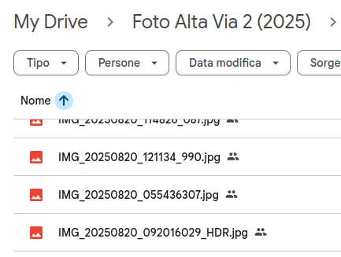
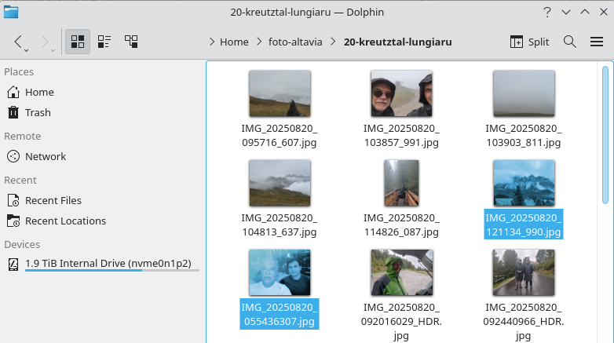

# When I say "alphabetical order", I mean "alphabetical order"

Last month I have been on a multi-day hike with my dad. Each of us took
many pictures, and when we came back we put them all in a shared folder.
We both have Android phones, and the naming scheme used for our pictures
was the same: `IMG_YYYYMMDD_HHmmss` followed maybe by some other numbers
and then a `.jpg`. Here `YYYY` stands for the year, `MM` for month and
so on, so that sorting the pictures in alphabetical order is the same as
sorting them by date.

Or so I thought. Strangely, when I looked at the files from my dad's
Windows PC, they were not sorted correctly: all the pictures took
with my phone came first, followed by all the pictures took by him.
I thought this was surely some weird Microsoft bug - after using
Windows 11 at work for a while, I would not be surprised if you
told me their file explorer can't figure out how to sort strings.

But then I looked at the same files in a shared Google Drive folder,
and again they were in the wrong order:



As you can see, the picture taken at 5:54 (with my dad's phone) comes
before the one taken at 9:20 (also with my dad's phone), but after the
one taken at 12:11 (with my phone).

Weird. Well, maybe Microsoft *and* Google got this wrong. But
that seems unlikely.

Indeed, KDE's Dolphin file manager does the same thing:



I'll spare you the screenshots, but Gnome and both the file managers
that I have on my phone also get the alphabetical order wrong.

At this point I thought that maybe one of the two phones is using some
weird alternative unicode character instead of the underscore `_`. Really,
I could not see any other explanation. But nope, this is not it, because
the good old `ls` sorts my files correctly:

```
$ ls -l

total 218572
-rw-r--r-- 1 seba seba 1866185 Aug 28 18:51 IMG_20250820_055436307.jpg
-rw-r--r-- 1 seba seba 4749899 Aug 28 18:50 IMG_20250820_092016029_HDR.jpg
-rw-r--r-- 1 seba seba 6201609 Aug 28 18:52 IMG_20250820_092440966_HDR.jpg
-rw-r--r-- 1 seba seba 7694802 Aug 28 18:51 IMG_20250820_092832138_HDR.jpg
-rw-r--r-- 1 seba seba 1536520 Aug 20 09:57 IMG_20250820_095716_607.jpg
-rw-r--r-- 1 seba seba 1054553 Aug 20 10:38 IMG_20250820_103857_991.jpg
-rw-r--r-- 1 seba seba  965353 Aug 20 10:39 IMG_20250820_103903_811.jpg
(and so on)
```

This was consistent among the couple of Linux distros I use, as well
as my OpenBSD server. On the one hand this is good: not *every* single
piece of software fucks up something as basic as string sorting. On the
other hand, this makes it harder to debug what the fuck is going on with
all the other file managers.

It took me more than a month to figure this one out. Tell me, which
file do you think comes first in alphabetical order, `file-9.txt` or
`file-10.txt`?

Of course, the user who named those files probably wants `file-9.txt` to
come before `file-10.txt`. But `1` is smaller than `9`, so `file-10.txt`
should be first in alphabetical order. Everyone understands that, and
soon people learn to put enough leading zeros if they want their files
to stay sorted the way they like.

Well, apparently all these operating systems have decided that no,
users are too dumb and they cannot possibly understand what alphabetical
order means.  So when you ask them to sort your files alphabetically,
they don't. Instead, they decide that if some piece of the file name is
a number, the real numerical value must be used.

I don't know when this became the norm, to be honest I have not used a
normal graphical file manager in a long time.

*I know you asked for the files to be sorted in alphabetical order,
but you don't want `file-10.txt` to come before `file-9.txt`, do
you? No, I know you don't. I am not even going to ask you, your
mushy human brain is too small to comprehend the intricacies of
such a question. I'll spare you the thinking.*

So it turns out that my dad's phone wrote the milliseconds in the file
name right after the seconds, while mine added an extra underscore to
separate them from the seconds.  Which in my mind it should not have
mattered, because alphabetically they should still have been sorted
correctly to the second. But with this "modern" interpretation of the
alphabetical order, the files without the extra separator in the name had
a much higher number, so they come last.

Now that I know what the issue is, I can solve it by renaming the files
with a consistent scheme. I have also found a setting to fix Dolphin's
behavior, but it was very much buried into its many configuration
options. And I would rather not have to change this setting in every
application I use, assuming they even allow it.

I miss the time when computers did what you told them to, instead of
trying to read your mind.
