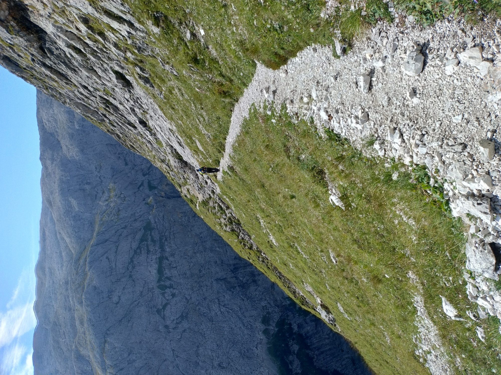

# The hike

Hello, people who read my rants about software! This update is not
about copmuter stuff, so it does not quite fit the theme of this blog.
I'll keep it short.

A couple of months ago I went on a crazy hike together
with my dad. For 9 consecutive days we walked on [Alta Via
2](https://en.wikipedia.org/wiki/Alta_Via_2), a high mountain route
through the Dolomites.  After the hike, I took some time to write about
it in these pages:

[My Alta Via 2 pages](../../av2)

If you are interested in this story, or if you just want to see some
cool pictures, do check them out!

