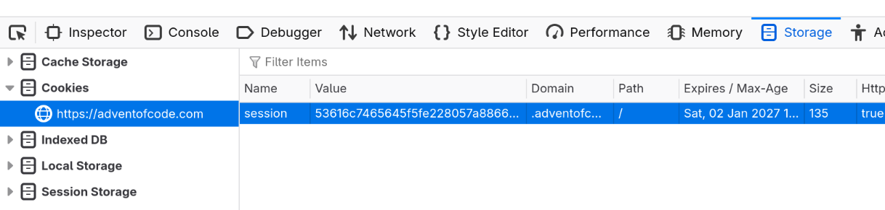

# Downloading AoC puzzle inputs with curl

As in the [past couple of years](../2023-12-25-advent-of-code), soon
I am going to take part in the daily programming challenges of the
[Advent of Code](https://adventofcode.com). This time I decided to take
some time and optimize my working setup a little bit - not that it matters
for someone solving the problems at my speed.

So let me show you how I automated downloading the inputs for the puzzles
(which require you to login) using [curl](https://curl.se).

## The problem

In case you are not familiar with the Advent of Code, it is a casual
programming challenge that takes place every year in December. Every day
a new problem is released, and you are supposed to write a program that
solves it and submit your answer as a short string, usually a number.
The fastest you solve the problems, the more internet points
you get, and you can brag about it with your colleagues.

The input data for each problem is given as a simple text file. Not
everyone gets the same, there are a few (hundreds? thousands? not sure)
of different inputs, and each user is assigned one.

This means that one must log in to be able to download their puzzle input.
To manually download the input file is quite tedious, so it would be nice
if there was a way to automate this. Of course,
[I am](https://github.polettix.it/ETOOBUSY/2022/11/28/aoc-inputs-downloader)
[not](https://packagist.org/packages/colinodell/aoc-downloader)
[the](https://github.com/johlinco/aoc-cli)
[first](https://github.com/Gronner/aoc-downloader)
[to](https://github.com/czyber/aoc-downloader)
[think](https://github.com/martintc/aoc-downloader-rs)
[about](https://github.com/scarvalhojr/aoc-cli)
[doing](https://github.com/colinodell/aoc-downloader)
[this](https://github.com/GreenLightning/advent-of-code-downloader).

## Session cookies

If log in was not required, we could simply download the input file for,
say, day 12 of 2024 and save it to `input.txt` with curl like this:

```
$ curl https://adventofcode.com/2024/day/12/input -o input.txt
```

But if you run this command, you'll get something like this:

```
Puzzle inputs differ by user.  Please log in to get your puzzle input.
```

To make curl act as if we were logged in, we need a
[session cookie](https://developer.mozilla.org/en-US/docs/Web/HTTP/Guides/Cookies).
If you log into [adventofcode.com](https://adventofcode.com) on a browser such
as Firefox, you can right-click on the page, select "Inspect" and then navigate
to Storage and then Cookies.



The long alphanumerical string under "Value" is your session cookie. Anyone
who gets a hold of it can pretend to be you on this website - by the way,
this is how the famous YouTube channel
[Linus tech tips got hacked](https://www.youtube.com/watch?v=yGXaAWbzl5A)
a couple of years ago.

Save this cookie somewhere, for example in an
[environment variable](https://en.wikipedia.org/wiki/Environment_variable)
called `AOC_SESSION_COOKIE`. Then run your curl with an extra option, like so:

```
$ curl https://adventofcode.com/2024/day/12/input -H "cookie: session=$AOC_SESSION_COOKIE" -o input.txt
```

And you are good to go!

## The fancy script

Typing out the full command above may look cooler than downloading the file
by right-clicking "Save page as", but it is just as annoying. So obviously I
saved that command to
[a script](https://git.tronto.net/scripts/file/aoc.html)
that also detects the correct file to download based on the current date
(or on two optional parameters for the year and the day). My script also
opens up an editor and [Lynx](https://en.wikipedia.org/wiki/Lynx_(web_browser))
session to set me up to speed, but that is not as interesting.

Happy coding!

### Update 2025-12-01

An interesting addition to my script: now it can also download and save
the `<code>` blocks and save them each in a separate file. This can
be useful because these blocks contain example input whose solution is
provided in the problem's page. The relevant code snippet, based on
`curl` and `sed`, is this:

```
url="https://adventofcode.com/$year/day/$daynozero"
curl "$url" | sed -n '/<pre><code>/,/<\/code><\/pre>/ p' | (\
        i=1
        rm -f "code-$i.txt"
        while read line; do
                if [ "$line" = "</code></pre>" ]; then
                        i=$((i + 1))
                        rm -f "code-$i.txt"
                else
                        echo "$line" | sed 's/<.*>//g' >> "code-$i.txt"
                fi
        done
)
```

