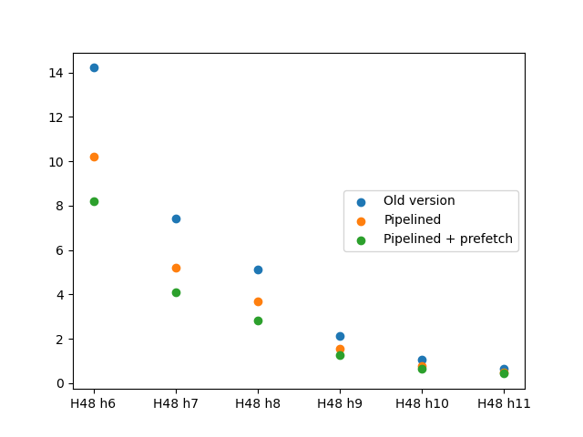

# Pipelining and prefetching: a 45% speedup story

In this blog post I want show you an impressive performance optimization
trick that I have recently come up with. Well, at least *I* was impressed;
your mileage may vary.

The trick consists in improving the memory
access pattern of the code and doing some manual
[*prefetching*](https://en.wikipedia.org/wiki/Prefetching).
I am not an expert on this topic, so I won't be able to explain
in detail how things work under the hood, but I'll try to provide
links to other sources whenever possible. For a start, you can have
a look at the amazing paper [*What Every Programmer Should Know About
Memory*](https://people.freebsd.org/~lstewart/articles/cpumemory.pdf).
It is a bit dated, but still very relevant.

## tl;dr

The main computational step in my program is a [depth-first
search](https://en.wikipedia.org/wiki/Depth-first_search) on an implicit
graph. At each node, a heuristic is used to determine if it is worth
continuing the seach from the current node or not. The heuristic uses
data that is stored in very large (many gigabytes), precomputed *pruning
table*.

Fetching data from RAM in random order is much slower than
other operations.  However, if the CPU knows in advance
that some data should be fetched, it can *prefetch*
it while other operations are performed. There are even
[intrinsics](https://en.wikipedia.org/wiki/Intrinsic_function#C_and_C++)
that one can use to tell the CPU that it should prefetch some data and
keep it in cache.

My trick boils down to expanding multiple neighbor nodes "in
parallel". This way, after the pruning table index for one neighbor is
computed, the corresponding value is not immediately accessed and used,
as other nodes are expanded first. This gives the CPU some time to
prefetch the data.

This way I obtained a speedup of 33% to 45%. This made my program, as
far as I know, the fastest publicly available Rubik's cube optimal solver.

## The problem

The program that I am working on is an *optimal Rubik's cube
solver*.  That is, a program that can find the shortest possible
solution to any given Rubik's Cube configuration.

This project has been for me an amazing playground for developing
[new skills](../2025-04-05-learned-rewrite). It has also been a source
of inspiration for many posts in this blog, starting from [*The big
rewrite*](../2023-04-10-the-big-rewrite), where I talked about how I
decided to start this project as a total rewrite of an earlier tool
of mine.

In this post we are only going to be concerned with the main solving
algorithm, the hardcore computational engine of this program.

You can find the source code
on [my git pages](https://git.tronto.net/nissy-core/) and on
[GitHub](https://github.com/sebastianotronto/nissy-core).

## The solving algorithm

### Solution search

The idea behind the solving algorithm is a simple brute-force tree
search: for each position, we make every possible move and check if
the configuration thus obtained is solved. If it is not, we proceed
recursively.

This is an oversimplification of course, and at least a couple of
optimizations are needed to make this approach even remotely feasible.

First of all, one may naturally think of
implementing this algorithm as a [breadth-first
search](https://en.wikipedia.org/wiki/Breadth-first_search),
because we are trying to find the shortest possible solution. But
a BFS needs to keep a list of all nodes to be processed at the
next iteration, and this we are never going to have anough memory
for that. So we use instead an [iterative-deepening depth first
search](https://en.wikipedia.org/wiki/Iterative_deepening_depth-first_search):
a DFS with depth limited to a certain value N that gets increased at
each iteration. This way we repeat some work, because a search at depth
N+1 includes a full search at depth N, but since the number of nodes
increases exponentially with the depth this won't matter much.

### Pruning tables and IDA\*

The second optimization we need is some kind of heuristic that
enables us to skip some branches: if, given a cube configuration,
we are able to determine a lower bound for the number of moves it
takes to solve it, we can stop searching at nodes whose value is
too high for the depth we are searching at.

For example, suppose we are searching for a 10 move solution,
and after 3 moves we get a lower bound of 8. With this we
know that we won't be able to find a solution shorter than 3
+ 8 = 11 moves, so we can stop the search from this node.

An algorithm of this kind is sometimes called [iterative-deepening A\*
algorithm](https://en.wikipedia.org/wiki/Iterative_deepening_A*), or IDA\*
for short.

To get a lower bound for each configuration, we employ a large
pruning table, which one can think of as a hash map: from the
cube configuration we compute an integer (the hash value, or
[coordinate](../../speedcubing/coordinates)) which we use as an index
in the table. The value at this index is going to be a lower bound for
our configuration, and for all other configurations that share the same
"hash value".  Since the number of valid Rubik's Cube configuration is on
the order of 10<sup>19</sup>, we are going to have many "hash collision".
But the larger the table is, the more the precise the lower bound can be,
and the faster the solver is.

### The bottleneck

Many other optimizations are possible, and in fact my solver uses a
bunch of them, but the details are not relevant for this post. What is
relevant for us is that, for any reasonably optimized solver, looking up
the lower bound values in the pruning table is going to be the bottleneck.
Indeed, fetching data from memory is very slow on modern CPUs compared
to other operations - on the order of hundreds of times slower than
executing simple instructions, such as adding two number.

Luckily, there are some caveats. First of all, modern CPUs have two or
three levels of [cache](https://en.wikipedia.org/wiki/CPU_cache), where
recently-fetched data is stored for fast subsequent access. Unfortunately,
this won't save us, because we are accessing essentially random addresses
in our pruning table.

But there is a window for optimization. CPUs work in
[pipelines](https://en.wikipedia.org/wiki/Pipeline_(computing)), meaning
that, in some cases, they can execute different types of instructions
in parallel. For example, if the CPU can predict in advance that
the program is going to access some data in memory, it can start the
(slow) fetching routine while other instructions are still running.
In other words, the CPU can take advantage of a predictable [memory
access pattern](https://en.wikipedia.org/wiki/Memory_access_pattern).
And in some cases we may even be able to give a hint to the CPU on when
to start fetching data, using specific prefetching instructions.

This is what my trick relies on.

## A software pipeline for the hardware's pipeline

### The old version

Before this optimization, my code followed a pattern that can be
summarized by the following Python-like pseudocode:

```
def visit(node):
	if should_stop(node):
		return

	if solution_is_reached(node):
		append_solution(node)
		return

	for neighbor in node.neighbors:
		visit(neighbor)

def should_stop(node):
	if should_stop_quick_heuristic(node):
		return true

	index = pruning_table_index(node)
	return pruning_table[index] > target:
```

The actual code is a fair bit more complicated than the pseudo code above,
but this should give you a good idea of my earlier implementation.

As we discussed in the previous sections, the slow part of this code
are the last two lines of `should_stop()`: we are trying to access
`table[index]` right after `index` was calculated. In my case, the
function `pruning_table_index()` does some non-trivial operations, so
it is impossible for the CPU to figure out, or even to guess, the value
of `index`. Therefore, there is no time for the CPU pipeline to fetch
the value of `table[index]` in advance: the code execution will stall,
waiting for the value to be retrieved from memory before it can determine
whether it is greater than `target` or not.

### The new version

To make this code more CPU-friendly, we need to change the order in
which we perform our operations. And we can do this by creating a sort
of pipeline of our own, expanding all neighbor nodes at the same time in
"stages". Something like this:

```
def visit(node):
	if solution_is_reached(node):
		append_solution(node)
		return

	prepared_neighbors = prepare_nodes(node.neighbors)
	for pn in prepared_neighbors:
		if not pn.stop:
			visit(pn.node)

def prepare_nodes(nodes):
	prepared_nodes = []

	# Stage 1: set up the nodes
	for node in nodes:
		pn = prepared_node()
		pn.node = node
		pn.stop = should_stop_quick_heuristic(node)
		prepared_nodes.append(pn)

	# Stage 2: compute the index and prefetch
	for pn in prepared_nodes:
		if not pn.stop:
			pn.index = pruning_table_index(pn.node)
			prefetch(pruning_table, index)

	# Stage 3: access the pruning table value
	for pn in prepared_nodes:
		if not pn.stop:
			pn.stop = pruning_table[pn.index] > target

	return prepared_nodes
```

With this new version, we compute `index` for all neighbors well before
trying to access `table[index]` for each of them. Each node has from 8
to 15 neighbors, and computing all these indeces gives time to the CPU
to fetch, or at least start to fetch, the corresponding table values.

It is interesting to note that, at least in theory, it may look like
this new version of the DFS is slower than the previous one, because
we are potentially doing more work. Imagine the solution is found while
visitng the node that came first in the list of neighbors of the previous
node: with the new algorithm, we have "prepared" for visiting all other
neighbors too, including the expensive table look ups; but that turned
out to be wasted work!

But in reality the extra work is not much: at most 14 \* depth nodes
will be uselessly prepared at each iteration of the IDA\* algorithm.
In practice, the time saved by allowing the CPU to prefetch the data is
much more significant.

### Manual prefetch

In the pseudocode above I added a call to a `prefetch()` function.
What this exactly does depends on the language, the compiler and the
CPU architecture.

Most modern x86\_64 processors support instructions such
as `PREFETCHT0`, which can by trigger by the `_mm_prefetch()`
[instrinsic](https://www.intel.com/content/www/us/en/docs/intrinsics-guide/index.html).
This instruction will tell the CPU to fetch the data stored at a specified
address in memory and keep it in cache. There are similar instructions
for other CPU architectures, but in practice it is more convenient to
rely on the `__builtin_prefetch()` function, supported by GCC, Clang,
and possibly other compilers.

In my case, re-organizing the code alone, without using any explicit
prefetch instruction, already gave a substantial 25% to 30% speedup on
my x86 machine.  Adding an explicit `__mm_prefetch()` resulted in an
additional 10% to 20% improvement. See the benchmarks below for details.

## Measuring the performance gain

In the the repository you can find a comprehensive set of benchmarks
of the current version of the H48 solver. They include a comparison
with [vcube](https://github.com/voltara/vcube) and an analysis of
multi-threading performance. In this section, however, we are going to
focus on the performance gain obtained by pipelining the IDA\* search.

The H48 solver supports pruning tables of different size; I have included
6 of them in these benchmarks, ranging from 1.8GiB to 56.5GiB. *(Yes,
I have 64GB of memory on [my desktop](../2023-10-15-build-time);
I bought it before RAM prices went [through the
roof](https://en.wikipedia.org/wiki/2024%E2%80%932026_global_memory_supply_shortage).)*

Since the runtime increases exponentially with each additional move,
I like to split the benchmarks by length of the optimal solution. Here
I used sets of 25 cube positions of each solution length between 16 and
19. I have then used the [approximate distribution for a random Rubik's
Cube configuration](https://cube20.org) to calculate the average runtime.
In short, about 99.8% of all the configurations require between 16 and
19 moves to solve optimally, and are thus covered by our tests.

### Old version (no pipeline, no prefetch)

|  Solver  |  Size  |16 moves|17 moves|18 moves|19 moves|
|:---------|:-------|-------:|-------:|-------:|-------:|
|H48 h11   |56.5 GiB|   0.05 |    0.13|    0.73|    3.43|
|H48 h10   |28.3 GiB|   0.06 |    0.23|    1.20|    6.18|
|H48 h9    |14.1 GiB|   0.08 |    0.36|    2.47|   11.79|
|H48 h8    | 7.1 GiB|   0.12 |    0.79|    6.09|   25.58|
|H48 h7    | 3.5 GiB|   0.11 |    1.07|    8.59|   42.16|
|H48 h6    | 1.8 GiB|   0.19 |    2.12|   16.29|   82.24|
*Time per cube (in seconds, lower is better).*

### Pipelined version without manual prefetch

|  Solver  |  Size  |16 moves|17 moves|18 moves|19 moves|
|:---------|:-------|-------:|-------:|-------:|-------:|
|H48 h11   |56.5 GiB|    0.04|    0.10|    0.55|    2.41|
|H48 h10   |28.3 GiB|    0.05|    0.16|    0.89|    4.33|
|H48 h9    |14.1 GiB|    0.06|    0.29|    1.82|    8.26|
|H48 h8    | 7.1 GiB|    0.11|    0.59|    4.37|   17.97|
|H48 h7    | 3.5 GiB|    0.10|    0.79|    6.01|   28.98|
|H48 h6    | 1.8 GiB|    0.18|    1.56|   11.72|   57.92|
*Time per cube (in seconds, lower is better).*

### Pipelined version with manual prefetch

|  Solver  |  Size  |16 moves|17 moves|18 moves|19 moves|
|:---------|:-------|-------:|-------:|-------:|-------:|
|H48 h11   |56.5 GiB|   0.04 |    0.09|    0.50|    2.24|
|H48 h10   |28.3 GiB|   0.04 |    0.15|    0.76|    3.36|
|H48 h9    |14.1 GiB|   0.05 |    0.24|    1.48|    6.69|
|H48 h8    | 7.1 GiB|   0.09 |    0.46|    3.36|   14.13|
|H48 h7    | 3.5 GiB|   0.09 |    0.63|    4.85|   23.25|
|H48 h6    | 1.8 GiB|   0.14 |    1.25|    9.45|   46.31|
*Time per cube (in seconds, lower is better).*

### Result summary

Here are the derived results for random cube positions:

|  Solver  |  Size  |Old version|Pipelined|Pipelined + prefetch|
|:---------|:-------|----------:|--------:|-------------------:|
|H48 h11   |56.5 GiB|      0.64 |    0.48 |               0.43 |
|H48 h10   |28.3 GiB|      1.07 |    0.78 |               0.66 |
|H48 h9    |14.1 GiB|      2.14 |    1.57 |               1.28 |
|H48 h8    | 7.1 GiB|      5.14 |    3.68 |               2.84 |
|H48 h7    | 3.5 GiB|      7.44 |    5.20 |               4.10 |
|H48 h6    | 1.8 GiB|     14.22 |   10.20 |               8.21 |
*Time per cube (in seconds, lower is better).*



These results imply the following speed ups when compared to the old,
non-pipelined version:

|  Solver  |  Size  |Pipelined|Pipelined + prefetch|
|:---------|:-------|--------:|-------------------:|
|H48 h11   |56.5 GiB|     25% |                33% |
|H48 h10   |28.3 GiB|     27% |                38% |
|H48 h9    |14.1 GiB|     27% |                40% |
|H48 h8    | 7.1 GiB|     28% |                45% |
|H48 h7    | 3.5 GiB|     30% |                45% |
|H48 h6    | 1.8 GiB|     28% |                42% |
*Percentage, higher is better*

As you can see, the improvements are less meaningful for larger
solvers. This makes sense, because larger tables provide a more precise
heuristic, leading to fewer table lookups. Looking at the complete tables
above, we can also see that the speedups are larger when the solutions are
longer, once again because longer solutions require more table lookups.

As we have previously noted, most of the benefit (25% to 30%) comes from
pipelining the algorithm, while adding a manual prefetch instruction
gives another 10% to 20% on top of that. This means that, once the
code is organized nicely from a memory access point of view, the CPU
can figure out what data to prefetch decently well.  However, manual
prefetch still give a significant improvement over the CPU's predictions.

## Conclusion

I am very proud of this optimization: it required some work, but in the
end it paid off quite well. I am also happy that I was able to learn
and put into practice concepts that for me were relatively new.

I guess this is a good example of how low-level optimization actually
requires reorganizing how an algorithm works on a higher level of
abstraction. Memory access is so ubiquitous that we rarely think about
it, but it can often be the bottleneck; when it is, you may not be able
to optimize by just working locally.

The technique I used here could be pushed further, by extending the
pruning pipeline to neighboring nodes of the next node to be expanded.
But is quite tricky, as it requires breaking up the recursive
structure of the DFS. This goes in the direction of implementing
[micro-threading](https://en.wikipedia.org/wiki/Micro-thread_(multi-core)),
a technique that was pointed out to me for the first time by Tomas
Rokicki.  If I end up implementing this too, I will definitely make a
dedicated post about it :)
