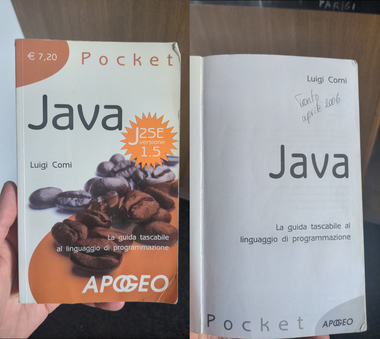
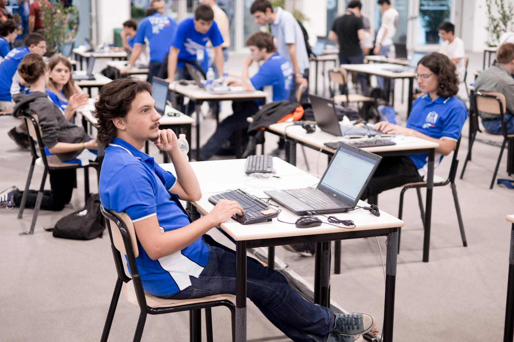

# 20 years of programming

The first time I wrote some gibberish on a computer, compiled it and run
it was over 20 years ago. In this post I want to tell you the story of
how it all started, and how it continued.

## It started with BASIC

It was the end of 2005, I was 11 years old. A friend of mine shared with
me this strange program that let you *create other programs*.

This program was called
[DarkBASIC](https://en.wikipedia.org/wiki/The_Game_Creators#DarkBASIC).
It was an IDE with its own language and game development framework. This
framework made it quite easy to load pictures, sound and even 3D models,
but we did not go much further than making a couple of short text
adventure games, and other less useful programs.

Although I guess one of these "less useful" programs was somewhat
interesting, since it ultimately made me learn a proper programming
language. I forgot what exactly this program did, but at some point
you could input a password. Later in the execution, if you typed this
password wrong, it would delete the `C:\Windows` folder from your PC. And
sure enough, I tried it and got the password wrong on the very first try.

Ah, those were days. My only complaint about DarkBASIC is that it bundled
a lot of stuff when it built your code into an executable, so that even
the most minimal program would result in a *huge* 1.5Mb binary. Just
large enough not to fit in a floppy disk. So it was kinda hard to share
programs with my friends.

Anyways, my parents were not happy with my amazing Windows-erasing
program, as we had to pay someone to fix the family PC. But my mom
offered me a deal: if I promised never to make harmful software again,
she would buy me a book to learn a real programming language. In case you
did not know, in 2005 you learnt programming languages by reading books.

## The Java phase

According to the [TIOBE index](https://www.tiobe.com/tiobe-index/),
Java was the most popular programming language in 2006, and so it
was chosen as my first *real* programming language.

The book explained how to write, compile and run code the proper way: no
fancy IDE, just notepad and command-line tools. It took me days, if not
weeks to figure out how to add `javac` and `java` to the Windows `$PATH`,
but in the end I made it and I could finally run my Hello World. A couple
of years later I would switch to Linux, where all of this is trivial;
to this day I still wonder why some programmers *choose* to use Windows.

This pocket book, and another one that I bought soon afterwards, explained
many topics, including object-oriented programming and how to make GUI
applications. I don't think I got OOP at the time - it was meant to solve
problems I had never encountered. Now that I have been a professional
software developer for a few years, I don't think I get it either -
it still does not solve any problem I have encountered; if anything,
it creates a few more.

I managed to recover some of the
programs I wrote between 2006 and 2010 in [a git
repository](https://git.tronto.net/ancient-projects/file/README.md.html).
The most successful one is JBriscola, a single-player game of
[briscola](https://en.wikipedia.org/wiki/Briscola) with a decent AI. It is
actually quite fun to play, and a few of my friends played it regularly
back then.  It's so cool that they still run on a modern Java runtime -
good job, Java! Great backwards compatibility.

At some point in 2009 or so I bought a third, more advanced Java book.
My goal at the time was learning how to make more complex GUI applications
- something I don't find particularly enjoyable nowadays, but at the
time I was having a lot of fun with it. But I never read past
the first half of this book, because my focus shifted to [programming
challenges](https://en.wikipedia.org/wiki/Competitive_programming).

## Competitive programming

I don't remember exactly how it happened, but in 2010, in my second
year of high school, I qualified for the regional phase of the national
competitive programming circuit. In school we were learning Pascal (for a
grand total of 10 hours a year), but I thought that with Java knowledge
it would have been better to pick up C or C++, the other two languages
allowed in the contest. And so I did: I learnt just enough C to get by,
and somehow I qualified for the *Olimpiadi Italiane di Informatica* -
the national final.

Not only did I qualify, but I also did pretty well in it: I ended
up in the top-half of the ranking. Considering my young age (the
competition was open to students of all 5 years of high school,
and I had just started my 3rd year) I was invited to take part in the
[IOI](https://en.wikipedia.org/wiki/International_Olympiad_in_Informatics)
preparation stages. A new world opened up for me.

In these preparation stages, to which I was invited for three
consecutive years, I learnt a lot about data structures, algorithms and
computational complexity. I used C++, although it was very much "C with
[STL](https://en.wikipedia.org/wiki/Standard_Template_Library)" - I dont
think I wrote a class or even a struct at the time. But I did not care
much: C++ was just a tool for a specific task, like Java and DarkBASIC
were. The task was writing text adventures first, GUI programs later
and it was now solving puzzles.

In 2012 I qualified for the IOI as a B-team member - the hosting country,
which was Italy that year, was allowed to bring a second team who could
compete without appearing in the official rankings. In the end that was
a good call, as all the members of the A-team did better than me - my
[results](https://stats.ioinformatics.org/people/2818) were not amazing.

I enjoyed this part of my programming journey a lot. You may think that
this cemented my passion for coding and turned me into a programmer. But
somehow, it did the opposite.

## The Math break

Solving programming puzzles made me enjoy problem-solving, logic reasoning
and formal proofs more than coding. I was also enjoying Math contests
during high school, and these two things made me realize I wanted to dive
deeper into the theory, rather than just writing code. So I decided to
sign up for a Mathematics program at University.

During my first year (2013-2014) I kept coding a little bit: I was
solving problems on [projecteuler.net](https://projecteuler.net/),
I learnt some [J](https://www.jsoftware.com/) (an ASCII-based
[APL](https://en.wikipedia.org/wiki/APL_(programming_language))
clone), I started porting JBriscola to
[Scala](https://en.wikipedia.org/wiki/Scala_(programming_language)) -
I wonder if I still have that code somewhere.  I even looked into Rust
and Go, two languages that had just been announced.  But I lacked the
motivation for starting a new project, and soon I would drop all these
new languages - except J, I still use it as a fancy desktop calculator
from time to time.

For a while I tried to follow also my passion for computer science by
taking elective courses in OOP, Algorithms, and Functional Programming.
But it was not easy to find a study program that combined the two
subjects in way I liked. I ended up signing up for a pure Math master:
the [ALGANT](https://algant.eu/) program.

Between 2015 and 2018 I did not write much code outside of the
little that was needed for my studies. As a noteworthy exception,
I did take part in the North-West Europe regional phase of the [ACM
ICPC](https://icpc.global/), a programming contest for university
students. But even then, I put very little effort into practicing for it -
I just had other priorities at the time.

## Back at it

After graduating, I doubled down on Math and decided to get
a PhD.  But at the beginning of my PhD, in 2019, I wrote
some code for work: my supervisor and a colleague of mine had
devised an algorithm to compute the degrees of certain [field
extensions](https://en.wikipedia.org/wiki/Field_extension),
and I [implemented
it](https://git.tronto.net/kummer-degrees/file/README.md.html).

I don't know if this is what got me back into coding for fun, or if it
was just a matter of time, but by the end of 2019 I was already thinking
about writing a Rubik's cube solver. 6 years and two rewrites later,
I am still working on this project, which became a great sandbox for
learning new topics and a good source of inspiration for blog posts.

Still during my PhD,
[COVID](https://en.wikipedia.org/wiki/COVID-19_pandemic) hit.  Forced to
spend long hours alone in my one-room apartment, I had more time to code
and tinker with Linux and OpenBSD. A couple of years later I started
this blog. As I was now approaching the end of my PhD, I had to decide
if I wanted to continue in academia or do something else.

And I chose to do something else: I chose to become a software developer.

## Now it's (not just) my job

When I applied for jobs as a software engineer, I thought there was a
chance I could get fed up with programming and quit it as a hobby. After
all, I liked Math, but when I was a PhD student I did not do much of it
in my weekend or my free time.

But coding was different. I can't seem to get tired of it nowadays. If
during the week I write C# for a living, in the weekend I work on my C
projects or hack on shell scripts.  If at day I work with Python, at night
I solve puzzles in C++ or play around with [Hare](https://harelang.org/).
When I had a few idle months between projects, I learnt some Rust,
some QT and [ported my C program to WebAssembly](../2025-06-06-webdev).
I listen to programming talks and podcasts while I cook and do the dishes.

No, I did not get tired of programming. Maybe I never will.
