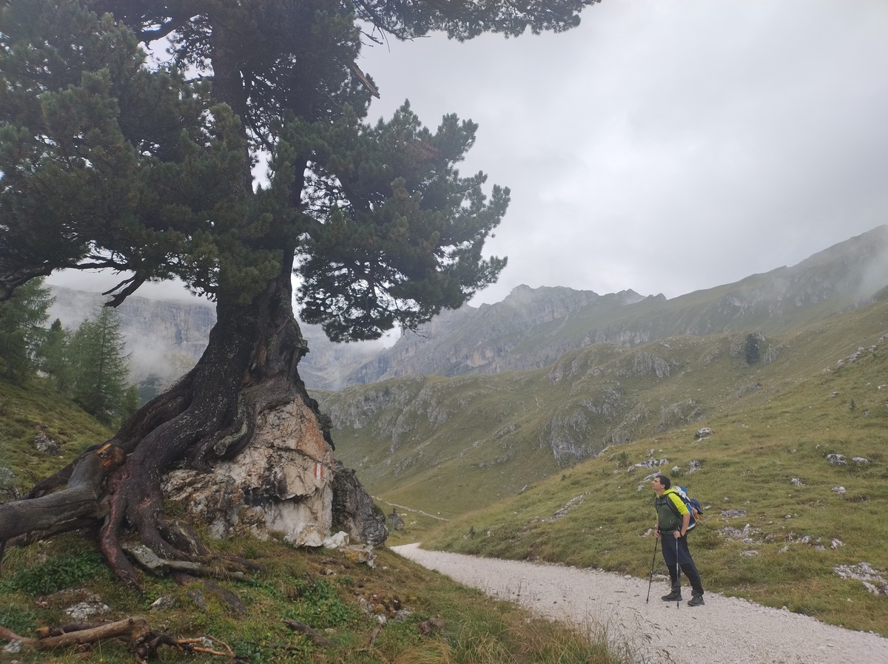

# Sebastiano Tronto

Hello! I am a software developer based in Leiden, The Netherlands.

Previously I was a PhD student in Mathematics at the Universities of
Luxembourg and Leiden. You can check out my [list of papers](research)
and [my talks](talks).

During my free time I enjoy tinkering with my computer, [programming](git)
and playing with the [Rubik's cube](speedcubing).

In August 2025 I completed
[Alta Via 2](https://en.wikipedia.org/wiki/Alta_Via_2), a 9-day hiking
route through the Dolomites. I wrote about this adventure in [this page](./av2)
- check it out if you want to see some beautiful pictures!
