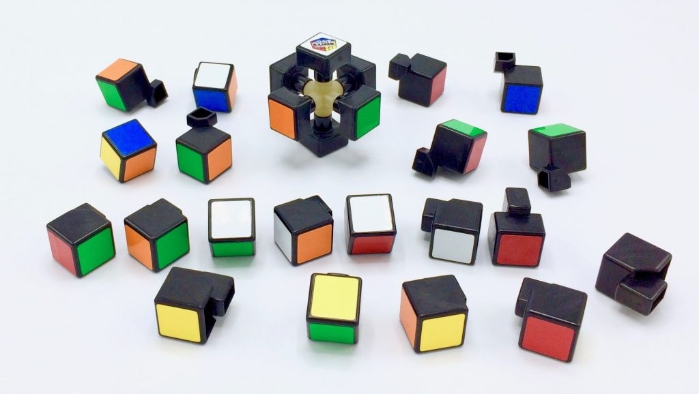
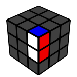
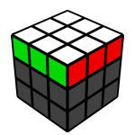
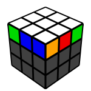
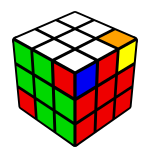
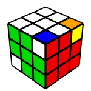
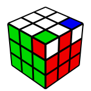
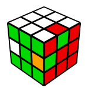
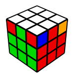

# Rubik's cube: how to figure it out

So you decided to try and solve a
[Rubik's Cube](https://en.wikipedia.org/wiki/Rubik%27s_Cube).  Maybe it
is for a bet. Maybe your parents grounded you for playing too much
Minecraft and now you have to find an off-line hobby.  Maybe you have
been fascinated by this toy since you were a kid and now that you have
retired from work you finally have the time to try and solve it.

Of course it is and all you have to do it to learn how to solve
this puzzle is asking your favorite search engine (or AI? I guess search
engines are *so* 2021...). Sure you can do that, and you will find plenty
of tutorials that teach you how to build it up *layer by layer*, and with
the help of some pre-mmemorized sequences of moves you can easily learn
it in a few hours (or days). Also, there are probably apps that can take a
picture of a scrambled cube and tell you how to solve it move by move.

But that feels a bit like cheating, doesn't it?  What if you want to
figure it out on your own, without relying on someone else's instructions?

This is where this page comes in. Here I will try to explain just enough
about the Rubik's cube so that you can try and tackle it alone. After
explaining some basics about how the cube works as a 3D puzzle, I will
introduce a couple of general-purpose techniques to help you move the
pieces around, without telling you directly what steps to take.

So, let's dive in!

## How it works

The first thing you should do to understand how the cube works is taking
it all apart and inspect the pieces it is made of and the mechanism
holding them together.

Well actually don't do it, just look at the picture below:

As you can see, there are three types of pieces:

* **The core**, consisting of 3 axes intersecting in the center. Some
screws and springs keep the **6 center pieces** attached to it, in such
a way that they can spin. This is what makes the faces turn.
* **Edge pieces**, with only two colored faces each. When the cube is
assembled, they lie between two center pieces. There are 12 of them.
* **Corner pieces**, with three colored faces each. When the cube is
assembled, each corner piece is adjacent to 3 edge pieces, and it
touches 3 center pieces "diagonally". There are 8 corner pieces.

So far so good. But what does this tell us about solving the cube
by turning its sides?

First of all, the fact that the centers are attached to the core implies
that their relative position does not change, ever. In other words, you
can think of the **centers as fixed** pieces, and **build the rest
around them**.

Another important thing that is made clear by looking at the disassembled
cube is that **you should think about pieces, not stickers** or colors.
When naïvely attempting to solve the cube without a clue, many would
think about "moving this color there". But what you have to always keep
in mind is that you can never move a single colored sticker: the other
colored stickers attached to the same piece, be it an edge or a corner,
will always move with it.

Now we are ready to move on to some fundamental techniques. If you have
actually disassebled your cube, put it back together *in a solved state*:
if you don't, there is a good chance (11 out 12) that you will reassamble
it in an **unsolvable state**, just like a
[15 puzzle](https://en.wikipedia.org/wiki/15_Puzzle) with the
last two number swapped.

## Building blocks

Most methods to solve a Rubik's cube a divided into steps, where:

* In the first few steps, you put together blocks of pieces. This is 
also known as **blockbuilding**. These steps are often "intuitive",
which means that they do not require memorizing sequences of moves
to apply blindly.
* In the last few steps, you need to move around a few remaining pieces
without destroying the progress made in the previous steps. Most of the
time steps like these rely on memorized sequences of moves that are known
to only affect the position of certain pieces; but there are alternative
approaches, as we will see later.

So, what do we mean exactly by "block of pieces"? To be precise we could
say that two or more adjacent pieces form a block when adjacent stickers
of different pieces have the same color. For example, the simplest kind
of block is a **pair**, that you can see in the picture below:

To be precise, the one above is a coner-edge pair. There are also center-edge
pairs, consisting of a center and an edge, but they are rarely referred to
as "pairs". In any case, they do fit our definition of "block".

A more complex example of a block is a **layer**, which is the result of
the first two steps of the classic "layer by layer" method. This one is
a correctly solved layer:

On the other hand, this is **not a layer**:

It is worth pausing here to reflect a bit. The last two pictures both
clearly show a solved white face, don't they? For a most people, they
could look equivalent. But remember what we said earlier: you should
think about *pieces*, not *stickers*. In the last picture, the pieces
have all white on top, but their side colors do not match (except for
the blue-white edge and the blue-orange-white corner). So they do not
form a block, which means that their **relative position** is incorrect.
By contrast, the second to last picture shows a block: all side colors
match, not only the white top. This means that the pieces are in correct
relative position with respect to each other.

With this in mind, you can starting making your own way through
the first few steps of your solving method: try to build multiple
blocks of pieces and put them together to make even bigger blocks.

If you want some more hints, Ryan Heise's website contains some nice
examples about building blocks in his
[fundamental techniques page](https://www.ryanheise.com/cube/fundamental_techniques.html).

## Commutators

*In the rest of this page I am going to use the standard
[Rubik's cube notation](../notation) to write down sequences of moves.
You should familiarize with it at least a bit before continuing. Don't
worry, it's very easy.*

The more blocks you build, the harder it becomes to make progress. The
reason for this is that you want to avoid destroying the blocks you
have already built, so your options become more and more restricted
as you go. This is completely normal.

The most common speedsolving methods go around this issue by
prescribing the use of memorized sequences, somewhat improperly
called "algorithms".  For example the layer by layer method relies
on blockbuilding to build the first layer, but on at least 5
"algorithms" to complete the last two layers.  The more advanced
[CFOP](https://www.speedsolving.com/wiki/index.php/CFOP_method) method
uses blockbuilding for the first two layers, but it then requires
78 different "algorithms" to complete the last layer.

Here I am going to outline an alternative, more flexible approach,
based on
[commutators](https://www.speedsolving.com/wiki/index.php?title=Commutator).
They are generally considered an advanced technique, I believe that
they are perfectly fine to learn as a beginner. Ryan Heise's page that
I linked above has a
[section about them](https://www.ryanheise.com/cube/commutators.html),
too.

If you have not done it already, you should have a look at my page on
[the Rubik's cube notation](../notation) before continuing.

### Corner commutators

Suppose that you manage, via blockbuilding, to reach the following state:

First of all, this would be an amazing achievement! The whole cube is
solved except for three corners. The bottom-left corner (only one red
sticker visible) is white-green-red, and it should go to the place where
the white-red-blue corner is right now. The latter should in turn take
the place of the corner on the right whose visible stickers are orange
and yellow (the hidden sticker being green). In Mathematical terms, these
3 corner form a **permutation cycle of 3 pieces**, or 3-cycle for short.

Commutators are a general technique to solve 3-cycles of pieces. They
can be decomposed in 4 small steps:

1. **Interchange**: a single move that interchanges two of the three
pieces.
2. **Insertion**: a sequence of moves (usually 3) that inserts the third
piece into the place of one of the other two, without affecting the
"interchange" face of the cube in any other way.
3. **Inverse interchange**: the inverse of the move done in step 1.
4. **Inverse insertion**: the inverse of the sequence of moves done in step 2.

**Note:** step 1 and 2 can appear in the other order; if they do, steps
3 and 4 should also be swapped.

Let's look at an example. From the position in the picture above, you
can interchange the top two corners using the move U. More precisely, U
brings the orange-yellow-green corner into the position currently occupied
by the white-red-blue corner. The move U' also works, as it moves the
white-red-blue corner to the position of the orange-yellow-green one.

An interchange move is worth nothing without a compatible insertion
sequence. In this case, you can use R' D R as insertion: this sequence
of 3 moves moves the red-green-white corner to the place currently
occupied by the white-red-blue one and, very importantly, **it does not
affect any other piece in the U layer**. To put it in another way,
**the interchange and the insertion only "clash" on one corner**.

The last thing to decide before we put all of this together is which
one should go first: the interchange or the insertion? This is not hard
to figure out: I described both of them as "moving a certain piece into
a certain position"; only one of the two moves a piece in its correct
final position, and that is the sequence that must go first. In our case
it is the insertion, because the red-green-white corner's final position
is the one occupied by the white-red-blue one.

So our commutator looks like this: R' D R U R' D' R' U'. Let's split
this up to review it:

* **R' D R**: the insertion sequence, moving the red-green-white corner
to the position of the white-red-blue one.
* **U**: the interchange move, moving the orange-yellow-green corner
to the position now occupied by the red-green-white one.
* **R' D' R**: the inverse of the insertion sequence. To invert a sequence
of moves, you have to **read it backwards inverting every single move**.
Here we start with R', because it is the inverse of R, the last move of
the insertion sequence; then we have D', the inverse of the second move; 
and finally R, the inverse of the first move of the insertion sequence.
* **U'**: the inverse of the interchange move.

To help understanding all of this, you can visualize this commutator
[alg.cubing.net](https://alg.cubing.net/?setup=%5BU,_R-DR%5D&alg=R-_D_R_%2F%2FInsertion%0AU_%2F%2FInterchange%0AR-_D-_R_%2F%2FInverse_insertion%0AU-_%2F%2FInverse_interchange).

**Note:** looking at the position of the pieces is not enough to
determine a correct commutator to permute them. Their **orientation**
is also important. For example, consider the following case:

The three corners are permuted in exactly the same way, so everything
we said above could be repeated word by word, move by move. However,
if you apply the commutator we constructed to this case, you'll get
something like this:

What's wrong here? Well, obviously the cube is not solved. All the pieces
are in their correct position, but two corners are twisted in place!

To avoid situations like this when creating your commutators, you need to
keep track of **which sticker goes where**. I know, I know: I said at the
beginning that *pieces* are important, not *stickers*. This is still true,
but sometimes it is important to keep track of both.

Let's highlight the difference between the two 3-cycles. In the first one:

1. The red-green-white corner must go to the place of the white-red-blue one,
*with the white sticker of the first going to the place of the white sticker
of the latter*.
2. The white-red-blue corner must go to the place of the
orange-yellow-green one, *with the white sticker of the former going to
the place of the orange sticker of the latter*.
3. The orange-yellow-green corner must go to the place of the red-green-white
one, *with the orange sticker of the former going to the place of the
white sticker of the latter*.

While in the second case:

1. The red-green-white corner must go to the place of the white-red-blue one,
*with the white sticker of the first going to the place of the* **blue** *sticker
of the latter*.
2. The white-red-blue corner must go to the place of the
orange-yellow-green one, *with the* **blue** *sticker of the former going to
the place of the* **green** *sticker of the latter*.
3. The orange-yellow-green corner must go to the place of the red-green-white
one, *with the* **green** *sticker of the former going to the place of the
white sticker of the latter*.

The main point here is that not only interchange and insertion moves
should swap the correct pieces around, but they must also move each
"reference sticker" to the position of the next "reference sticker".
For example, using the commutator R' D R U R' D' R U' for the second
case does not work, because the insertion sequence R' D R moves the
white sticker of the red-green-white corner to the position of the
red sticker of the white-red-blue one, while it should move it
to the position of the blue sticker!

I won't repeat the whole construction for the second commutator,
but you can visualize a solution
[here](https://alg.cubing.net/?setup=%5BR-,_UL-U-%5D&alg=U_L-_U-_%2F%2FInsertion%0AR-_%2F%2FInterchange%0AU_L_U-_%2F%2FInverse_insertion%0AR_%2F%2FInverse_interchange).

### Edge commutators

So far I have only talked about *corner* commutators, but what if you
are also left with some unsolved edges? For example, consider this case:

The picture shows a 3-cycle of edges.  You might think that the same
reasoning can be applied and that you can use commutators to solve
edge 3-cycles of edges. This is exactly the case, and this is why this
subsection is so short.

Let's see how to solve the case above. As interchange move, you can use
the **inner-layer move** E' (check out the [notation page](../notation)
if you are unfamiliar with these). The insertion sequence to be used
with it is L' U2 L. Putting everything together, you get
[E' L' U2 L E L' U2 L](https://alg.cubing.net/?setup=%5BL-U2L,E-%5D&alg=E-_%2F%2FInterchange%0AL-_U2_L_%2F%2FInsertion%0AE_%2F%2FInverse_interchange%0AL-_U2_L_%2F%2FInverse_insertion).

### Commutators with set-up moves

At this point I have good news and bad news.

The good news is that commutators are so powerful that you could solve
the whole cube using just commutators and at most one single move (this
sentence might sound a bit strange, but it is Mathematically correct -
the best kind of correct). Although it would not be very efficient, you
could avoid blockbuilding altogether and move pieces around
only with commutators - this is how advanced
[blindsolving](https://www.speedsolving.com/wiki/index.php?title=Blindfolded_Solving)
methods work.

The bad news is that not every 3-cycle can be solved directly with a
commutator, at least not one of the form I described above. Sometimes
you need to use **set-up moves**, also known as 
[conjugates](https://www.ryanheise.com/cube/conjugates.html).

Consider the following case:

No matter how much you try, you are not going to find valid interchange
and insertion moves as above. The fundamental problem is that you would
like to use U (or U', or U2) as an interchange move, but this move affects
all 3 of the corners. You might think of using R or F as interchange; they
do affect only two of the pieces, but they do not move the the stickers in
the correct position: any commutator based on R or F as interchange move
would lead not to a solved cube, but to some corners twisted in place.

So, how can we deal with this case? The solution is to use one or more
moves to set up a better case. These moves will be done at the
beginning and then undone at the end.

For example in this case you can start by doing L as a setup move.
This has the effect of moving the white-red-green corner out of the U
layer, so that you can then use U (or rather, U') as interchange move.
The insertion sequence that makes it all work here is R D2 R', and
putting it all together you get:

* Set-up: L
* Interchange: U'
* Insertion: R D2 R'
* Inverse interchange: U
* Inverse insertion: R D2 R'
* Inverse set-up: L'

**Note:** in this case the insertion coincides with its inverse. This
can happen and there is nothing particular about it.

As usual, you can visualize the final result on
[alg.cubing.net](https://alg.cubing.net/?setup=L2B2R-F-RB2R-FRL2&alg=L_%2F%2FSet%26%2345%3Bup%0AU-_%2F%2FInterchange%0AR_D2_R-_%2F%2FInsertion%0AU_%2F%2FInverse_interchange%0AR_D2_R-_%2F%2FInverse_insertion%0AL-_%2F%2FInverse_set%26%2345%3Bup)

## Conclusion

With what you have learned so far, you can now try and solve the Rubik's
cube on your own, without further help. Granted, it won't be a walk
in the park: this short tutorial is not meant to explain everything. I
could have given you advice on which blocks to build first or on when to
stop building blocks and start using commutators, I could have shown you
many more examples, I could have told you how to address tricky cases
like permutation parity or pieces twisted in place. But I think it can
be more fun to try and figure all of this out by yourself - and if you
disagree, just look for a more complete tutorial online.

Happy cubing!
