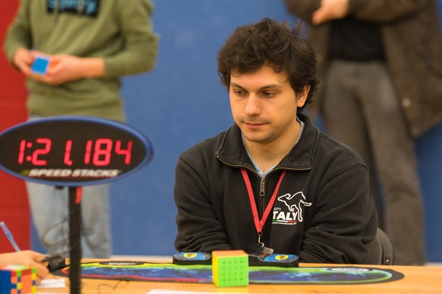

# Speedcubing

I have been practicing
[speedcubing](https://en.wikipedia.org/wiki/Speedcubing) since 2008,
and since 2011 I have competed in more than 70 officially recognized
[WCA](https://www.worldcubeassociation.org) competitions.
I am currently a senior member of the WCA Disciplinary Committee and
a WCA Junior Delegate.

I use the Roux method to solve the Rubik's cube in about 8 seconds
on average.  I currently hold the world record for the single best
result in the *3x3x3 Fewest Moves* event (16 moves), and some national
records in blindfolded events.  You can see all my official results
[on my WCA profile](https://www.worldcubeassociation.org/persons/2011TRON02).

If you are interested in Fewest Moves solving, check out my [FMC
Tutorial](https://fmcsolves.cubing.net/). I also upload irregularly on
[my YouTube channel](https://www.youtube.com/c/SebastianoTronto), but
most videos consist just of me solving the cube without any comment
or explanation.

Below you can find some links

## Fundamentals

* [Rubik's cube notation](notation), good to know before reading any
text-based tutorial.
* [Figure it out](figure-it-out): a "tutorial" on how to figure out
the Rubik's cube by yourself, without spoilers. It will not teach you
how to solve it step by step, but it will point you in the right direction.

## Software

* [Computer Puzzling](https://www.jaapsch.net/puzzles/compcube.htm) by
Jaap Scherphuis. If you are interested in implementing a puzzle solver,
do check out this page.
* [Nissy](https://nissy.tronto.net), a Rubik's cube solver and FMC assistant.
* [Cube coordinates](coordinates), an explanation of how "coordinates" in
  the sense of [Kociemba](https://kociemba.org/cube.htm) can be implemented
  for efficient Rubik's cube computations and solving.

## Fewest moves

* [My FMC Tutorial](https://fmcsolves.cubing.net) - "old style" techniques,
no Domino Reduction.
* [Slice theory](slice-theory): optimizing DR solutions by inserting multiple
"slice" moves.
* [DR triggers](triggers): with pictures (work in progress / forever draft).
* [Reconstruction of my 22.00 former WR average](https://www.youtube.com/watch?v=I0yjjwxonEE),
including my 16 moves single (YouTube video).

## Blindfolded

* [An old 3BLD tutorial](guidabld.pdf) for beginners, in Italian.
* [My new alg sheet](https://docs.google.com/spreadsheets/d/1iIuCNs_GXQAQFEssZam5lQ4cm3R_MRw9uQkb0GIThvo/edit?usp=sharing).
At the moment it has only corners (UFR), 4BLD wings (UFr), 4BLD x-centers
(Ubl) and 5BLD t-centers. Also available in csv format:
[corners](bldsheets/corners.csv), [wings](bldsheets/wings.csv),
[xcenters](bldsheets/xcenters.csv). Work in progress.
* [My 3BLD algs for UBL/UR](https://docs.google.com/spreadsheets/d/17sL1RuiYijTMiQkBn_d5xthdgAoxGE8oaH-Po-PZ58s/edit?usp=sharing).
They are outdated and not very good, I may upload a better version at some point.

## Other links

* [My WCA profile](https://www.worldcubeassociation.org/persons/2011TRON02)
* [My YouTube channel](https://www.youtube.com/c/SebastianoTronto)
* [Solving a cube... without a cube](no-cube)
