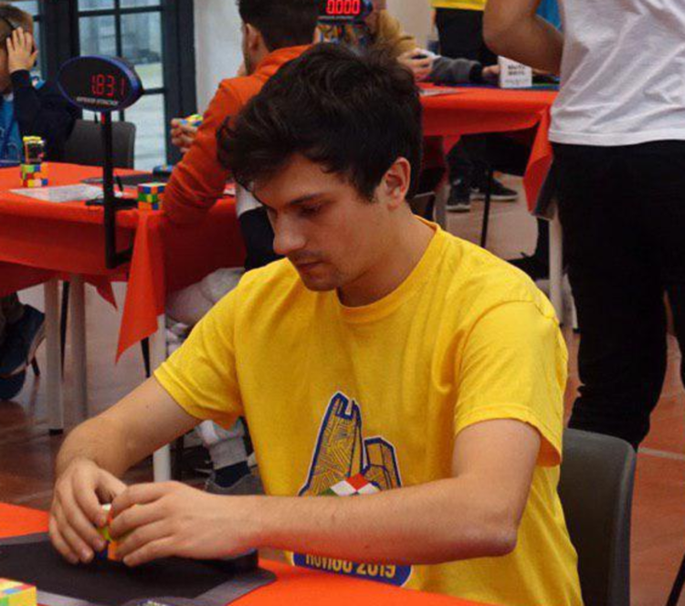

# Speedcubing

I have been practicing
[speedcubing](https://en.wikipedia.org/wiki/Speedcubing) since 2008,
and since 2011 I have competed in more than 50 officially recognized
[WCA](https://www.worldcubeassociation.org) competitions.

I use the Roux method to solve the Rubik's cube in about 8 seconds
on average.  I currently hold the world record for the single best
result in the *3x3x3 Fewest Moves* event (16 moves), and some national
records in blindfolded events.  You can see all my official results
[here](https://www.worldcubeassociation.org/persons/2011TRON02).

If you are interested in Fewest Moves solving, check out my [FMC
Tutorial](https://fmcsolves.cubing.net/). I also upload irregularly on
[my YouTube channel](https://www.youtube.com/c/SebastianoTronto), but
most videos are just me solving the cube.

## Links

* [My WCA profile](https://www.worldcubeassociation.org/persons/2011TRON02)
* [My YouTube channel](https://www.youtube.com/c/SebastianoTronto)
* [My FMC Tutorial](https://fmcsolves.cubing.net/)
* [My 3BLD algs for UBL/UR](https://docs.google.com/spreadsheets/d/17sL1RuiYijTMiQkBn_d5xthdgAoxGE8oaH-Po-PZ58s/edit?usp=sharing) (outdated, not very good)
* [Solving a cube... without a cube](https://www.speedsolving.com/forum/threads/the-3x3x3-example-solve-thread.14345/page-273#post-1173067)
